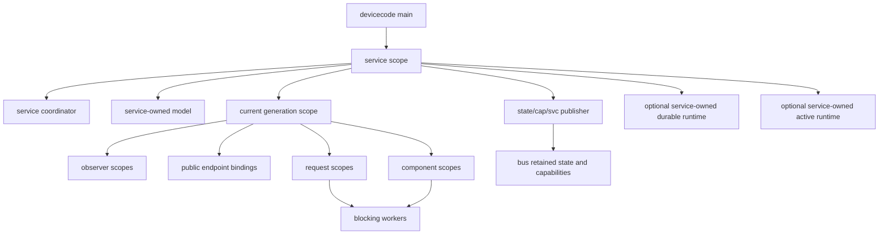
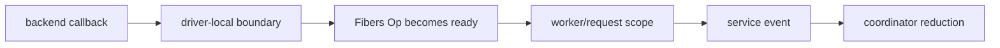
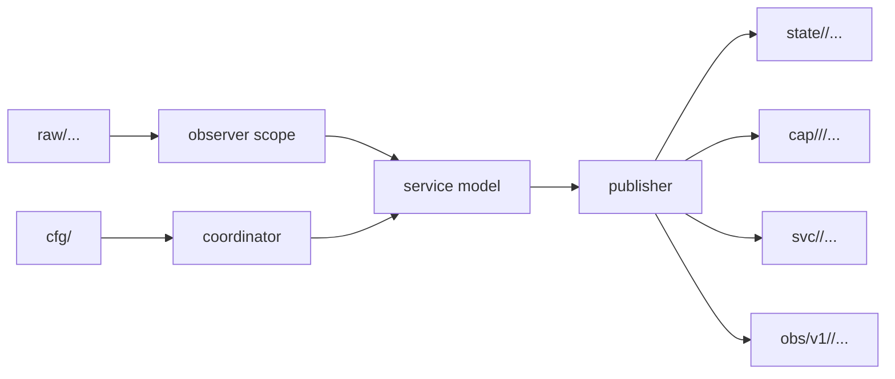

# Devicecode service architecture guide

> **Basis of this note**
>
> This architecture follows the `fibers` doctrine.
>
> It relies on the observed runtime contracts that:
>
> * `fibers.perform` is scope-aware;
> * `fibers.spawn` spawns into the current scope;
> * `perform_raw` bypasses scope-aware cancellation and belongs to infrastructure;
> * scope cancellation is downward only;
> * scope cancellation is cooperative;
> * finalisers cannot yield, only `perform` with an `:or_else()` immediate fallback is permitted;
> * parentage is the structural ownership mechanism;
> * attached child scopes are joined by their parent’s join/finalisation path;
> * `join_op()` is active finalisation, not passive observation;
> * non-parent joining must be an explicit service discipline;
> * `run_scope_op` is useful for deliberate whole-operation waits, but not for strict coordinator branches;
> * `named_choice`, `choice`, and `first_ready` select readiness, not semantic priority;
> * Lua table order must not be used as a priority mechanism;
> * where semantic priority is **genuinely** required, Device uses `devicecode/support/priority_event.lua`;
> * finalisers must release owned resources without waiting.

## Purpose

This guide is the canonical architecture guide for Devicecode services built on `fibers` and `bus`.

It defines the expected shape and programming style for Fabric, Device, Update, HTTP, UI and future services. Individual service notes should describe only the service-specific application of this guide.

The core rule is:

```text
Ops describe possible waits.
Scopes own lifetimes.
Coordinators decide.
Workers wait.
Finalisers terminate.
Models expose observable state.
Callbacks stay at the edge.
```

Devicecode services are written as explicit state machines with visible waiting points. The aim is not to avoid concurrency. The aim is to make concurrency inspectable.

## Core abstractions

```text
Op     = a first-class possible wait
Scope  = a lifetime, cancellation, cleanup, joining and failure boundary
Model  = observable state, not a worker
Bus    = local control-plane transport
Handle = an owned resource with immediate termination
```

Ordinary service code waits with:

```lua
local ev = fibers.perform(next_event_op(state))
```

This means:

```text
wait for the next service event while the current scope remains healthy
```

Do not use `perform_raw` in service code. It is infrastructure.

## Canonical service shape



A service usually has:

```text
service scope
  coordinator
  service-owned model
  service-owned bus connection
  publication cleanup
  current generation scope
  request scopes
  worker scopes
```

Introduce a scope when work has any of:

```text
identity
owned resources
cleanup
child work
blocking I/O
timeout policy
retry policy
diagnostics
caller-visible result
durable side effects
ownership transfer
```

A fibre runs code. A scope owns lifetime.

## Service entry contract

A service launched by `main.lua` has a foreground entry point:

```text
start(conn, opts)
  creates service lifecycle state
  enters the long-lived service coordinator
  must not return while the service is healthy
```

The lower-level coordinator body is:

```text
run(scope, params)
  owns the service event loop
  normally blocks until cancellation or failure
```

A helper that returns a local handle must use an explicit name such as
`open_handle`, `new_handle`, or `open_component`. It must not be called
`start`. If `start()` or `run()` returns in a healthy path, the service should
publish a stopped/failed lifecycle state and raise an error.

## Programming style

Devicecode service code should be direct, explicit and state-machine shaped.

Prefer:

```text
small modules with clear ownership
plain tables for event records and model snapshots
explicit topic helper functions
explicit request owner objects
explicit resource ownership wrappers
explicit _op functions for waits
explicit terminate(reason) methods for finaliser-safe cleanup
```

Avoid:

```text
callbacks as service control flow
hidden suspension
implicit global state
backend objects escaping into public APIs
long call chains that both decide and wait
boolean flags whose ownership is unclear
fire-and-forget fibres with no scope identity
ad hoc topic literals scattered across service logic
```

A good service reads as a sequence of ownership and event transitions:

```lua
local ev = fibers.perform(next_event_op(state))
local decision = reduce_event(state, ev)
dispatch_immediate_effects(state, decision.effects)
```

The service should make it clear:

```text
who owns the resource
who may cancel the work
where the result is stored
who reports completion
what happens if reporting fails
what happens if the operation loses a choice
```

## Avoid callbacks in service logic

Callbacks are allowed only at infrastructure edges, such as:

```text
transport driver callbacks
backend wake-up hooks
foreign event-loop integration
low-level command-loop plumbing
test fakes modelling callback-driven backends
```

Callbacks must not be used as ordinary service control flow.

A callback must not:

```text
call a service reducer
mutate service coordinator state
perform a Fibers Op
call fibers.perform or perform_raw
run a bus RPC
publish canonical service state
resolve public requests directly unless it owns the request object by construction
```

A callback may:

```text
update backend-local state
mark a backend command complete
wake an Op-facing boundary
terminate a backend-local resource
enqueue an already-shaped service event through a narrow immediate port
```

The preferred pattern is:



Do not write:

```lua
backend.on_event(function(raw)
  state.model:update(raw)       -- bad: callback mutates service state
  conn:retain(topic, raw)       -- bad: callback publishes canonical truth
end)
```

Prefer:

```lua
local ev = fibers.perform(driver:event_op())
port:emit({
  kind = "backend_event",
  generation = generation,
  payload = ev,
})
```

Then let the coordinator decide.

## Do not hide suspension

These functions must not yield:

```text
wrap functions
guard builders
or_else fallback thunks
abort handlers
finalisers
waitable steps
model update functions
coordinator branches
immediate publication helpers
validation functions
topic helper functions
```

`wrap` transforms a result. It must not perform another wait.

Good:

```lua
stream:read_line_op():wrap(parse_line)
```

Bad:

```lua
stream:read_line_op():wrap(function(line)
  return fibers.perform(read_body_op(stream, line))
end)
```

If a sequence needs multiple waits, put it in a worker or operation scope:

```lua
local function read_request_op(stream)
  return fibers.run_scope_op(function(scope)
    local line = fibers.perform(stream:read_line_op())
    local body = fibers.perform(read_body_op(stream, line))
    return { line = line, body = body }
  end)
end
```

## Coordinator discipline

A coordinator should have one suspending control point:

```lua
while true do
  local ev = fibers.perform(next_event_op(state))

  local decision = reduce_event(state, ev)
  dispatch_immediate_effects(state, decision.effects)
end
```

Coordinator branches may:

```text
mutate coordinator-owned state
record pending work
start scoped work
cancel child scopes
ignore stale completions
resolve already-owned in-memory requests
publish through immediate publication helpers
update models
terminate local handles immediately
```

Coordinator branches must not:

```text
perform waits
sleep
join
call join_op
do stream I/O
make blocking bus calls
call backends directly
run protocol work inline
block on queue capacity
```

Blocking work belongs in workers, request scopes, I/O owners, operation scopes or service-owned runtimes.

## Reducers and decisions

Reducers should be boring.

A reducer should normally:

```text
check event identity
ignore stale events
update coordinator-owned records
decide what immediate effects are required
record state before effects are dispatched
```

A reducer should not:

```text
perform work
call an Op
publish to the bus directly
open handles
close protocols gracefully
call HAL or HTTP transport
call another service directly
```

A useful split is:

```lua
local decision = reduce_event(state, ev)

for _, effect in ipairs(decision.effects) do
  dispatch_effect(state, effect)
end
```

Effects should be immediate. If an effect would wait, dispatch it by starting scoped work.

## Event records

Use explicit event records rather than positional tuples once events cross a service boundary.

Good:

```lua
{
  kind = "component_done",
  component = "reader",
  link_id = link_id,
  generation = generation,
  status = "ok",
  result = result,
}
```

Avoid:

```lua
{ "done", link_id, true, result }
```

Event records should include enough information to make stale handling simple:

```text
kind
service-owned id
generation
status
result or reason
primary failure where relevant
```

## Completion records

Completion events must carry enough identity to be stale-safe.

```lua
{
  kind = "operation_done",
  operation_id = operation_id,
  generation = generation,

  status = "ok",
  report = report,

  result = result,
  primary = primary,
}
```

Coordinator handling should be defensive:

```lua
local rec = state.operations[ev.operation_id]
if not rec or rec.generation ~= ev.generation then
  return
end
```

Child failure is data until the owning coordinator decides policy.

## Ops and reusable blocking code

Reusable blocking helpers should expose `_op` forms.

Good:

```lua
local function read_message_op(stream)
  return stream:read_line_op():wrap(parse_message)
end
```

Bad:

```lua
local function read_message(stream)
  return fibers.perform(stream:read_line_op())
end
```

The caller chooses the waiting policy:

```lua
local which, value = fibers.perform(fibers.named_choice {
  message = read_message_op(stream),
  timeout = sleep.sleep_op(2),
})
```

Avoid APIs where the reusable helper accepts opaque timeout parameters and hides a race internally. Return an Op and let the caller compose it.

### Caller-composed timeouts

Reusable SDKs and client helpers should normally return Ops with no hidden bus timeout policy.

Good:

```lua
local which, result, err = fibers.perform(fibers.named_choice {
  reply = ref:call_op(payload),
  timeout = sleep.sleep_op(5):wrap(function ()
    return nil, "timeout"
  end),
})
```

Bad:

```lua
-- Bad: a reusable client silently installs a default 5s bus timeout.
return conn:call_op(topic, payload, { timeout = opts.timeout or 5 })
```

A reusable client may expose an explicit timeout option for convenience, but its default should be caller-composed waiting, usually by passing `timeout = false` to bus calls. Service-protection timeouts are still valid where the service owns the policy; they should live in the admitted operation scope, not be smuggled through a general SDK helper.

## Choice is readiness, not priority

`choice`, `named_choice` and `first_ready` do not express semantic priority.

Where priority matters, use an explicit selector:

```text
try ready sources in priority order
if none are ready, block once on all relevant Ops
after waking, re-run the priority selector
```

The waking event is a hint. It need not be the event processed next.

Use the shared priority helper rather than relying on table order.

## Shared service support modules

The shared support modules encode service discipline. Prefer them over service-local reinvention.

| Module | Role |
|---|---|
| `devicecode.support.scoped_work` | Starts identity-bearing child work, stores completion before reporting, separates body-ended from authorised reaping, and accepts `cancel_op` for external cancellation sources. |
| `devicecode.support.service_events` | Stamps events with identity and generation before sending them to coordinators. |
| `devicecode.support.priority_event` | Implements explicit semantic priority without relying on `choice` ordering. |
| `devicecode.support.resource` | Provides immediate ownership, handoff and termination helpers. |
| `devicecode.support.request_owner` | Ensures at-most-once reply, fail or abandon for bus/HTTP requests, and provides `caller_cancel_op()` for bus request abandonment. |
| `devicecode.support.queue` | Provides public try-now helpers built from `or_else`. |
| `devicecode.support.config_watch` | Standard retained `cfg/<service>` watching. |
| `devicecode.support.bus_cleanup` | Finaliser-safe bus cleanup wrappers. |
| Service models | Pulse-backed observable state with snapshots, versions and `changed_op`. |

Use the shared helper unless the service has a clear reason not to.

### Retained service configuration

Modern service shells consume intended configuration through
`devicecode.support.config_watch`.

The helper opens a normal `lua-bus` subscription to `cfg/<service>`.  In
`lua-bus`, subscription creation replays matching retained messages before
subsequent live publications.  That retained replay is the bootstrap mechanism:
a service which starts after its configuration has already been retained must
observe that configuration as a normal `config_changed` event.

Do not build service-specific retained configuration paths using an independent
retained view plus a live subscription.  That split can reintroduce the timing
race retained configuration was introduced to remove.  Service code should own
validation and generation policy, but the subscription/replay mechanics belong
in the shared helper.

Direct `cfg/<service>` subscriptions in modern services are architecture debt.
Bridge code may still subscribe to arbitrary bus topics supplied by Fabric
routing rules, but service shell configuration should go through
`config_watch.open`.

## Request ownership

Every request-like object needs one owner.

This includes:

```text
bus Request
HTTP accepted context
HTTP response writer
artifact ingest session
upload body source
transfer source
worker completion waiter
```

Use a request owner to ensure at-most-once resolution:

```text
reply once
fail once
abandon once
finalise unresolved once
```

A finaliser may abandon or fail an unresolved in-memory request owner. It must not wait for graceful completion.

## Bus request cancellation

A public bus request may outlive the caller's interest in the result. If the caller races a bus SDK Op against another Op and the bus Op loses, the bus `Request` is abandoned. Service code must treat that abandonment as a cancellation source for any admitted caller-owned work.

The canonical admission pattern is:

```lua
local owner = request_owner.new(req)

local handle, err = scoped_work.start {
  lifetime_scope = scope,
  reaper_scope = scope,
  report_scope = scope,
  identity = identity,

  setup = function (work_scope)
    work_scope:finally(function (_, status, primary)
      owner:finalise_unresolved(primary or status or "request_closed")
    end)

    return {
      request_owner = owner,
      cancel_owned_now = function (reason)
        owner:abandon_unresolved(reason or "caller_abandoned")
        return true
      end,
    }
  end,

  run = run_request_work,
  report = report_completion,
  cancel_op = owner:caller_cancel_op(),
}
```

Use this for bus requests that admit meaningful scoped work, including device actions, update manager requests, artifact ingest, Fabric transfer requests, Fabric local-to-remote bridge calls, HTTP operations and long HAL capability operations.

Do not apply `caller_cancel_op()` to service-owned background components such as observers, publishers, generation reconcilers, retained watchers or listener runtimes unless they were directly admitted from a caller-owned bus `Request`.

The intended semantics are:

```text
caller abandons or times out the SDK Op
  -> bus Request becomes abandoned
  -> request_owner observes caller cancellation
  -> scoped_work cancels the admitted child scope
  -> owned resources terminate through the scope's normal cleanup path
  -> late completion is stale or resolves only local cleanup
```

Caller abandonment is not a service fault. Log it as cancellation or abandonment, not as a backend failure.

## Resource ownership

Every owned resource should have one clear owner at any point in time.

A resource may be:

```text
owned by caller
owned by request scope
owned by generation
owned by service
handed off to receiver
borrowed but not owned
```

Ownership transfer must be visible.

```text
before admission:
  caller owns cleanup

after successful admission:
  admitted scope owns cleanup

if admission fails:
  original owner still owns cleanup
```

For handoff:

```text
receiver installs cleanup first
sender then detaches cleanup
sender must not return a resource that its own finaliser will immediately close
```

## Handles and public wrappers

Do not return backend objects as public handles.

A public handle should expose only the safe public operations:

```text
read_op
write_op
send_op
receive_op
close_op where graceful close is intended
terminate(reason)
public id or metadata
```

It should not expose:

```text
backend driver object
raw file descriptor
private command mailbox
service coordinator state
scope join authority
private cleanup function
```

Public wrappers keep service boundaries enforceable.

## Join authority

`join_op()` is active finalisation. It may:

```text
close admission
wait for fibres
join child scopes
run finalisers
record outcome
detach the joined scope from its parent
```

Therefore:

```text
parent finalisation is the default structural reaper
early reaping must be explicit
non-parent reaping must be delegated
reporters must not join arbitrary work
```

Use `scoped_work` for identity-bearing child work that needs completion reporting.

## Finalisers

Finalisers terminate owned resources. They do not wait.

Allowed:

```text
terminate a handle
detach a registration
release a local reservation
mark closed
cancel a child scope without waiting
resolve or abandon an in-memory request owner
```

Not allowed:

```text
perform on a waiting Op
perform_raw
sleep
join
close_op
stream read/write/flush
protocol handshake
retry loop
blocking queue send
backend call that may wait
```

Use this vocabulary consistently:

```text
terminate(reason)  immediate, idempotent, finaliser-safe
close_op()         graceful protocol work, may wait
```

Any owned resource must have an immediate termination path.

## Models

Models are observable state. They are not workers.

A model should provide:

```text
snapshot()
version()
changed_op(seen)
set_snapshot(...)
terminate(reason)
```

Rules:

```text
snapshot returns copies
updates are non-yielding
updates signal only on material change
changed_op is an Op for observers
models do not perform Ops
models do not call services or backends
models do not publish unless explicitly designed as publishers
```

Expensive projection belongs in scoped work, not in model update logic.

## Publication

Publication should be an immediate effect over already-computed state.

A publisher may:

```text
retain canonical state
retain capability metadata
retain capability status
publish observability metrics
unretain records during finalisation through immediate cleanup helpers
record cleanup failures explicitly
```

A publisher should not:

```text
perform blocking reads
query other services
call HAL
do expensive projection
hide retries inside model update
silently drop publication failures
```

If publication can fail, the service should decide what that means:

```text
mark degraded
fail the observing scope
record cleanup failure
retry through explicit worker
continue with documented loss
```

## Topic style

Use topic helper functions.

Good:

```lua
topics.update_manager_rpc("create-job")
topics.workflow_update_job(job_id)
topics.raw_member_cap_rpc("mcu", "update", "main", "stage")
```

Avoid scattered literals:

```lua
{ "cap", "update-manager", "main", "rpc", "create-job" }
```

Topic helpers should:

```text
return fresh tables
validate identifiers where useful
use kebab-case public tokens
make canonical ownership obvious
reduce accidental compatibility roots
```

## Control-plane publication

Devicecode uses these planes:

```text
svc/...       service lifecycle only
cfg/...       intended service configuration
raw/...       provenance-bearing source truth and raw provider interfaces
state/...     canonical retained public truth
cap/...       stable public callable/inspectable interfaces
obs/v1/...    observability
```

Canonical roots are deliberately limited. Public call surfaces belong under `cap/...`, raw provider-native call surfaces under `raw/.../cap/...`, and retained workflow records under `state/workflow/...`. Public workflows should not be exposed through ad hoc `cmd/...` trees. :contentReference[oaicite:0]{index=0} :contentReference[oaicite:1]{index=1}

General rules:

```text
svc/<service>/status and svc/<service>/meta are lifecycle only.
cfg/<service> is intended service configuration.
raw/... is for provenance-bearing facts and raw provider-native capabilities.
state/device/... is composed appliance truth owned by Device.
state/workflow/... is retained workflow instance truth.
state/<domain>/... is canonical domain retained truth.
cap/... is the public interface plane.
obs/v1/... is for metrics, logs and diagnostics, not operational truth.
```

A service id is not automatically a domain id. `state/<domain>` names public semantic truth, not an implementation module.

## Typical publication pattern



## Observability

Observability is not canonical operational truth.

Use `obs/v1/...` for:

```text
metrics
diagnostics
logs
counters
service-local debugging
performance or queue statistics
```

Do not use `obs/v1/...` for:

```text
public workflow records
component state
appliance composition
stable interface availability
durable configuration
```

Where a statistic is useful for interface inspection, a narrow retained adjunct under `cap/.../state/...` may also be justified. Keep that narrow and summary-level.

## Backpressure

Backpressure is policy, not an accident of queue length.

A service should explicitly choose one of:

```text
reject the request
terminate the client or watch
drop low-priority telemetry
mark degraded
cancel scoped work
fail the observing scope
slow a worker or I/O owner
store and retry completion reporting
```

Completion events for healthy observing scopes should not be silently dropped.

## Error style

Prefer explicit status values and public-safe errors.

Good public result:

```lua
{
  ok = false,
  error = "unknown-component",
  message = "component is not configured",
}
```

Good internal completion:

```lua
{
  status = "failed",
  primary = "durable-save-failed",
  report = report,
}
```

Avoid exposing:

```text
private resource objects
stack traces in public replies
ownership internals
mailbox objects
scope handles
backend errors without classification
```

Internal diagnostics can retain richer reports under service-owned observability.

## Validation style

Validate at the boundary.

Examples:

```text
bus RPC payload enters service
HTTP request becomes UI operation
config is loaded from cfg/<service>
raw provider capability is accepted into HAL
public handle is returned to another service
```

Validation functions should be pure and non-yielding. They should not repair ambiguous public input silently where that would create a second contract.

## Test style

Happy-path tests are insufficient.

Tests should include:

```text
operation loses a choice
timeout wins
caller abandonment crosses the bus boundary into admitted scoped work
queued bus requests abandoned before admission are skipped or resolved locally
scope cancellation interrupts waits
finalisers do not wait
try-now helpers do not suspend
callback registration unregisters on abort
queue overflow follows documented policy
join authority is respected
stale completions are ignored
stored completion exists before reporting
ownership transfer disables old cleanup
terminate is idempotent
close_op is not called from finalisers
models wake observers on termination
priority selectors re-check after wake-up
```

Integration tests should drive public seams:

```text
cfg/<service>
cap/.../rpc/...
raw/... retained facts
HTTP public capability handles
state/... retained truth
obs/v1/... where observability is the subject
```

They should not inspect private coordinator tables unless the test is explicitly a unit test for that module.

## Service review checklist

A service review should check:

```text
No service code uses perform_raw.
Reusable waits expose _op APIs.
Coordinators have one visible wait point.
Coordinator branches do not block.
Callbacks do not mutate service state directly.
Identity-bearing work has a scope.
Completions carry identity and generation.
Stale completions are ignored.
Stored completion exists before reporting.
Finalisers terminate only.
Owned resources have terminate(reason).
Public handles do not expose backend objects.
Public calls are under cap/...
Workflow records are under state/workflow/...
Canonical retained truth is under state/...
Raw provider truth remains under raw/...
Observability is under obs/v1/...
Backpressure policy is explicit.
Topic helpers are used instead of scattered literals.
Boundary validation is pure and non-yielding.
Tests cover losing paths.
Bus-admitted scoped work uses owner:caller_cancel_op().
Reusable SDK/client helpers do not install hidden bus timeouts by default.
```

## Signs that code is drifting

Look closely if a service introduces:

```text
a callback that updates service state
a helper without _op that can block
a reusable SDK/client helper with a hidden default bus timeout
a bus request that starts scoped_work without owner:caller_cancel_op()
a finaliser calling close_op
a coordinator branch calling fibers.perform
a queue send with no overflow policy
a child fibre with no identity or completion path
a public reply containing private handles
a state/<service> tree justified only by module name
a cap/.../state subtree growing into a domain model
a raw provider interface mirrored directly under cap/...
a cmd/... public path
a test that depends on private coordinator tables for an integration behaviour
```

Any one of these may be justified in a narrow case. Several together usually mean the service boundary is losing shape.
