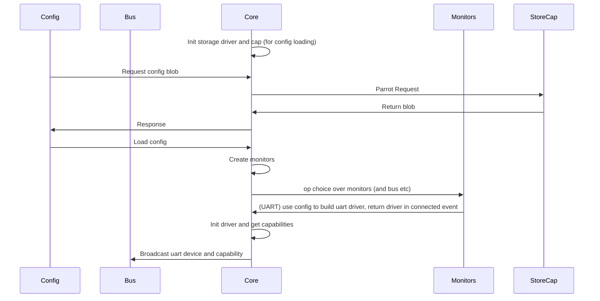

# HAL
## File Structure
- hal.lua
- hal

  - backends <-- portability layer: choose a provider implementation per device family
    - uart
      - provider.lua <-- selects UART provider (fibers, ubus, etc)
      - providers
        - fibers_core
          - init.lua

    - modem
      - provider.lua <-- selects modem provider (OpenWrt ModemManager, testing, etc)
      - iface.lua <-- the modem-backend interface contract (documented + validated)
      - mode
        - qmi.lua
        - mbim.lua
      - model
        - quectel.lua
        - fibcocom.lua
      - providers
        - openwrt_mm
          - init.lua <-- constructs a backend that implements modem/iface.lua
          - mmcli.lua <-- executor: mmcli bindings
          - at.lua <-- ModemManager-specific AT bridge (if needed)
        - some_other_software
          - init.lua

  - drivers <-- domain logic + stable capability surface
    - modem.lua <-- specific modem functionality and HAL interaction
    - modem
      - any helper stuff here

  - managers <-- owns lifecycles, supervision, (re)announce capabilities
    - modemcard.lua

  - types <-- structured tables + validation
    - core.lua
    - capabilities.lua
    - external.lua
    - modem.lua

  - resources.lua <-- loads managers based on hardware target (declarative wiring)
  - resources
    - bigbox_v1_cm.lua
    - bigbox_ss.lua

## HAl monitor acticheture



Monitors are scope protected modules that provide a event based op which returns when a device is either connected or disconnected.
```lua
local device_event = perform(uart_monitor:monitor_op())
if device_event.connected then
  -- somthing
else
  --somthing else
end
```

Monitors can scale for complexity, for example the simplest case of a monitor would be uart, where the monitor would recieve a config and build drivers immediately based on that config, the monitor_op would iterate over the drivers and then block forever
```lua
function monitor:monitor_op()
  if self._progress >= #self._drivers then
    return op.never()
  end
  return op.always(
    -- device connected event goes here
  )
end
```

Some devices are not defined at config time, and appear dynamically. These monitors can return a scope_op which listens to an underlying command to build device events
```lua
function monitor.new()
  return setmetatable({
    scope = -- child scope to protect HAL from montior based failure
    cmd = -- monitoring command here
  }, monitor)
end

-- A monitor op that is dependant on command line output
function monitor:monitor_op()
  return scope:scope_op(function ()
    return self.cmd:read_line_op():wrap(parser)
  end)
end
```

Both of these examples are fiberless

Monitors may also spawn fibers in the background, although the majority won't need to, to mediate command output between drivers


