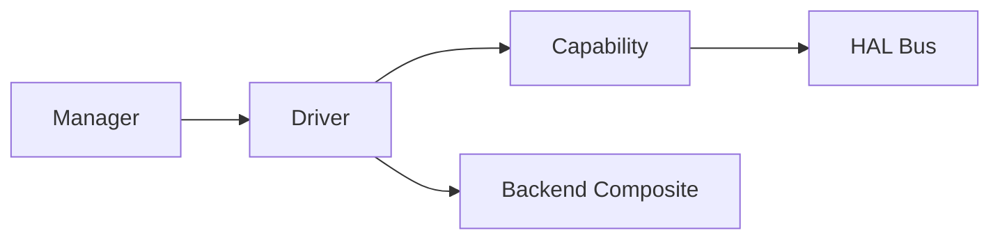
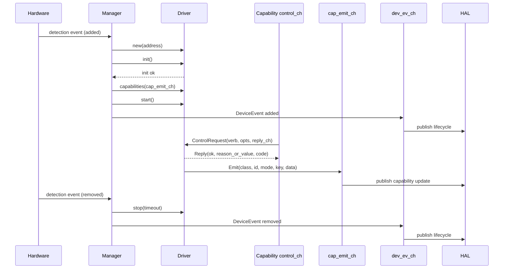

# HAL Architecture Standards

This document defines the required architecture for new HAL device classes.

## Layer Model

Every HAL device class MUST follow this layering model unless explicitly justified in design review.

### Manager

Responsibilities:

- Detect add/remove events for a device class.
- Construct, initialize, start, and stop drivers.
- Emit device lifecycle events.

Standards:

- A manager MUST own device discovery and lifecycle orchestration for one device class.
- A manager MUST emit `DeviceEvent("added", ...)` only after the driver is initialized, capabilities are built, and the driver starts successfully.
- A manager MUST emit `DeviceEvent("removed", ...)` when a driver is removed or faults.
- A manager MUST expose `apply_config(config)` as part of the manager interface.
- `apply_config(config)` MAY be a no-op for managers that do not support runtime config.
- A manager SHOULD isolate failures by running detector/manager loops in a child scope.

Manager channel contract:

- A manager MUST consume hardware detection/removal from class-specific inputs.
- A manager MUST produce `DeviceEvent` messages on `dev_ev_ch`.
- A manager MUST pass `cap_emit_ch` into `driver:capabilities(cap_emit_ch)`.
- A manager SHOULD own internal channels for detection, removal, and initialized-driver handoff.

Canonical reference: `src/services/hal/managers/modemcard.lua`

### Driver

Responsibilities:

- Represent one hardware instance.
- Expose capability verbs through control channels.
- Emit state/event/meta updates.
- Delegate platform-specific operations to backend when a backend exists.

Standards:

- A driver MUST implement `init()`, `start()`, `stop(timeout)` and `capabilities(emit_ch)`.
- A driver MUST validate option types for each verb.
- A driver MUST construct `Reply` objects for control requests.
- A driver SHOULD keep long-running loops in fibers supervised by a scope.

Driver channel contract:

- A driver MUST expose one or more capability `control_ch` channels used to receive `ControlRequest` messages.
- A driver MUST publish emits through `cap_emit_ch` using `hal_types.new.Emit(...)`.
- A driver SHOULD use dedicated internal channels for asynchronous signals (for example SIM state changes) when needed.

Canonical references:

- `src/services/hal/drivers/modem.lua`
- `src/services/hal/drivers/filesystem.lua`

### Capability

Responsibilities:

- Publish callable offerings for a class/id pair.
- Route control requests to driver logic through `control_ch`.

Standards:

- Capabilities MUST be created using `capabilities.new.Capability(...)` or a typed constructor from `types/capabilities.lua`.
- Offerings MUST include only verbs implemented by the driver.
- Capability class/id combinations MUST be stable and unique per device instance.
- Offerings SHOULD be static at startup by default.

Canonical reference: `src/services/hal/types/capabilities.lua`

### Backend

Responsibilities:

- Implement platform-specific operations (system commands, provider APIs, parsing).
- Compose a stable function surface consumed by drivers.

Standards:

- A backend MAY be omitted when platform-specific abstraction adds no value (filesystem reference).
- If a backend exists, it MUST satisfy the class contract validator.
- Backends MUST return `(result, error_string)` semantics consistently.

Backend composition standard:

- A backend MAY be composed from multiple sources before validation.
- The base source is typically OS/software-provider implementation.
- Additional layers (for example mode/model/device-specific contributors) MAY augment behavior.
- The final composed backend MUST fully satisfy the target backend contract before it is returned.

Canonical references:

- `src/services/hal/backends/modem/provider.lua`
- `src/services/hal/backends/modem/contract.lua`

## Lifecycle Standard

Standards:

- Managers MUST NOT announce `added` before `start()` returns success.
- Managers MUST handle driver scope faults as removal events.
- Drivers MUST stop within timeout or return an explicit timeout error.

## Backend Optionality Decision Rule

Use this decision process for new classes:

1. If implementation requires platform-specific command execution, parsing, or provider detection, a backend SHOULD be used.
2. If logic is local and portable with no provider split, backend MAY be skipped.
3. If future provider variance is likely, backend SHOULD be introduced early.

Filesystem is the skip-backend reference.
Modem is the use-backend reference.
