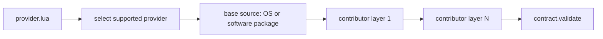

# HAL Backend Authoring Guide

This guide covers authoring backend providers and implementations for HAL device classes, using modem as the canonical pattern.

Mode/model in modem are modem-specific names for a broader composition idea: a backend can be built from multiple contributors, as long as the final composed backend satisfies the contract.

## Backend Composition Model

Standards:

- Provider assembly MUST call contract validation before returning backend.
- Provider selection MUST choose first supported provider in configured order.
- Contributor augmentation MUST happen before contract validation when contributor methods are required contract members.

Composition guidance:

- The base source is usually an OS/software-provider implementation.
- Additional contributors MAY be mode/model/device/board/vendor specific.
- Contributor names are device-class specific and are not globally fixed.
- Modem `mode` and `model` are one concrete specialization of this pattern.

## Provider Contract

A provider module SHOULD expose:

- `is_supported()`
- `backend` table with `new(address)` constructor
- `new_monitor()` when discovery monitoring is supported

Standards:

- `is_supported()` MUST be fast and safe to call at startup.
- `new_monitor()` is required only for backends that support dynamic runtime detection.
- Backends using static config/manager wiring MAY omit `new_monitor()`.
- When provided, `new_monitor()` MUST return a monitor satisfying the monitor contract for that device class.

Canonical reference:

- `src/services/hal/backends/modem/providers/linux_mm/init.lua`

## Backend Function Contract

Contract is enforced in:

- `src/services/hal/backends/modem/contract.lua`

Standards:

- Backend implementations MUST implement all required functions in the contract list.
- Backend implementations MUST NOT expose extra function-valued keys not listed in the contract.
- Functions MUST return `(result, error_string)` and use empty string on success where applicable.

## Monitor Contract

Monitor contracts are per device class.

Modem monitor contract currently requires:

- `next_event_op`

Standards:

- Monitors MUST NOT expose extra function-valued keys beyond required monitor contract.
- Monitor event parser SHOULD treat unknown lines as non-fatal and continue.
- Each device class MUST define and validate its own monitor contract when monitors are used.

## Contributor Augmentation Rules

Contributor augmentations apply class-specific behavior during backend construction.

For modem this appears as mode and model augmentations.

Mode augmentations:

- Apply mode-specific behavior based on detected transport, for example qmi or mbim.
- Keep overrides localized to mode-specific concerns.

Model augmentations:

- Apply vendor/model-specific workarounds.
- Use narrow conditional matching (manufacturer + model + optional variant).

Standards:

- Overrides MUST preserve expected call signatures.
- Overrides MUST preserve return semantics and error conventions.
- Overrides SHOULD avoid global side effects outside backend instance mutation.
- The fully composed backend MUST satisfy the class contract before return.

Canonical references:

- `src/services/hal/backends/modem/modes/qmi.lua`
- `src/services/hal/backends/modem/models/quectel.lua`

## Authoring Checklist

1. Add provider entry and support detection logic.
2. Implement backend constructor and required contract functions.
3. Add monitor implementation only if class discovery needs dynamic monitor support.
4. Add optional contributor modules (for example mode/model/device-specific layers).
5. Run through contract validation path from provider assembly.

## Common Errors and Fixes

1. Missing required backend function.
Fix: implement function named exactly as contract key.

2. Unsupported extra backend function.
Fix: remove extra function key or add it to contract only if required by driver architecture.

3. Broken driver integration due to signature mismatch.
Fix: match function arguments expected by driver call sites.

4. Inconsistent success/error tuple returns.
Fix: normalize return to `(value_or_ok, error_string)`.

5. Monitor shape validation failure.
Fix: expose only required monitor methods.
