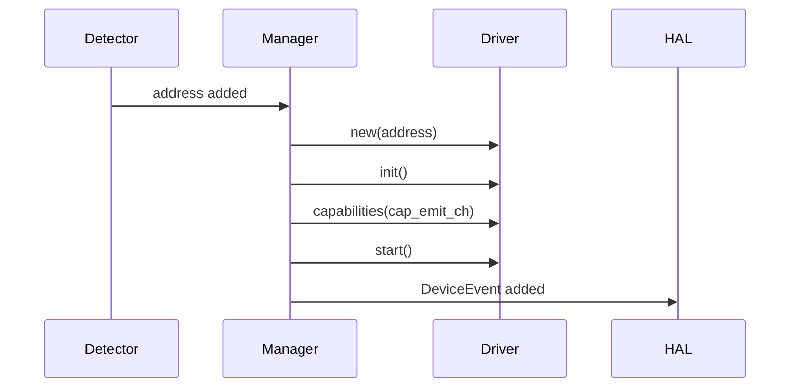

# HAL Implementation Cookbook

This document gives template-first implementation patterns for adding or extending HAL components.

## Pattern 1: Add a Capability Verb

Use this when adding a new action to an existing capability class.

### Required changes

1. Add a typed options constructor in `types/capability_args.lua`.
2. Add a driver verb method in the relevant driver.
3. Add the verb to capability offerings in `types/capabilities.lua`.
4. If driver delegates to backend, add backend function and contract entry.

### Template

```lua
-- types/capability_args.lua
local ModemFooOpts = {}
ModemFooOpts.__index = ModemFooOpts

function new.ModemFooOpts(value)
    if type(value) ~= "string" or value == "" then
        return nil, "invalid value"
    end
    return setmetatable({ value = value }, ModemFooOpts), ""
end
```

```lua
-- drivers/modem.lua
function Modem:foo(opts)
    if opts == nil or getmetatable(opts) ~= capability_args.ModemFooOpts then
        return false, "invalid options", 1
    end
    local ok, err = self.backend:foo(opts.value)
    if not ok then
        return false, err, 1
    end
    self:_emit_event("foo_done", { value = opts.value })
    return true
end
```

### Standards

- New verbs MUST validate metatable-typed opts.
- Offerings MUST match real driver method names.
- Driver verb responses MUST return HAL reply shape: `ok, reason_or_value, code`.

### Return-value semantics

Capability endpoints are not limited to boolean-only outcomes.

- State-changing verbs often return boolean success, for example `enable`, `disable`, `connect`.
- Query verbs SHOULD return the requested value on success.

Canonical example (`modem:get` pattern):

```lua
function Modem:get(opts)
    if opts == nil or getmetatable(opts) ~= capability_args.ModemGetOpts then
        return false, "invalid options", 1
    end
    local value, err = self.backend[opts.field](self.backend, opts.timescale)
    if err ~= "" then
        return false, err, 1
    end
    return true, value
end
```

In the control loop, this value is carried in `Reply.reason` when `ok == true`.

## Pattern 2: Add a New Manager + Driver Pair

Use this for a new device class.

### Manager template responsibilities

1. Own detector loop.
2. Spawn and initialize driver on add.
3. Start driver after capability creation.
4. Emit added/removed `DeviceEvent`.
5. Expose `apply_config(config)` even when configuration is optional.

### Driver template responsibilities

1. Implement `init/start/stop/capabilities`.
2. Implement control manager loop over `control_ch`.
3. Emit state/event/meta updates via `Emit`.

### Sequence template



### Standards

- Manager MUST keep map from address to active driver.
- Manager MUST remove map entry on removal/fault.
- Manager MUST implement `apply_config(namespaces)`; if unused it SHOULD return success as a no-op.
- Driver MUST reject `start()` when not initialized or capabilities not applied.

### Required channel wiring

Manager-side channels:

1. `dev_ev_ch`: manager MUST publish add/remove lifecycle events.
2. `cap_emit_ch`: manager MUST pass to driver capability setup for emit forwarding.
3. Internal manager channels: detection/removal/driver-ready channels SHOULD isolate detector logic from lifecycle logic.

Driver-side channels:

1. Capability `control_ch` per exposed capability endpoint MUST receive `ControlRequest`.
2. `request.reply_ch` MUST receive `Reply` from driver control manager.
3. `cap_emit_ch` MUST be used for `Emit` messages (event/state/meta/log).

## Pattern 3: Add a Backend Provider

Use this when a device class needs platform-specific implementations.

### Required changes

1. Add provider module with `is_supported()` and backend constructor.
2. Add provider name to provider selection table.
3. Ensure backend passes contract validation.
4. Optionally add monitor implementation and monitor contract compliance.
5. Optionally compose backend with extra contributors (mode/model/device-specific layers) before validation.

### Template

```lua
-- providers/my_platform/init.lua
local function is_supported()
    return true
end

local function new_monitor()
    return monitor.new()
end

return {
    is_supported = is_supported,
    backend = backend,
    new_monitor = new_monitor,
}
```

### Standards

- Providers MUST be side-effect free at module load.
- Provider selection MUST fail fast when no provider is supported.
- `new_monitor()` is required only when dynamic runtime detection is needed.
- Monitor objects MUST satisfy the monitor contract for that device class exactly.

## Pattern 4: Add Mode or Model Overrides

Use this when behavior differs by transport mode, model, or other device-specific contributors.

### Mode override template

```lua
local function add_mode_funcs(backend)
    backend.wait_for_sim_present_op = function(self)
        -- mode-specific behavior
    end
end

return { add_mode_funcs = add_mode_funcs }
```

### Model override template

```lua
local function add_model_funcs(backend, model, variant)
    if model == "rm520n" and backend.base == "linux_mm" then
        backend.connect = function(self, connection_string)
            -- model-specific connect flow
        end
    end
end

return { add_model_funcs = add_model_funcs }
```

### Standards

- Overrides MUST preserve function signatures expected by driver callers.
- Overrides MUST continue returning `(result, error_string)` semantics.
- Overrides SHOULD be narrowly conditional (mode/model/variant/base) to avoid global behavior changes.
- The composed backend MUST still pass contract validation after all contributor layers are applied.

## Pattern 5: Backend-Free Driver (Filesystem Style)

Use this for classes with purely local logic.

### Required properties

1. Driver directly implements verbs.
2. Driver still uses capability/type contracts.
3. Driver still emits events and replies through HAL types.

### Standards

- Backend-free drivers MUST still maintain lifecycle and control loop standards.
- Backend-free does NOT relax capability/options validation.

## Common Failure Modes

1. Contract validation failure: backend has missing or extra function.
2. Offering mismatch: capability declares verb not implemented in driver.
3. Options mismatch: caller passes non-typed opts table.
4. Scope leak: long-running loop not scope-managed.
5. Emit misuse: emitting `nil` data fails `Emit` constructor validation.

## Author Checklist

1. Manager lifecycle order is detection -> init -> capabilities -> start -> added event.
2. Removal and fault both result in driver stop and removed event.
3. Every verb has typed options and explicit error handling.
4. Offerings list and driver methods are aligned.
5. Contract validation passes when backend exists.
6. Manager includes `apply_config(config)` endpoint with either real handling or explicit no-op behavior.

## Code Templates

Concrete starter templates are available in source:

- `src/services/hal/templates/manager_template.lua`
- `src/services/hal/templates/driver_template.lua`
