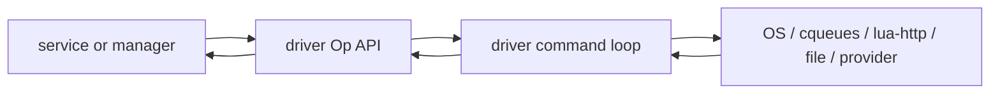

# Op-only driver guide

## Purpose

Op-only drivers are edge components that expose backend or provider behaviour as Fibers-native Ops.

They are used by HAL and transport services to keep backend-specific polling, callbacks and command loops out of ordinary service code.

An Op-only driver should make this true:

```text
service code sees Ops and terminate(reason)
driver code owns backend mechanics
```

## Boundary shape



The service should not know about backend polling, raw callbacks or backend object lifetimes.

## Driver API rules

Prefer APIs like:

```lua
driver:start_op(...)
driver:apply_config_op(...)
driver:shutdown_op(...)
driver:fault_op()
handle:read_op(...)
handle:write_op(...)
handle:terminate(reason)
```

Avoid APIs that hide blocking work behind ordinary functions.

Synchronous helpers are acceptable only when they are pure validation, pure projection or immediate state inspection.

## Termination and graceful closure

Drivers should distinguish:

```text
terminate(reason)  immediate, idempotent, finaliser-safe
close_op()         graceful protocol work, may wait
```

Every object handed to a service must have an immediate termination path if it is owned by a scope finaliser.

## Losing choices

Every driver Op must define what happens when it loses a choice.

Expected patterns:

```text
queued command loses: remove or mark abandoned
active backend job loses: abort/terminate active job
owned backend handle loses: terminate handle
borrowed backend handle loses: leave owner intact
callback registration loses: unregister callback
```

A losing Op must not leave a callback, file descriptor, driver command or backend job silently live.

## Publication rules

Op-only drivers normally do not publish canonical `state/...` directly.

Instead:

```text
driver/provider emits raw facts or capability events to its owning service
HAL publishes raw/... for provider-native truth
Device/Update/Fabric/UI publish canonical state where they own it
HTTP publishes narrow interface stats and obs metrics where it owns the interface
```

Drivers should not invent public `cap/...` or `state/...` families unless the driver itself is deliberately the service boundary.

## Reviewer checklist

```text
All blocking driver operations are Ops.
No service-facing method hides a wait.
No driver handle lacks terminate(reason).
close_op is not required for finaliser cleanup.
Losing Ops clean up queued and active backend work.
Callbacks do not call service reducers directly.
Backend objects are not returned as public handles.
Raw/provider facts are emitted to the owning service, not published as canonical state by accident.
```
