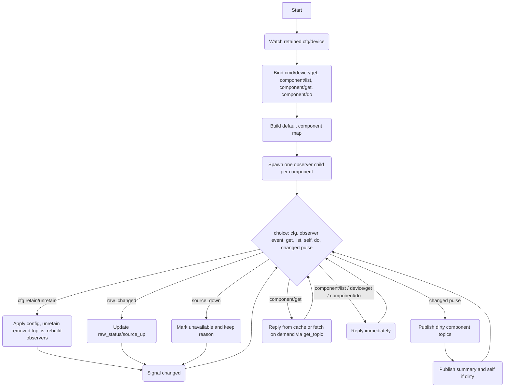

# Device Service

## Purpose

The Device service is the appliance-level façade over local and member-backed components.
It does not implement hardware drivers or device policy. Instead it:

1. consumes retained `cfg/device`
2. maintains a canonical in-memory component map
3. observes each configured component through its configured status watch / status get topics
4. projects a stable retained device view under `state/device/...`
5. exposes stable local command topics for reading component state and dispatching component actions

The service is intentionally thin. It consumes whatever topics a component definition names, and republishes a uniform local shape for the rest of the system.

## Dependencies

### Retained configuration

| Topic | Purpose |
|---|---|
| `{'cfg','device'}` | Device component configuration. Retained and replayed on startup. |

### Consumed topics and calls

The service has no direct HAL dependency. It consumes whatever each component definition names:

| Config field | Purpose |
|---|---|
| `status_topic` | Optional watch topic for ongoing status updates. |
| `get_topic` | Optional call topic used for one initial fetch and explicit `get` requests. |
| `actions.*` | Call topics used by `cmd/device/component/do`. |

### Built-in default component

Even with no retained config, the service includes a built-in `cm5` host component:

```lua
cm5 = {
  class = 'host',
  subtype = 'cm5',
  role = 'primary',
  member = 'local',
  status_topic = { 'cap', 'updater', 'cm5', 'state', 'status' },
  get_topic = { 'cap', 'updater', 'cm5', 'rpc', 'status' },
  actions = {
    prepare_update = { 'cap', 'updater', 'cm5', 'rpc', 'prepare' },
    stage_update   = { 'cap', 'updater', 'cm5', 'rpc', 'stage' },
    commit_update  = { 'cap', 'updater', 'cm5', 'rpc', 'commit' },
  },
}
```

Configured components extend or override this default map.

## Configuration

Retained payload on `{'cfg','device'}`:

```lua
{
  schema = 'devicecode.config/device/1',
  components = {
    [<name>] = {
      class = <string|nil>,
      subtype = <string|nil>,
      role = <string|nil>,
      member = <string|nil>,
      member_class = <string|nil>,
      link_class = <string|nil>,
      present = <boolean|nil>,
      status_topic = <topic|nil>,
      get_topic = <topic|nil>,
      actions = {
        [<action_name>] = <topic>,
      } | nil,
    }
  }
}
```

Notes:

- if `schema` is present and does not match `devicecode.config/device/1`, the service falls back to defaults
- configured components are merged over the built-in defaults by name
- each configured action becomes an operation record with:
  - `name`
  - `kind` (`'update'` for names ending in `_update`, otherwise `'call'`)
  - `call_topic`

## Exposed commands

The service binds four command topics:

| Topic | Purpose |
|---|---|
| `{'cmd','device','get'}` | Return the aggregate `device.self` payload. |
| `{'cmd','device','component','list'}` | Return all public component views. |
| `{'cmd','device','component','get'}` | Return one public component view. |
| `{'cmd','device','component','do'}` | Dispatch a configured action for one component. |

### `cmd/device/get`

Request payload is ignored.

Response:

```lua
{
  ok = true,
  device = <device.self payload>,
}
```

### `cmd/device/component/list`

Request payload is ignored.

Response:

```lua
{
  ok = true,
  components = { <device.component>, ... },
}
```

The list is sorted by component name before reply.

### `cmd/device/component/get`

Request:

```lua
{ component = <string>, args = <table|nil>, timeout = <number|nil> }
```

Behaviour:

- if the component already has cached raw status, reply from the current projection
- otherwise, if `get_topic` is configured, perform an on-demand fetch, update local state, publish the refreshed component and summary, then reply
- otherwise fail with `no_status_available`

Fails with `unknown_component` if the component is not known.

### `cmd/device/component/do`

Request:

```lua
{
  component = <string>,
  action = <string>,
  args = <table|nil>,
  timeout = <number|nil>,
}
```

Behaviour:

- resolve `component.operations[action].call_topic`
- call that topic with `args`
- return the callee reply unchanged

Fails with:

- `unknown_component`
- `missing_action`
- `unsupported_action`
- the underlying call error

## Retained topics published

| Topic | Payload |
|---|---|
| `{'state','device','self'}` | aggregate `device.self` payload |
| `{'state','device','components'}` | aggregate `device.components` payload |
| `{'state','device','component', <name>}` | canonical `device.component` view |
| `{'state','device','component', <name>, 'software'}` | software facet for that component |
| `{'state','device','component', <name>, 'update'}` | update facet for that component |

Removed components are explicitly unretained when config changes or the service stops.

## Observation model

Each configured component gets one child observer scope.

Per observer:

1. if `get_topic` exists, issue one initial call with `{}` and timeout `0.5s`
2. if that call succeeds, emit `raw_changed`
3. if `status_topic` exists, subscribe to it with bounded buffering
4. for each received message:
   - use `msg.payload` if present
   - otherwise use `msg` itself
   - emit `raw_changed`
5. if the subscription closes, emit `source_down` and exit

Shell-side effects:

- `raw_changed`:
  - `raw_status = payload`
  - `source_up = true`
  - `source_err = nil`
- `source_down`:
  - `raw_status = { state = 'unavailable', err = <reason> }`
  - `source_up = false`
  - `source_err = <reason>`

The service does not try to interpret source protocols deeply. It preserves source detail and projects a canonical shape from it.

## Public component projection

Primary retained payload shape:

```lua
{
  kind = 'device.component',
  ts = <monotonic seconds>,
  component = <name>,
  class = <string>,
  subtype = <string>,
  role = <string>,
  member = <string>,
  member_class = <string>,
  link_class = <string|nil>,
  present = <boolean>,
  available = <boolean>,
  ready = <boolean>,
  health = 'ok' | 'degraded' | 'unknown' | <string>,
  actions = { [<action_name>] = true, ... },
  capabilities = { [<capability>] = true, ... },
  software = {
    version = <string|nil>,
    build = <string|nil>,
    image_id = <string|nil>,
    boot_id = <string|nil>,
    incarnation = <number|nil>,
  },
  updater = {
    state = <string|nil>,
    last_error = <string|nil>,
    ...
  },
  source = {
    kind = 'host' | 'member' | <string>,
    member = <string>,
    member_class = <string>,
    link_class = <string|nil>,
    role = <string>,
    status = {
      watch_topic = <topic|nil>,
      get_topic = <topic|nil>,
    },
    ...
  },
  raw = <source payload clone|nil>,
}
```

### Projection rules

The service supports two input shapes:

### A. Canonical component payloads

If raw status already contains `software` or `updater` tables, it is treated as canonical and copied forward with light normalisation:

- `available` defaults to `true` unless explicitly `false`
- `ready` defaults to `true` unless explicitly `false`
- `software`, `updater`, and `capabilities` are normalised to tables

### B. Plain status payloads

Otherwise the service derives a canonical form from the source payload:

- `software.version` from `raw.version` or `raw.fw_version`
- `software.build` from `raw.build`
- `software.image_id` from `raw.image_id`
- `software.boot_id` from `raw.boot_id`
- `software.incarnation` from `raw.incarnation` or `raw.generation`
- `updater.state` from `raw.updater_state`, else `raw.state`, else `raw.status`, else `raw.kind`
- `updater.last_error` from `raw.last_error` or `raw.err`
- `available = next(raw) ~= nil`
- `ready = raw.ready ~= false`

### Derived fields

- `available = rec.source_up and base.available`
- `ready = available and base.ready`
- `capabilities.update = true` whenever the component has any actions
- `health`:
  - use `base.health` if supplied by the source
  - otherwise `unknown` when unavailable
  - otherwise `degraded` when updater state is `failed` or `unavailable`
  - otherwise `ok`

## Summary payloads

### `state/device/components`

```lua
{
  kind = 'device.components',
  ts = <monotonic seconds>,
  components = {
    [<name>] = {
      class = <string>,
      subtype = <string>,
      role = <string>,
      member = <string>,
      member_class = <string>,
      link_class = <string|nil>,
      present = <boolean>,
      available = <boolean>,
      ready = <boolean>,
      health = <string>,
      actions = { ... },
      software = { ... },
      updater = { ... },
    }
  },
  counts = {
    total = <integer>,
    available = <integer>,
    degraded = <integer>,
  }
}
```

`degraded` counts every component whose health is not `'ok'`.

### `state/device/self`

```lua
{
  kind = 'device.self',
  ts = <monotonic seconds>,
  counts = { ... },
  components = { ... },
}
```

This is a thin wrapper over the same component summary used by `state/device/components`.

### `state/device/component/<name>/software`

A projected copy of `component.software` plus:

- `kind = 'device.component.software'`
- `ts`
- `component`
- `role`
- `member`
- `member_class`
- `link_class`

### `state/device/component/<name>/update`

A projected copy of `component.updater` plus:

- `kind = 'device.component.update'`
- `ts`
- `component`
- `available`
- `health`
- `actions`

## Service flow



## Architecture notes

- the service is intentionally thin: no HAL calls, no component-specific policy, no direct fabric coupling
- the default `cm5` host component ensures there is always a stable local host façade even without retained config
- source-specific detail is preserved in `raw` and lightly interpreted into canonical `software`, `updater`, and `source` sections
- local and member-backed components are deliberately projected into the same shape so that UI, update, and higher-level services can treat them uniformly
