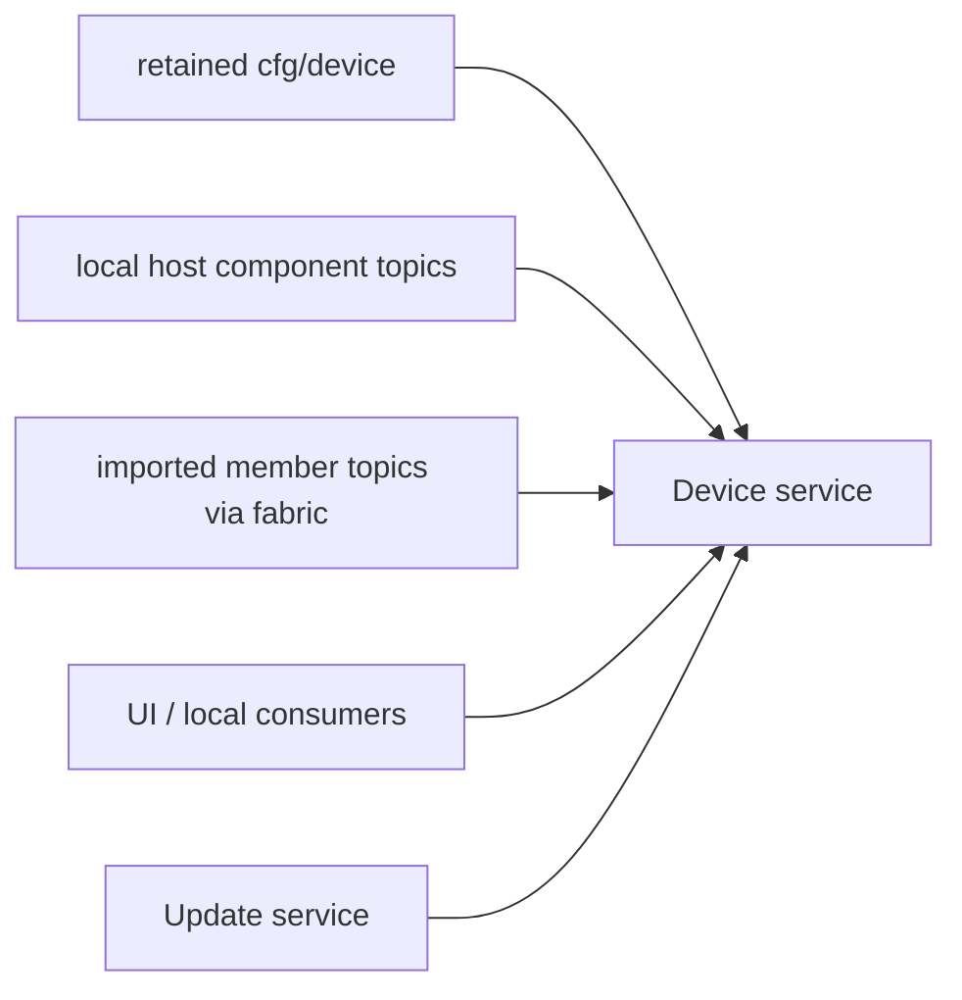
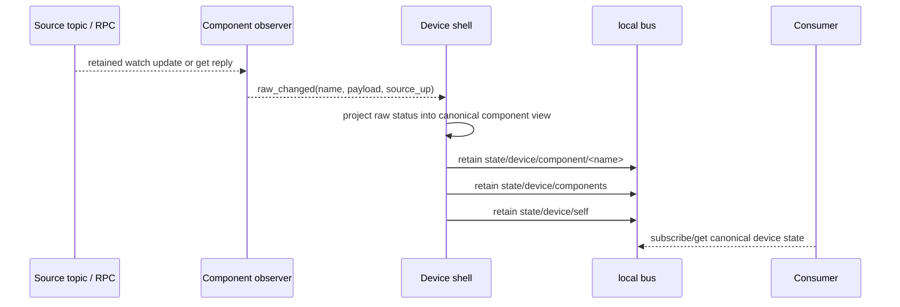
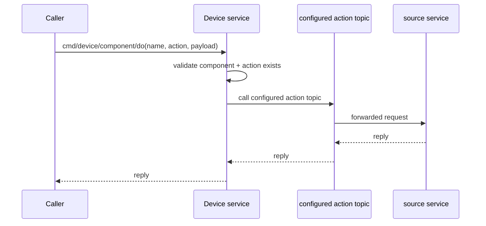

# Device Service

## Description

The Device Service is an application-layer service responsible for:

1. **Component projection** — maintaining a small canonical local model of device components, combining host and member-backed component definitions from retained configuration.
2. **Status observation** — observing each configured component via one status watch topic and one optional status RPC topic, and tracking whether the source is currently up or unavailable.
3. **Retained state publication** — publishing per-component retained views plus component software and update facets, along with aggregate self and component summaries.
4. **Local command façade** — exposing stable device-level command topics for component listing, component status retrieval, and component action dispatch.

The service does not talk to HAL directly. It consumes whatever topics and call surfaces its configured components define. This makes it the canonical **appliance-level façade** over local host components and remote/member-backed components alike.

## Dependencies

### Consumed retained configuration

| Topic | Usage |
|-------|-------|
| `{'cfg','device'}` | Component configuration. Retained; replayed on startup. |

### Consumed service topics

The service consumes whichever topics are named in each component definition:

| Source | Usage |
|--------|-------|
| `status_topic` | Retained or non-retained status watch for the component. |
| `get_topic` | Optional RPC topic used for an initial status fetch and explicit `get` requests. |
| `actions.*` | RPC topics used when `cmd/device/component/do` dispatches an action. |

There is no hard-coded HAL dependency other than the default built-in `cm5` component definition.

## Configuration

Received via retained bus message on `{'cfg','device'}`.

Schema:

```lua
{
  schema = 'devicecode.config/device/1',
  components = {
    [<name>] = {
      class = <string|nil>,
      subtype = <string|nil>,
      role = <string|nil>,
      member = <string|nil>,
      member_class = <string|nil>,
      link_class = <string|nil>,
      present = <boolean|nil>,
      status_topic = <topic|nil>,
      get_topic = <topic|nil>,
      actions = {
        [<action_name>] = <topic>,
      } | nil,
    }
  }
}
```

### Default component set

Even with no config, the service includes a built-in `cm5` host component:

```lua
cm5 = {
  class = 'host',
  subtype = 'cm5',
  role = 'primary',
  member = 'local',
  status_topic = { 'cap', 'updater', 'cm5', 'state', 'status' },
  get_topic = { 'cap', 'updater', 'cm5', 'rpc', 'status' },
  actions = {
    prepare_update = { 'cap', 'updater', 'cm5', 'rpc', 'prepare' },
    stage_update   = { 'cap', 'updater', 'cm5', 'rpc', 'stage' },
    commit_update  = { 'cap', 'updater', 'cm5', 'rpc', 'commit' },
  }
}
```

Configured components replace or extend this default set. If `cfg.components` is present, the service rebuilds the effective component map from defaults plus the configured overrides.

## Exposed command topics

The service binds four stable command topics:

| Topic | Usage |
|-------|-------|
| `{'cmd','device','get'}` | Get the aggregate local device/self payload. |
| `{'cmd','device','component','list'}` | List all public component views. |
| `{'cmd','device','component','get'}` | Get one public component view by name. |
| `{'cmd','device','component','do'}` | Perform a named component action via its configured call topic. |

### `cmd/device/get`

Request payload is ignored.

Response:

```lua
{
  ok = true,
  device = <self payload>
}
```

### `cmd/device/component/list`

Request payload is ignored.

Response:

```lua
{
  ok = true,
  components = { <component view>, ... }
}
```

### `cmd/device/component/get`

Request:

```lua
{ component = <string> }
```

Response:

```lua
{
  ok = true,
  component = <component view>
}
```

Fails if the component is unknown.

### `cmd/device/component/do`

Request:

```lua
{
  component = <string>,
  action = <string>,
  args = <table|nil>,
  timeout = <number|nil>,
}
```

The service looks up `component.operations[action].call_topic` and issues a local bus call to that topic.

Response:

```lua
{
  ok = true,
  result = <call reply>
}
```

Fails if:
- the component is unknown
- the action is missing/unsupported
- the underlying call fails.

## Retained topics published

The service publishes the following retained topics.

| Topic | Payload kind |
|-------|--------------|
| `{'state','device','self'}` | `device.self` |
| `{'state','device','components'}` | `device.components` |
| `{'state','device','component', <name>}` | `device.component` |
| `{'state','device','component', <name>, 'software'}` | `device.component.software` |
| `{'state','device','component', <name>, 'update'}` | `device.component.update` |

These are republished whenever a component becomes dirty or the summary becomes dirty.

## Component observation model

For each component, the service spawns one observer child.

Observer behaviour:

1. If `get_topic` exists, issue one initial call with empty args and timeout `0.5s`.
2. If the call returns a value, emit a `raw_changed` event with that payload.
3. If `watch_topic` exists, subscribe to it with bounded buffering.
4. For each received message, emit a `raw_changed` event with `msg.payload` if present, otherwise the message itself.
5. If the subscription closes, emit `source_down` with a textual reason and exit the child.

The service then updates component state as follows:

- `raw_changed` → `raw_status = payload`, `source_up = true`, `source_err = nil`
- `source_down` → `raw_status = { state = 'unavailable', err = <reason> }`, `source_up = false`, `source_err = <reason>`

This means the service does **not** interpret status payloads deeply. It treats them as component-provided raw status and projects a stable, canonical device view from that raw record.

## Projected component view

A component view has this shape:

```lua
{
  kind = 'device.component',
  ts = <monotonic seconds>,
  component = <name>,
  class = <string>,
  subtype = <string>,
  role = <string>,
  member = <string>,
  member_class = <string>,
  link_class = <string|nil>,
  present = <boolean>,
  available = <boolean>,
  health = 'ok' | 'degraded' | 'unknown',
  state = <string|nil>,
  version = <string|nil>,
  incarnation = <number|nil>,
  actions = { [<action>] = true, ... },
  facets = {
    software = {
      version = <string|nil>,
      incarnation = <number|nil>,
    },
    update = {
      state = <string|nil>,
    },
  },
  status = <raw status payload>,
  source = {
    member = <string>,
    member_class = <string>,
    link_class = <string|nil>,
    role = <string>,
    status = {
      watch_topic = <topic|nil>,
      get_topic = <topic|nil>,
    },
  }
}
```

Projection rules:

- `state` comes from `status.state` or `status.status` or `status.kind`
- `version` comes from `status.version` or `status.fw_version`
- `incarnation` comes from `status.incarnation` or `status.generation`
- `update.state` comes from `status.updater_state` if present, otherwise from `state`
- `health` is:
  - `unknown` if there is no raw status
  - `degraded` if `state` is `failed` or `unavailable`
  - `ok` otherwise

## Aggregate summaries

### `state/device/components`

Contains compact per-component entries and counts:

```lua
{
  kind = 'device.components',
  ts = <monotonic seconds>,
  components = {
    [<name>] = {
      class = ...,
      subtype = ...,
      role = ...,
      member = ...,
      member_class = ...,
      link_class = ...,
      present = <boolean>,
      available = <boolean>,
      health = <string>,
      state = <string|nil>,
      version = <string|nil>,
      incarnation = <number|nil>,
      actions = { ... },
    }
  },
  counts = {
    total = <integer>,
    available = <integer>,
    degraded = <integer>,
  }
}
```

### `state/device/self`

Contains the same component summary and counts, wrapped as the canonical device/self payload.

## Service Flow

### Device main fiber

```mermaid
flowchart TD
  St[Start] --> A(Watch retained cfg/device)
  A --> B(Bind cmd/device/get, component/list, component/get, component/do)
  B --> C(Build default component state)
  C --> D(Spawn observer child per component)
  D --> E{choice: cfg event, observer event, self get, list, get, do, changed pulse}
  E -->|cfg retain/unretain| F(Apply config, mark all dirty, rebuild observers)
  F --> G(Signal changed)
  G --> E
  E -->|raw_changed| H(Update component raw_status/source_up)
  H --> G
  G --> E
  E -->|source_down| I(Mark component unavailable)
  I --> G
  G --> E
  E -->|changed pulse| J(Publish dirty component views)
  J --> K(Publish summary and self if needed)
  K --> E
  E -->|cmd/device/get| L(Reply with self payload)
  L --> E
  E -->|component/list|get| M(Reply with component view/list)
  M --> E
  E -->|component/do| N(Call configured action topic and reply)
  N --> E
```


## Additional Review Diagrams

### Service position in the platform



### Component projection pipeline



### Action dispatch path



## Architecture

- The service is deliberately **thin**: it does not implement device policy or hardware drivers.
- Each component is modelled by:
  - metadata (`class`, `subtype`, `role`, `member`, …)
  - one status watch topic
  - one optional status get topic
  - zero or more named action call topics
- All observers are independent child scopes. In the normal watch-closure path a source emits `source_down`, the component is marked unavailable, and observers are rebuilt on config change or service restart.
- The service is the canonical place where local and remote components acquire a stable, appliance-level shape.
- Raw component status is preserved in the published `status` field; the service does not discard source detail.
