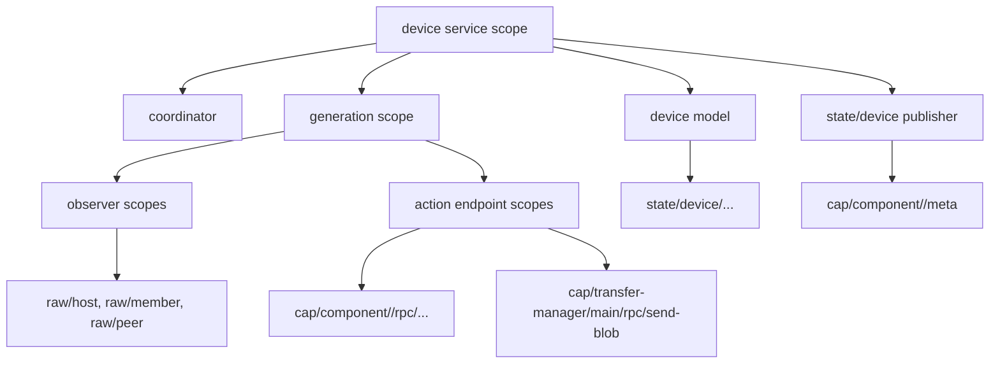
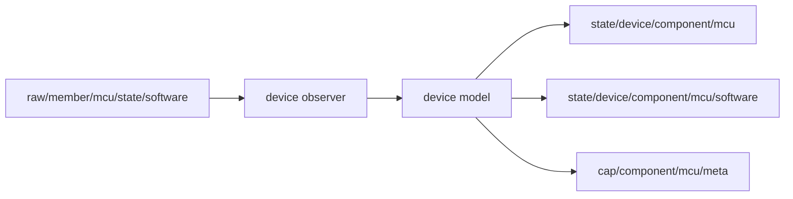

# Device service guide

## Purpose

Device owns composed appliance truth.

It observes raw local, member and Fabric-imported facts and publishes stable appliance-facing component state.

Device is responsible for:

```text
component catalogue
component state
component software/update projections
component capability metadata/status
curated component actions
raw-source provenance references
```

Device is not HAL. Device curates raw facts. It is not a raw RPC mirror.

## Lifetime shape


```mermaid
flowchart TD
  DeviceScope["device service scope"] --> Coordinator["coordinator"]
  DeviceScope --> Model["device model"]
  DeviceScope --> Publisher["state/device publisher"]
  DeviceScope --> Generation["generation scope"]

  Generation --> Observers["observer scopes"]
  Generation --> Actions["action endpoint scopes"]

  Observers --> Raw["raw/host, raw/member, raw/peer"]
  Actions --> ComponentCaps["cap/component/<component>/rpc/..."]
  Actions --> Transfer["cap/transfer-manager/main/rpc/send-blob"]

  Model --> State["state/device/..."]
  Publisher --> ComponentMeta["cap/component/<component>/meta"]
```

The service model outlives generations. Catalogue-dependent observers and action endpoints belong to the generation.

## Public surfaces

Device should publish:

```text
svc/device/status
svc/device/meta
cfg/device

state/device/identity
state/device/components
state/device/component/<component>
state/device/component/<component>/software
state/device/component/<component>/update

cap/component/<component>/meta
cap/component/<component>/status
cap/component/<component>/rpc/<method>
```

Component capability metadata should include backing raw sources or interfaces where relevant.

Example:

```text
cap/component/mcu/meta
  backing:
    facts:
      software: raw/member/mcu/state/software
    actions:
      stage-update: raw/member/mcu/cap/update/main/rpc/stage
```

## Raw versus composed truth


```mermaid
flowchart LR
  RawSoftware["raw/member/mcu/state/software"] --> Observer["device observer"]
  Observer --> Model["device model"]
  Model --> Component["state/device/component/mcu"]
  Model --> Software["state/device/component/mcu/software"]
  Model --> CapMeta["cap/component/mcu/meta"]
```

Raw provider facts stay under `raw/...`. Device publishes the composed appliance view under `state/device/...`.

## Action rules

Component actions are public curated controls:

```text
cap/component/<component>/rpc/prepare-update
cap/component/<component>/rpc/stage-update
cap/component/<component>/rpc/commit-update
```

A non-trivial action should run in a request/action scope. The coordinator admits or rejects. The worker waits.

Actions admitted from public component bus requests must use the canonical request-owner cancellation path:

```lua
scoped_work.start {
  ...,
  cancel_op = owner:caller_cancel_op(),
}
```

If the caller abandons the action request, the action scope is cancelled and late completion must not reply to the abandoned bus request.

Fabric-stage action rules:

```text
open source inside action scope
install termination before waits
call cap/transfer-manager/main/rpc/send-blob
transfer ownership only after successful admission
sanitize ownership internals from public replies
```

## Reviewer checklist

```text
Only Device publishes state/device/...
Raw facts are not mirrored wholesale.
Component ids are stable appliance ids, not raw topology ids.
Capability metadata preserves provenance.
Actions run in request/action scopes.
Action request scopes observe caller abandonment through owner:caller_cancel_op().
Fabric-stage receiver topics use raw/.../cap/.../rpc/...
Model updates are non-yielding.
Publication failures are explicit.
Config replacement cancels generation-owned observers and actions.
```
