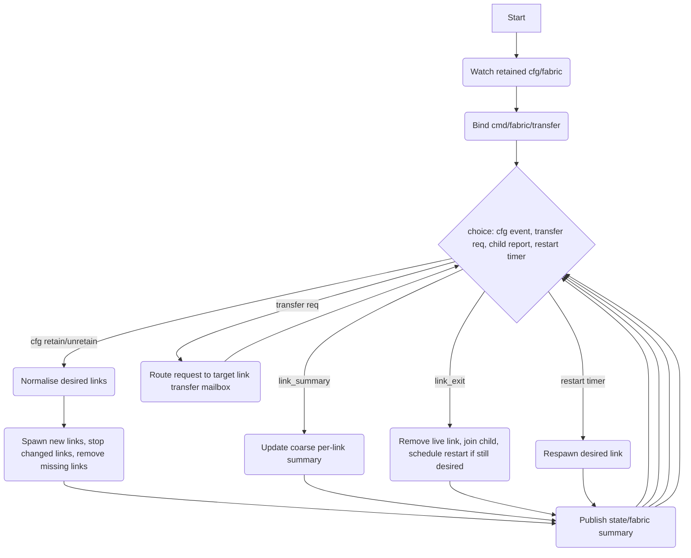
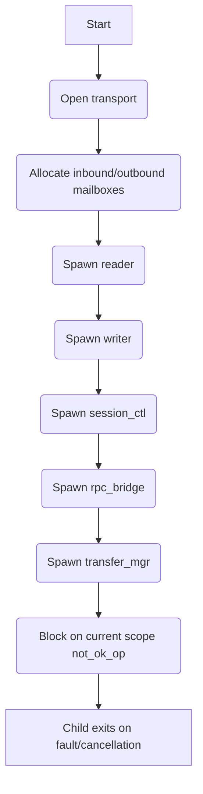
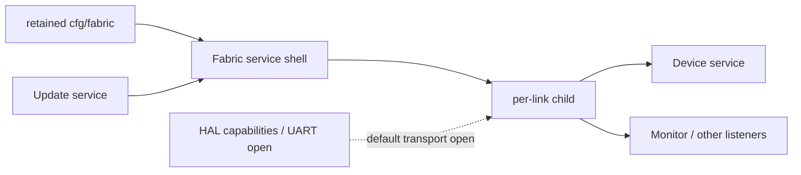
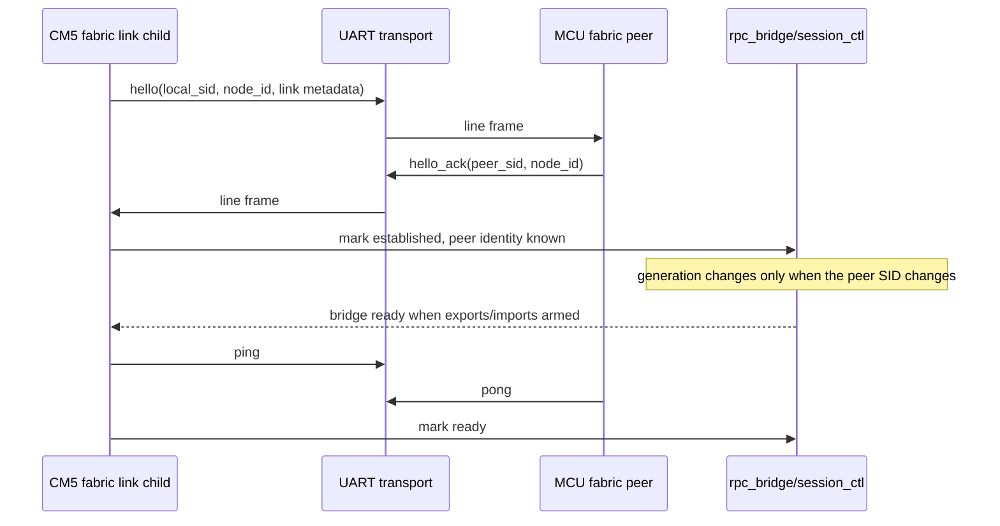
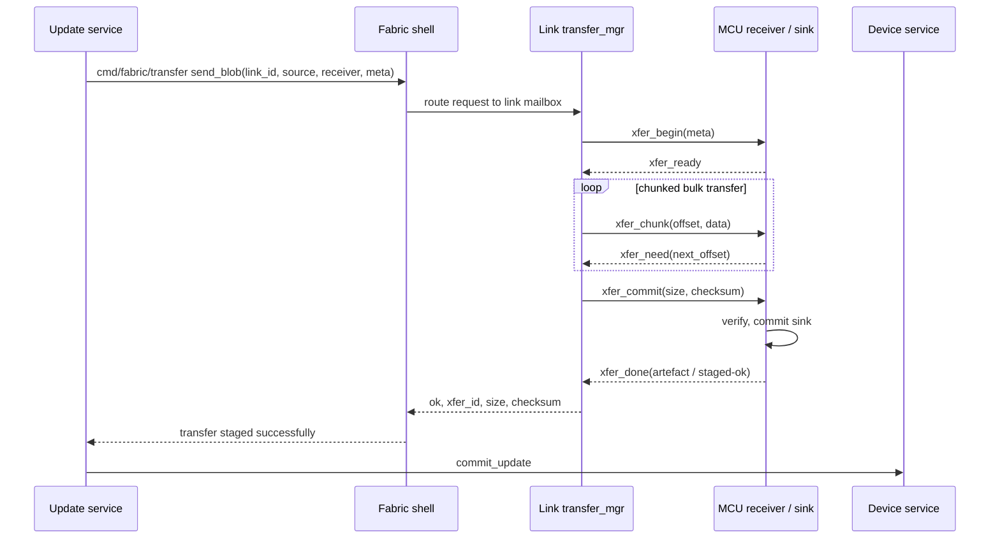

# Fabric Service

## Description

The Fabric Service is an application-layer service responsible for:

1. **Link supervision** — consuming retained `cfg/fabric`, normalising the desired link set, and supervising one child link scope per configured link.
2. **Session establishment and liveness** — opening the configured transport, exchanging `hello` / `hello_ack`, tracking generation and readiness, and publishing per-link session state.
3. **RPC/pub-sub bridging** — exporting selected local pub/sub and retained topics to the peer, importing selected peer topics into the local bus, and proxying request/reply calls in both directions according to configured topic-map rules.
4. **Blob transfer** — exposing a service-level transfer RPC (`cmd/fabric/transfer`), routing requests to the target link, and managing staged incoming and outgoing transfers.
5. **Aggregate fabric state** — publishing a retained summary of desired links, live links, and coarse per-link readiness under `state/fabric`.

The service itself is a **shell**: it owns desired-vs-live link supervision, aggregate retained state, and the service-level transfer endpoint. Each link child owns all per-link mechanics:

- transport
- session control
- RPC bridge
- transfer manager

This keeps restart policy and aggregate state in one place, while isolating link faults to child scopes.

## Dependencies

### Consumed retained configuration

| Topic            | Usage |
|-----------------|-------|
| `{'cfg','fabric'}` | Desired link configuration. Retained; replayed on startup. |

### HAL capabilities consumed indirectly

The shell does not talk to HAL directly, but each link child may open a transport through the `transport_uart` adapter. By default this uses a HAL capability with:

| Capability class | Id source | Usage |
|------------------|-----------|-------|
| `uart` (default) | `cfg.transport.id` or `cfg.capability_id` or `cfg.uart_id` or `link_id` | Open a `fibers` Stream via control verb `open`. |

A custom transport may instead be supplied by `cfg.transport.open(conn, link_id, cfg)`.

### Service-level command endpoint exposed

| Topic | Usage |
|-------|-------|
| `{'cmd','fabric','transfer'}` | Start, query, or abort a transfer on a specific link. |

### Per-link retained state published

Each child link retains component state under:

| Topic | Owner |
|-------|-------|
| `{'state','fabric','link', <link_id>, 'session'}` | `session_ctl` |
| `{'state','fabric','link', <link_id>, 'bridge'}` | `rpc_bridge` |
| `{'state','fabric','link', <link_id>, 'transfer'}` | `transfer_mgr` |

The shell retains the aggregate summary under:

| Topic | Payload kind |
|-------|---------------|
| `{'state','fabric'}` | `fabric.summary` |

## Configuration

Received via retained bus message on `{'cfg','fabric'}`.

The service accepts either:

- a payload whose `data.links` field is a table keyed by link id, or
- a top-level table of link records.

Each link record is cloned into the shell’s desired-state table and must include a non-empty id, taken from:

- `id`
- or `link_id`
- or the table key.

### Configuration schema (effective)

```lua
{
  links = {
    [<link_id>] = {
      id = <string>,
      node_id = <string|nil>,
      member_class = <string|nil>,
      link_class = <string|nil>,

      -- restart policy
      restart_backoff_s = <number|nil>,

      -- transport selection
      capability_id = <string|nil>,
      uart_id = <string|nil>,
      transport = {
        class = <string|nil>,         -- default 'uart'
        id = <string|nil>,
        terminator = <string|nil>,    -- default '\n'
        open_verb = <string|nil>,     -- default 'open'
        open_opts = <table|nil>,
        read = <boolean|nil>,
        write = <boolean|nil>,
        open = <function|nil>,        -- custom transport factory
      },

      -- session behaviour
      hello_interval_s = <number|nil>,
      ping_interval_s = <number|nil>,
      liveness_timeout_s = <number|nil>,
      read_timeout_s = <number|nil>,
      bad_frame_limit = <number|nil>,
      bad_frame_window_s = <number|nil>,

      -- writer scheduling
      rpc_quantum = <number|nil>,
      bulk_quantum = <number|nil>,

      -- transfer behaviour
      chunk_size = <number|nil>,
      transfer_phase_timeout_s = <number|nil>,

      -- bridge rules
      export_publish_rules = { <rule>, ... } | nil,
      export_retained_rules = { <rule>, ... } | nil,
      import_rules = { <rule>, ... } | nil,
      outbound_call_rules = { <rule>, ... } | nil,
      inbound_call_rules = { <rule>, ... } | nil,
      max_pending_calls = <number|nil>,
      max_inbound_helpers = <number|nil>,
      call_timeout_s = <number|nil>,
    }
  }
}
```

### Topic-mapping rules

Rules are declarative prefix mappings normalised by `services.fabric.topicmap`.
A rule may be written with any of the following equivalent fields:

```lua
{
  id = <string|nil>,
  local = { ... } | nil,
  remote = { ... } | nil,
  local_prefix = { ... } | nil,
  remote_prefix = { ... } | nil,
  from = { ... } | nil,
  to = { ... } | nil,
  topic = { ... } | nil,   -- optional exact-match topic
  timeout = <number|nil>,  -- used by outbound call rules
}
```

Semantics:

- `export_publish_rules`: local ephemeral pub/sub → remote `pub retain=false`
- `export_retained_rules`: local retained watch → remote `pub retain=true`
- `import_rules`: remote `pub` / `unretain` → local pub / retain / unretain
- `outbound_call_rules`: local bound endpoint → remote `call`
- `inbound_call_rules`: remote `call` → local bus topic call

## Service-level transfer API

The shell exposes one endpoint:

### `{'cmd','fabric','transfer'}`

The request payload must include:

```lua
{
  link_id = <string>,
  op = 'send_blob' | 'status' | 'abort',
  ...
}
```

Supported operations:

### `send_blob`

```lua
{
  link_id = <string>,
  op = 'send_blob',
  source = <blob source descriptor>,
  xfer_id = <string|nil>,
  receiver = <topic|nil>,
  meta = <table|nil>,
}
```

The shell forwards the request object unchanged to the target link child. The child:

1. normalises the source via `blob_source.normalise_source`
2. sends `xfer_begin`
3. streams chunks and commit frames
4. replies to the original caller only when the remote side acknowledges `xfer_done`

### `status`

```lua
{ link_id = <string>, op = 'status' }
```

Returns the current outgoing/incoming transfer snapshot for that link.

### `abort`

```lua
{ link_id = <string>, op = 'abort', reason = <string|nil> }
```

Aborts any live incoming and outgoing transfer for the link.

### Failure cases

The shell rejects the request if:

- `link_id` is missing
- `op` is unsupported
- the link does not currently exist
- the child transfer mailbox is closed/full.

## Aggregate retained summary

The shell retains:

```lua
{
  kind = 'fabric.summary',
  component = 'summary',
  ts = <monotonic seconds>,
  status = {
    desired = <integer>,
    live = <integer>,
  },
  links = {
    [<link_id>] = {
      state = <string>,
      ready = <boolean>,
      established = <boolean>,
      generation = <number|nil>,
      member_class = <string|nil>,
      link_class = <string|nil>,
      node_id = <string|nil>,
    }
  }
}
```

The aggregate summary is updated when:

- config changes
- a child publishes a new coarse summary
- a child exits
- a desired link is restarted.

## Per-link responsibilities

## Session control (`session_ctl`)

Owns:
- `state/fabric/link/<id>/session`

Responsibilities:
- generate `local_sid`
- handle `hello`, `hello_ack`, `ping`, `pong`
- track `peer_sid`, `peer_node`, `generation`
- maintain `established` and `ready`
- detect liveness timeout
- bump generation on new handshakes
- publish coarse link summary back to the shell

Retained payload shape:

```lua
{
  kind = 'fabric.link.session',
  link_id = <id>,
  component = 'session',
  ts = <monotonic seconds>,
  status = {
    state = 'opening' | 'establishing' | 'ready' | 'down',
    local_sid = <string>,
    peer_sid = <string|nil>,
    peer_node = <string|nil>,
    generation = <number>,
    last_rx_at = <number|nil>,
    last_tx_at = <number|nil>,
    last_pong_at = <number|nil>,
    established = <boolean>,
    ready = <boolean>,
  }
}
```

`ready` is true only when:
- the session is established, and
- the RPC bridge has reported readiness.

## RPC bridge (`rpc_bridge`)

Owns:
- `state/fabric/link/<id>/bridge`

Responsibilities:
- subscribe to local export pub/sub topics
- watch local retained topics for replayable export
- bind local outbound endpoints and turn requests into remote `call` frames
- accept remote `pub`, `unretain`, `call`, and `reply` frames
- maintain a pending call table with timeouts
- maintain a bounded helper pool for inbound local calls
- re-replay retained export cache when a new session becomes established

Retained bridge payload includes coarse counts and readiness, with pending-call/helper load tracked by the bridge component.

## Transfer manager (`transfer_mgr`)

Owns:
- `state/fabric/link/<id>/transfer`

Responsibilities:
- manage one outgoing transfer and one incoming transfer per link
- normalise sources
- stream chunked bulk data
- verify incoming size/checksum
- commit incoming sink
- optionally deliver the committed artefact to a local receiver topic
- abort on timeout or session generation change

Outgoing flow:
1. receive `send_blob`
2. normalise source
3. send `xfer_begin`
4. wait for `xfer_ready`
5. send `xfer_chunk` frames, paced by `xfer_need`
6. send `xfer_commit`
7. await `xfer_done`
8. reply `{ ok=true, xfer_id, size, checksum }`

Incoming flow:
1. receive `xfer_begin`
2. open sink (default `memory_sink` if no custom sink factory is supplied)
3. reply `xfer_ready`
4. accept ordered `xfer_chunk` frames
5. send `xfer_need` after each accepted chunk
6. on `xfer_commit`, verify size and checksum
7. commit sink to an artefact
8. if `meta.receiver` is a topic, call it with `{ link_id, xfer_id, size, checksum, meta, artefact }`
9. send `xfer_done`

Retained transfer payload reports:
- `idle`
- outgoing/incoming state
- offsets
- size
- checksum on completion
- latest transfer error if any.

## Reader / writer scheduling

### Reader
The reader:
- reads line-delimited frames from the transport
- decodes and validates via `protocol.decode_line`
- classifies frames into control / rpc / transfer mailboxes
- reports RX activity timestamps to session control.

Bad frames are tolerated up to:
- `bad_frame_limit` within `bad_frame_window_s`

After that the reader faults the link child.

### Writer
The writer:
- consumes pre-encoded writer items from three queues: control, rpc, bulk
- gives strict priority to control
- applies weighted round-robin between rpc and bulk using `rpc_quantum` and `bulk_quantum`
- writes line-delimited frames to the transport
- reports TX activity timestamps.

## Protocol classes

Supported frame classes are defined in `services.fabric.protocol`.

### Control
- `hello`
- `hello_ack`
- `ping`
- `pong`
- `xfer_begin`
- `xfer_ready`
- `xfer_need`
- `xfer_commit`
- `xfer_done`
- `xfer_abort`

### RPC/pub-sub
- `pub`
- `unretain`
- `call`
- `reply`

### Bulk
- `xfer_chunk`

All frames are JSON-encoded line-delimited objects.

## Service Flow

### Fabric shell



### Link child




## Additional Review Diagrams

### Service position in the platform



### Session establishment sequence



### MCU firmware transfer over fabric



## Architecture

- The shell owns `desired`, `links`, and restart scheduling.
- Each link child owns all mechanics below the aggregate state line.
- Link faults are isolated to child scopes; the shell decides whether to restart.
- All retained state written by the service is best-effort and monotonic-time stamped.
- The transport contract is a `fibers` Stream opened from HAL by default, but a custom transport factory may be injected per link.
- Transfer delivery to a receiver topic happens **after** incoming sink commit, so receivers operate on an artefact object, not on raw transfer chunks.
