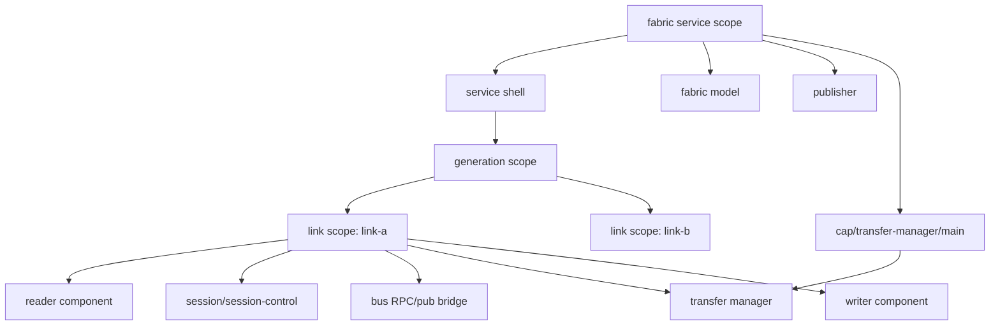

# Fabric service guide

## Purpose

Fabric owns local link/session orchestration and cross-node message and transfer plumbing.

It is responsible for:

```text
configured links
link lifecycle
session establishment
bus publish/call bridging
imported retained state cleanup
transfer-manager capability
fabric-domain state publication
```

Fabric is not the Device service. It does not publish appliance composition truth.

## Lifetime shape


```mermaid
flowchart TD
  FabricScope["fabric service scope"] --> Shell["service shell"]
  FabricScope --> Model["fabric model"]
  FabricScope --> Publisher["publisher"]
  FabricScope --> TransferCap["cap/transfer-manager/main"]

  Shell --> Generation["generation scope"]
  Generation --> LinkA["link scope: link-a"]
  Generation --> LinkB["link scope: link-b"]

  LinkA --> Reader["reader component"]
  LinkA --> Session["session/session-control"]
  LinkA --> Bridge["bus RPC/pub bridge"]
  LinkA --> Transfer["transfer manager"]
  LinkA --> Writer["writer component"]

  TransferCap --> Transfer
```

A generation owns configured links. A link owns its transport, session machinery, bridge and transfer lanes.

## Public surfaces

Fabric should publish:

```text
svc/fabric/status
svc/fabric/meta
cfg/fabric

state/fabric/link/<link>
state/fabric/link/<link>/component/<component>

cap/transfer-manager/main/meta
cap/transfer-manager/main/status
cap/transfer-manager/main/rpc/send-blob
```

Imported remote truth should be provenance-bearing:

```text
raw/member/<source>/...
raw/peer/<source>/...
```

Fabric summaries belong under `state/fabric/...`; imported peer/member facts belong under `raw/...`.

## Coordinator events

Typical Fabric events:

```text
config changed
generation completed
link completed
link state changed
transfer request received
session established
session dropped
publisher requested
```

Coordinator branches should not perform link I/O. Link I/O belongs in link components.

## Ownership rules

```text
service owns model and public transfer-manager capability
generation owns configured link scopes
link owns transport/session/bridge/transfer resources
transfer attempt owns source handoff until receiver accepts it
reader/writer own stream-side waits
```

Transfer handoff must be explicit:

```text
before admission: caller owns source cleanup
after successful receiver admission: receiver owns source cleanup
on failed admission: caller still terminates source
```

Public transfer-manager requests are caller-owned bus requests. They should be admitted as `scoped_work`, not raw spawned fibres, and should pass `cancel_op = owner:caller_cancel_op()`. If the caller abandons `send-blob`, the transfer request scope is cancelled, source ownership is terminated or released according to the current handoff point, and late completion must not reply to the abandoned request.

Local-to-remote bridge calls follow the same rule where the local bus caller is the owner. Remote-to-local bridge work is cancelled by Fabric session/protocol state rather than by `caller_cancel_op()` unless a local bus `Request` is the admitted owner.

## Reviewer checklist

```text
Link work is scoped.
Link completions carry link id and generation.
Imported retained state is cleared on peer session drop.
Transfer source ownership is transferred visibly.
send-blob does not leak ownership internals in public replies.
send-blob request work observes caller abandonment through owner:caller_cancel_op().
Local-to-remote bridge calls propagate caller cancellation into outbound scoped work.
Fabric state is under state/fabric/...
Public transfer manager is under cap/transfer-manager/...
No Fabric coordinator branch waits on transport or bus calls.
```
