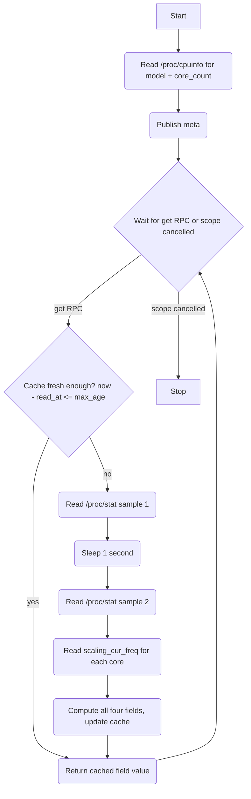

# CPU Driver (HAL)

## Description

The CPU driver is a HAL component that exposes CPU metrics to the rest of the system via a single `cpu` capability. It provides utilisation and frequency readings sourced from `/proc/stat` and `/sys/devices/system/cpu/cpuN/cpufreq/scaling_cur_freq`. The model string and core count are read once at startup from `/proc/cpuinfo` and published in the capability meta.

All metrics are available via a single `get` RPC offering that accepts a `field` name and a `max_age` parameter. The driver maintains a shared cache of the last full set of computed readings. Any `get` call within `max_age` seconds of the last read is served from cache, avoiding the blocking 1-second double-sample required for utilisation calculation.

The CPU driver is created and owned by the Sysmon Manager. It does not manage its own lifecycle.

## Dependencies

None. The driver reads directly from procfs and sysfs.

## Initialisation

On creation by the Sysmon Manager:

1. Read `/proc/cpuinfo` to determine CPU model string and core count.
2. Publish capability `meta` — includes model and core count.
3. Start the RPC handler fiber.

The readings cache is empty at startup. The first `get` call always triggers a fresh read.

## Capability

Class: `cpu`
Id: `'1'`

### Meta (retained)

Topic: `{'cap', 'cpu', '1', 'meta'}`

```lua
{
  provider   = 'hal',
  version    = 1,
  model      = <string>,   -- cpu model string e.g. "Qualcomm Atheros QCA9558"
  core_count = <number>,   -- number of logical cores
}
```

### Offerings

#### get

Topic: `{'cap', 'cpu', '1', 'rpc', 'get'}`

Input (`CpuGetOpts`):

```lua
{
  field   = <string>,  -- required: one of the field names listed below
  max_age = <number>,  -- required: maximum acceptable age of reading in seconds
}
```

Available fields:

| Field              | Type            | Description                                    |
|--------------------|-----------------|------------------------------------------------|
| `utilisation`      | number          | Overall CPU utilisation as a percentage (0–100)|
| `core_utilisations`| table           | Per-core utilisation `{ cpu0 = %, cpu1 = %, ... }` |
| `frequency`        | number          | Average frequency across all cores in kHz      |
| `core_frequencies` | table           | Per-core frequency `{ cpu0 = kHz, cpu1 = kHz, ... }` |

Reply on success:

```lua
{ ok = true, reason = <field value> }
```

Reply on failure:

```lua
{ ok = false, reason = <error string> }
```

If the requested `field` string is not one of the four above, the driver replies with `ok = false`.

## Cache Behaviour

The driver uses `shared/cache.lua` (`cache.new()`), storing each field under its field name as the key. The `max_age` value from the RPC request is passed as the timeout to `cache:get(field, max_age)`.

On any `get` call:

1. Call `cache:get(field, max_age)`. If a non-nil value is returned, reply with it immediately.
2. Otherwise perform a fresh read and call `cache:set` for each computed field:
   - For `utilisation` or `core_utilisations`: double-sample `/proc/stat` (with 1-second sleep), compute both fields, then `cache:set('utilisation', value)` and `cache:set('core_utilisations', value)`.
   - For `frequency` or `core_frequencies`: read `scaling_cur_freq` for each core, compute both fields, then `cache:set('frequency', value)` and `cache:set('core_frequencies', value)`.

The two pairs (`utilisation`/`core_utilisations` and `frequency`/`core_frequencies`) are always refreshed together since they derive from the same underlying read. A cache miss for either field in a pair refreshes both.

## Service Flow



## Architecture

- The driver runs a single RPC handler fiber. No autonomous emission; all activity is request-driven.
- The 1-second sleep for utilisation sampling uses a cancellable op so the fiber exits cleanly when the scope is cancelled.
- If `/sys/devices/system/cpu/cpuN/cpufreq/scaling_cur_freq` is not readable for a given core, that core's frequency is omitted from the result without failing the whole call.
- A `finally` block logs the reason for shutdown.
- The driver does not republish meta on the report period — meta is static after startup.
