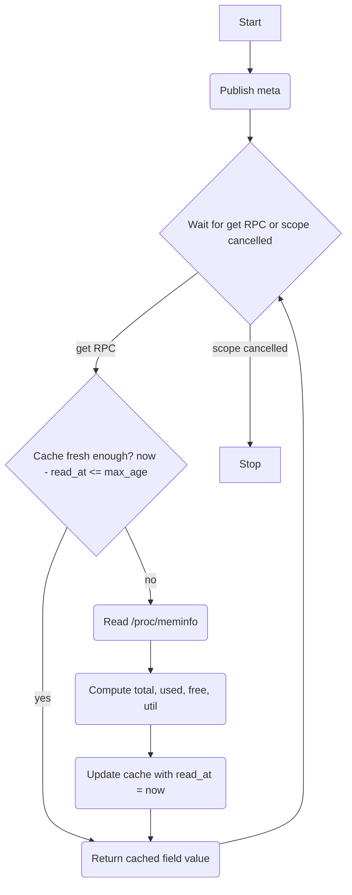

# Memory Driver (HAL)

## Description

The memory driver is a HAL component that exposes RAM metrics to the rest of the system via a single `memory` capability. It sources data from `/proc/meminfo`, computing total, used, free, and utilisation fields.

All metrics are available via a single `get` RPC offering that accepts a `field` name and a `max_age` parameter. The driver maintains a shared cache of the last full set of computed readings. Any `get` call within `max_age` seconds of the last read is served from cache, avoiding a repeated file read.

The memory driver is created and owned by the Sysmon Manager. It does not manage its own lifecycle.

## Dependencies

None. The driver reads directly from procfs.

## Initialisation

On creation by the Sysmon Manager:

1. Publish capability `meta`.
2. Start the RPC handler fiber.

The readings cache is empty at startup. The first `get` call always triggers a fresh read.

## Capability

Class: `memory`
Id: `'1'`

### Meta (retained)

Topic: `{'cap', 'memory', '1', 'meta'}`

```lua
{
  provider = 'hal',
  version  = 1,
}
```

### Offerings

#### get

Topic: `{'cap', 'memory', '1', 'rpc', 'get'}`

Input (`MemGetOpts`):

```lua
{
  field   = <string>,  -- required: one of the field names listed below
  max_age = <number>,  -- required: maximum acceptable age of reading in seconds
}
```

Available fields:

| Field   | Type   | Description                                                                 |
|---------|--------|-----------------------------------------------------------------------------|
| `total` | number | Total RAM in kB                                                             |
| `used`  | number | Used RAM in kB (total minus free, buffers, and cached)                      |
| `free`  | number | Usable free RAM in kB (MemFree + Buffers + Cached)                          |
| `util`  | number | RAM utilisation as a percentage (0–100), computed as `used / total * 100`   |

Reply on success:

```lua
{ ok = true, reason = <field value> }
```

Reply on failure:

```lua
{ ok = false, reason = <error string> }
```

If the requested `field` string is not one of the four above, the driver replies with `ok = false`.

## Cache Behaviour

The driver uses `shared/cache.lua` (`cache.new()`), storing each field under its field name as the key. The `max_age` value from the RPC request is passed as the timeout to `cache:get(field, max_age)`.

On any `get` call:

1. Call `cache:get(field, max_age)`. If a non-nil value is returned, reply with it immediately.
2. Otherwise, read `/proc/meminfo`, compute all four fields, then `cache:set` each:
   - `cache:set('total', value)`, `cache:set('used', value)`, `cache:set('free', value)`, `cache:set('util', value)`.

All four fields are derived from the same single `/proc/meminfo` read and are always updated together on a cache miss, so a subsequent call for a different field within `max_age` will always hit its cache entry.

## Service Flow



## Architecture

- The driver runs a single RPC handler fiber. No autonomous emission; all activity is request-driven.
- A `finally` block logs the reason for shutdown.
- `free` is computed as `MemFree + Buffers + Cached` from `/proc/meminfo`, matching existing system behaviour.
- If `/proc/meminfo` is unreadable, the driver replies with `ok = false` and does not update the cache.
