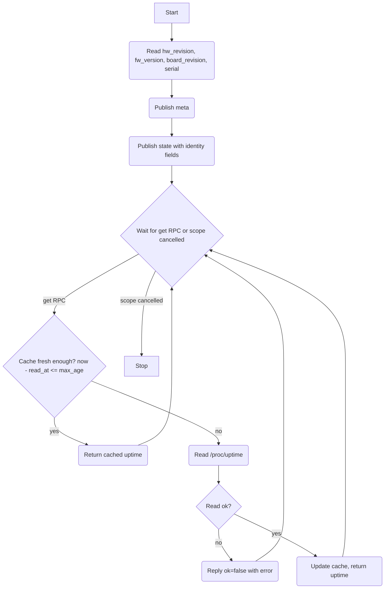

# Platform Driver (HAL)

## Description

The platform driver is a HAL component that exposes hardware and firmware identity information for the host device. It reads static identity fields once at startup and publishes them as retained capability state so any consumer can get them immediately on subscription without making an RPC call. The only dynamic field — system uptime — is available via a `get` RPC with a cache.

A trivial **Platform Manager** owns this driver. It has no discovery logic: it instantiates a single `PlatformDriver`, emits one HAL device-added event, and waits for its scope to be cancelled. The manager behaviour is not complex enough to warrant a separate spec file — it is described inline here.

## Dependencies

- **`fw_printenv`** command: required to read `board_revision`. If the command is unavailable or fails, `board_revision` is published as `nil` without failing startup.

## Initialisation

On startup:

1. Read static identity fields from the filesystem:
   - `hw_revision` from `/etc/hwrevision`
   - `fw_version` from `/etc/fwversion`
   - `board_revision` from `fw_printenv` output (extract `board_revision=` field)
   - `serial` from `/data/serial`
2. Publish capability `meta`.
3. Publish capability `state` with the static identity fields (retained). Fields that could not be read are published as `nil`.
4. Start the RPC handler fiber for `get` (uptime).

## Capability

Class: `platform`
Id: `'1'`

### Meta (retained)

Topic: `{'cap', 'platform', '1', 'meta'}`

```lua
{
  provider = 'hal',
  version  = 1,
}
```

### State (retained)

Topic: `{'cap', 'platform', '1', 'state'}`

Published once at startup and never updated thereafter (these fields are static for the life of the process). Consumers subscribe with retention to get the current values immediately.

```lua
{
  hw_revision    = <string|nil>,  -- e.g. 'bigbox-v1 1.0', nil if unreadable
  fw_version     = <string|nil>,  -- e.g. '1.2.3', nil if unreadable
  board_revision = <string|nil>,  -- e.g. 'rev2', nil if unreadable or fw_printenv unavailable
  serial         = <string|nil>,  -- device serial number, nil if unreadable
}
```

Whitespace is trimmed from all string values.

### Offerings

#### get

Topic: `{'cap', 'platform', '1', 'rpc', 'get'}`

Returns the current system uptime. This is the only dynamic field and the only one that requires an RPC.

Input (`PlatformGetOpts`):

```lua
{
  field   = <string>,   -- required: field to retrieve; currently only 'uptime' is supported
  max_age = <number>,   -- required: maximum acceptable age of reading in seconds
}
```

Available fields:

| Field    | Type   | Description                                   |
|----------|--------|-----------------------------------------------|
| `uptime` | number | System uptime in seconds (float, from `/proc/uptime`) |

Reply on success:

```lua
{ ok = true, reason = <field value> }
```

Reply on failure:

```lua
{ ok = false, reason = <error string> }
```

If the requested `field` string is not a recognised field, the driver replies with `ok = false`.

## Cache Behaviour

The driver uses `shared/cache.lua` (`cache.new()`), storing each field under its field name as the key. The `max_age` value from the RPC request is passed as the timeout to `cache:get(field, max_age)`.

On any `get` call:

1. Call `cache:get(field, max_age)`. If a non-nil value is returned, reply with it immediately.
2. Otherwise, perform the relevant read, call `cache:set(field, value)`, then reply with the value.
   - `uptime`: read `/proc/uptime`, parse the first number, `cache:set('uptime', value)`.

## Service Flow



## Architecture

- The driver runs a single RPC handler fiber for the `get` (uptime) offering.
- Static identity fields are published as retained state at startup — no timer, no re-publication.
- Read failures for static fields at startup are logged as warnings; `nil` is published for the unreadable field rather than aborting startup.
- A `finally` block logs the reason for shutdown.
- The `hw_revision` string may contain a model prefix followed by a version (e.g. `'bigbox-v1 1.0'`). Parsing the model prefix out of `hw_revision` is the responsibility of consumers (e.g. the system service), not this driver.
