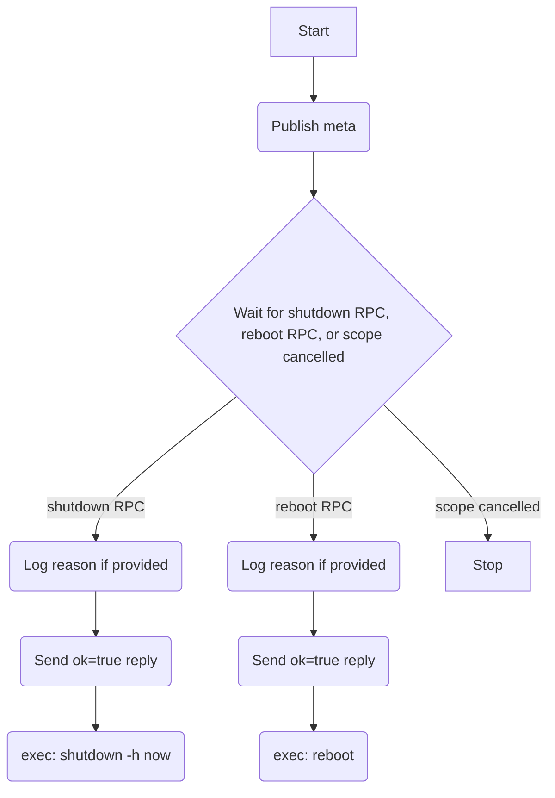

# Power Driver (HAL)

## Description

The power driver is a HAL component that exposes system power control to the rest of the system. It provides two offerings — `shutdown` and `reboot` — that execute the corresponding OS commands. The driver's sole responsibility is to run the command; all orchestration (notifying services, waiting for graceful shutdown) is the responsibility of the caller (the System Service).

A trivial **Power Manager** owns this driver. It has no discovery logic: it instantiates a single `PowerDriver`, emits one HAL device-added event, and waits for its scope to be cancelled. The manager behaviour is not complex enough to warrant a separate spec file — it is described inline here.

## Dependencies

- OS commands `shutdown` and `reboot` must be available on the system `PATH`.

## Initialisation

On startup:

1. Publish capability `meta`.
2. Start the RPC handler fiber.

## Capability

Class: `power`
Id: `'1'`

### Meta (retained)

Topic: `{'cap', 'power', '1', 'meta'}`

```lua
{
  provider = 'hal',
  version  = 1,
}
```

### Offerings

Both offerings accept a `PowerActionOpts` input and send an RPC reply **before** executing the OS command. This is intentional: the command will terminate the process, so the reply must be sent first on a best-effort basis.

#### shutdown

Topic: `{'cap', 'power', '1', 'rpc', 'shutdown'}`

Executes `shutdown -h now`.

Input (`PowerActionOpts`):

```lua
{
  reason = <string|nil>,   -- optional: human-readable reason, logged only
}
```

Reply (sent before command runs):

```lua
{ ok = true, reason = nil }
```

#### reboot

Topic: `{'cap', 'power', '1', 'rpc', 'reboot'}`

Executes `reboot`.

Input (`PowerActionOpts`):

```lua
{
  reason = <string|nil>,   -- optional: human-readable reason, logged only
}
```

Reply (sent before command runs):

```lua
{ ok = true, reason = nil }
```

## Service Flow



## Architecture

- The driver runs a single RPC handler fiber with `op.choice` over both offerings; the fiber exits when its scope is cancelled.
- The RPC reply is sent before the OS command is executed. There is no guarantee the caller receives the reply before the system goes down, but it is best-effort.
- The `reason` field is logged at info level before execution. It is not transmitted or stored beyond the log.
- A `finally` block logs the reason for shutdown of the driver fiber itself (distinct from the system shutdown action).
- The driver does not validate whether the caller has performed any graceful shutdown orchestration. That is entirely the caller's responsibility.
