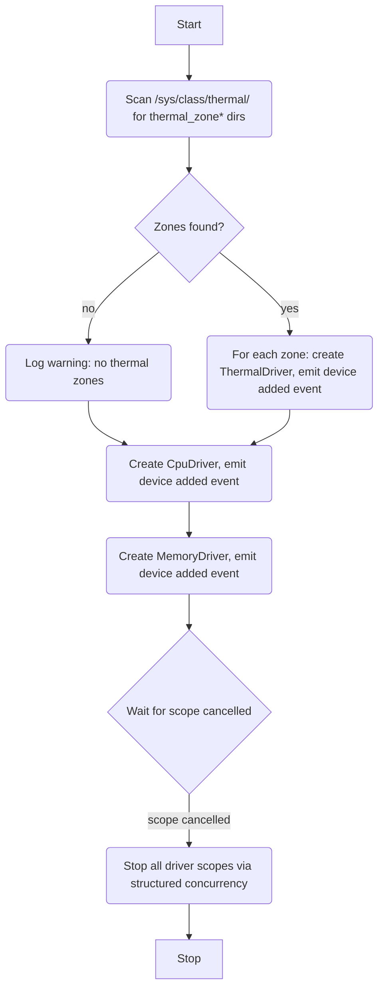

# Sysmon Manager (HAL)

## Description

The Sysmon Manager is a HAL manager that owns the lifecycle of three system monitoring drivers: CPU, Memory, and Thermal. It is responsible for discovering thermal zones at startup, instantiating all drivers, and registering the corresponding capabilities with the HAL service via device events.

The Sysmon Manager owns no capabilities directly — all capabilities are owned by the drivers it creates.

## Dependencies

- Sysfs path `/sys/class/thermal/` must be readable to discover thermal zones. If it is absent or unreadable, no thermal capabilities are registered and the manager logs a warning.

## Initialisation

On startup:

1. Scan `/sys/class/thermal/` for directories matching `thermal_zone*`.
2. For each discovered zone, create a `ThermalDriver` instance and emit a HAL device event (`added`).
3. Create one `CpuDriver` instance and emit a HAL device event (`added`).
4. Create one `MemoryDriver` instance and emit a HAL device event (`added`).

Each device event triggers the HAL service to register the corresponding capability and start its RPC handler fiber.

If no thermal zones are found, log a warning and continue — CPU and memory capabilities are still registered.

## Managed Drivers

| Driver         | Class     | Id                         | Quantity         |
|----------------|-----------|----------------------------|------------------|
| `CpuDriver`    | `cpu`     | `'1'`                      | 1                |
| `MemoryDriver` | `memory`  | `'1'`                      | 1                |
| `ThermalDriver`| `thermal` | `'zone0'`, `'zone1'`, ...  | 1 per sysfs zone |

Thermal zone IDs are derived from the sysfs directory name by stripping the `thermal_` prefix (e.g. `thermal_zone0` → `'zone0'`).

## Manager Interface

The Sysmon Manager implements the standard `Manager` interface:

- `start(scope)` — performs discovery, instantiates drivers, emits device events
- `stop(reason)` — cancels the manager scope; all child driver fibers are stopped via structured concurrency
- `apply_config(config)` — no-op for this manager; system monitoring has no configurable parameters

## Service Flow

## Architecture

- The manager holds references to all driver instances it created so it can stop them cleanly.
- All drivers are started within a child scope of the manager scope. If the manager scope is cancelled, all drivers stop via structured concurrency — no explicit teardown loop is needed.
- The manager does not re-discover zones after startup. If a sysfs zone appears or disappears at runtime, it is not reflected. This is acceptable for the current use case (zones are fixed at boot).
- Thermal zone discovery failure (unreadable sysfs) is a warning, not a fatal error.
- A `finally` block logs the reason for manager shutdown.
