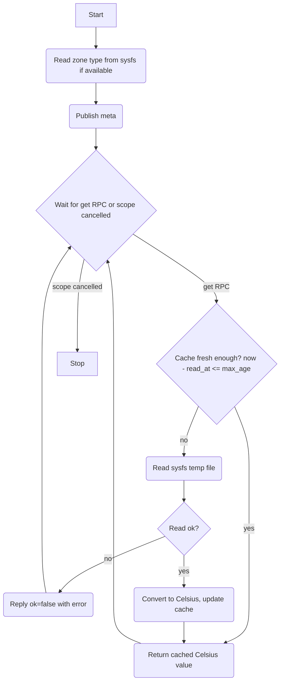

# Thermal Driver (HAL)

## Description

The thermal driver is a HAL component that exposes temperature readings for a single thermal zone to the rest of the system. Temperature is sourced from the Linux sysfs thermal subsystem at `/sys/class/thermal/thermal_zone{N}/temp`, which reports values in milli-degrees Celsius.

One thermal driver instance is created per discovered zone. The Sysmon Manager is responsible for discovering all zones at startup and creating the corresponding drivers.

Each driver exposes a single `get` RPC offering that accepts a `max_age` parameter. The driver caches the last reading, returning cached data for any call within `max_age` seconds.

## Dependencies

None. The driver reads directly from sysfs.

## Initialisation

On creation by the Sysmon Manager:

1. Attempt to read the zone type from `/sys/class/thermal/thermal_zone{N}/type` (optional; used for meta only).
2. Publish capability `meta` for this zone.
3. Start the RPC handler fiber.

The readings cache is empty at startup. The first `get` call always triggers a fresh read.

## Capability

One capability per discovered thermal zone.

Class: `thermal`
Id: zone identifier string, e.g. `'zone0'`, `'zone1'` (derived from the sysfs directory name)

### Meta (retained)

Topic: `{'cap', 'thermal', <zone_id>, 'meta'}`

```lua
{
  provider = 'hal',
  version  = 1,
  zone     = <string>,       -- zone id, e.g. 'zone0'
  path     = <string>,       -- sysfs path to the temp file, e.g. '/sys/class/thermal/thermal_zone0/temp'
  type     = <string|nil>,   -- zone type string if readable (e.g. 'cpu-thermal'), nil otherwise
}
```

### Offerings

#### get

Topic: `{'cap', 'thermal', <zone_id>, 'rpc', 'get'}`

Input (`ThermalGetOpts`):

```lua
{
  max_age = <number>,   -- required: maximum acceptable age of reading in seconds
}
```

Reply on success:

```lua
{ ok = true, reason = <number> }  -- temperature in degrees Celsius (float)
```

Reply on failure:

```lua
{ ok = false, reason = <error string> }
```

Temperature is converted from milli-degrees Celsius by dividing by 1000.

## Cache Behaviour

The driver uses `shared/cache.lua` (`cache.new()`), storing the temperature under the key `'temp'`. The `max_age` value from the RPC request is passed as the timeout to `cache:get('temp', max_age)`.

On any `get` call:

1. Call `cache:get('temp', max_age)`. If a non-nil value is returned, reply with it immediately.
2. Otherwise, read the sysfs temp file, convert to Celsius, call `cache:set('temp', value)`, then reply with the value.

If the sysfs read fails, the driver replies with `ok = false` and does not call `cache:set` (leaving the previous cached value intact for future requests).

## Service Flow



## Architecture

- One driver instance per thermal zone. Each instance runs its own RPC handler fiber.
- No autonomous emission; all activity is request-driven.
- A `finally` block logs the reason for shutdown.
- Zone IDs are derived directly from the sysfs directory name by the Sysmon Manager (e.g. `thermal_zone0` → id `'zone0'`).
- The sysfs `type` file is read once at startup for meta only; it is not re-read during operation.
