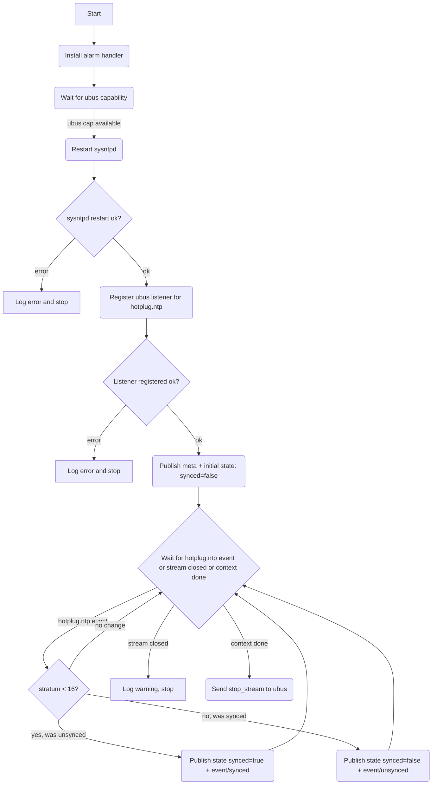

# Time Driver (HAL)

## Description

The time driver is a HAL component that manages the system NTP daemon (`sysntpd`) and exposes a time source capability to the rest of the system. It is responsible for all direct OS interaction related to time synchronisation: restarting the daemon, monitoring kernel hotplug NTP events via ubus, and publishing the current sync state and accuracy metadata as a capability on the bus.

The time driver acts as both a driver and a time manager — it owns the full lifecycle of `sysntpd` within the running session.

## Dependencies

- **ubus capability** (`{'cap', 'ubus', '1', ...}`): required to listen for `hotplug.ntp` kernel events. The driver waits for the ubus capability to become available before starting NTP.

## Initialisation

On startup (once the ubus capability is available):

1. Restart `sysntpd` via `exec.command("/etc/init.d/sysntpd", "restart"):run()`.
2. Register a ubus listener for `hotplug.ntp` events.
3. Publish initial capability `meta` and `state` (initially `synced = false`).

## Capability

The driver publishes a single time source capability. The capability id is a UUID generated at startup. In the future, additional time source capabilities may exist alongside this one.

### Meta (retained)

Topic: `{'cap', 'time', <uuid>, 'meta'}`

```lua
{
  provider  = 'hal',
  source    = 'ntp',           -- time source type
  version   = 1,               -- interface version
  accuracy_seconds = <number|nil>, -- estimated absolute error in seconds
}
```

`accuracy_seconds` is a coarse estimate of absolute clock error and is derived from NTP stratum. Lower values are better. It is `nil` when unsynced (stratum >= 16) or before first sync-quality data is available.

### State (retained)

Topic: `{'cap', 'time', <uuid>, 'state'}`

```lua
{
  synced           = true | false,
  stratum          = <number>,   -- last reported stratum, nil before first event
  accuracy_seconds = <number|nil>,
}
```

Published on every sync/unsync transition. Retained so new subscribers immediately get the current state.

### Events (non-retained)

#### synced

Topic: `{'cap', 'time', <uuid>, 'event', 'synced'}`

Fired when the NTP daemon transitions from unsynced to synced (stratum < 16). Payload:

```lua
{ stratum = <number>, accuracy_seconds = <number|nil> }
```

#### unsynced

Topic: `{'cap', 'time', <uuid>, 'event', 'unsynced'}`

Fired when the NTP daemon transitions from synced to unsynced (stratum == 16 or daemon restarts). Payload:

```lua
{ stratum = 16, accuracy_seconds = nil }
```

These events are non-retained — consumers that need current state should read `{'cap', 'time', '1', 'state'}` first, then subscribe to events for transitions.

## Service Flow



## Architecture

- The driver runs a single main fiber that handles the full lifecycle. No child scope is needed.
- Sync and unsync events are only published on **transitions** — the driver tracks the previous sync state and only emits an event when it changes.
- The retained `state` topic is always updated on any hotplug event regardless of transition, to refresh the stratum value.
- A `finally` block logs the reason for shutdown and performs cleanup (stop_stream if still active).
- The ubus `stream_id` must be stopped cleanly on context cancellation to avoid leaking listener registrations in the ubus driver.
