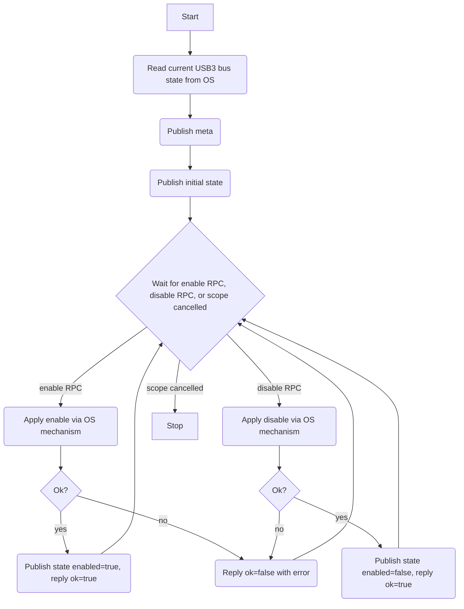

# USB Driver (HAL)

## Description

The USB driver is a HAL component that exposes enable/disable control of a USB bus to the rest of the system. The initial scope covers the USB3 bus only (`id = 'usb3'`), modelled as a fixed capability. The actual mechanism for enabling and disabling the bus is device-specific (sysfs, UCI, or a vendor script) and is considered an implementation detail; this spec defines the interface only.

A trivial **USB Manager** owns this driver. It has no discovery logic: it instantiates a single `UsbDriver` for `usb3`, emits one HAL device-added event, and waits for its scope to be cancelled. The manager behaviour is not complex enough to warrant a separate spec file — it is described inline here.

## Dependencies

The exact OS-level mechanism for bus control is implementation-defined. The driver implementation must document which mechanism it uses.

## Initialisation

On startup:

1. Read the current USB3 bus enable/disable state from the OS (implementation-defined).
2. Publish capability `meta`.
3. Publish initial capability `state` (retained).
4. Start the RPC handler fiber.

If the initial state cannot be determined, assume `enabled = true` and log a warning.

## Capability

Class: `usb`
Id: `'usb3'`

### Meta (retained)

Topic: `{'cap', 'usb', 'usb3', 'meta'}`

```lua
{
  provider = 'hal',
  version  = 1,
  bus      = 'usb3',
}
```

### State (retained)

Topic: `{'cap', 'usb', 'usb3', 'state'}`

```lua
{
  enabled = true | false,
}
```

Updated and republished after every successful `enable` or `disable` call.

### Offerings

#### enable

Topic: `{'cap', 'usb', 'usb3', 'rpc', 'enable'}`

Enables the USB3 bus. Input is an empty table `{}`.

Reply on success:

```lua
{ ok = true, reason = nil }
```

Reply on failure:

```lua
{ ok = false, reason = <error string> }
```

On success, updates retained state to `{ enabled = true }`.

#### disable

Topic: `{'cap', 'usb', 'usb3', 'rpc', 'disable'}`

Disables the USB3 bus. Input is an empty table `{}`.

Reply on success:

```lua
{ ok = true, reason = nil }
```

Reply on failure:

```lua
{ ok = false, reason = <error string> }
```

On success, updates retained state to `{ enabled = false }`.

## Service Flow



## Architecture

- The driver runs a single RPC handler fiber with `op.choice` over both offerings; the fiber exits when its scope is cancelled.
- State is only updated on success; a failed `enable` or `disable` call leaves the retained state unchanged.
- A `finally` block logs the reason for shutdown.
- If a second `enable` is called when already enabled (or `disable` when already disabled), the driver still applies the OS action and updates the retained state. Idempotency is a property of the OS mechanism, not enforced at this layer.
- Future extension to other buses (USB2, etc.) would follow the same pattern with a different `id`. A manager with bus discovery may be introduced at that point.
