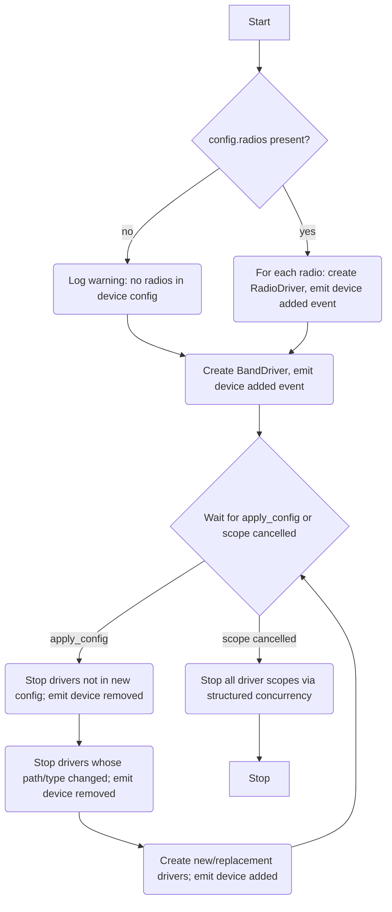

# WLAN Manager (HAL)

## Description

The WLAN Manager is a HAL manager that owns the lifecycle of all wireless drivers: one `RadioDriver` instance per configured radio and one `BandDriver` instance.

The WLAN Manager owns no capabilities directly — all capabilities are owned by the drivers it creates.

## Dependencies

- HAL device config must contain a `radios` table with one entry per physical radio. If `radios` is absent or empty, no radio drivers are started and a warning is logged. The band driver is always started regardless of radio count.

## Initialisation

On startup:

1. Read the HAL device config passed by the HAL service at startup.
2. For each entry in `config.radios`: create a `RadioDriver` instance and emit a HAL device-added event.
3. Create one `BandDriver` instance and emit a HAL device-added event.

Each device-added event triggers the HAL service to register the corresponding capability, bind RPC endpoints, and start the emit-forwarding fiber.

If `config.radios` is absent or not a table, log a warning and start only the band driver.

## Managed Drivers

| Driver        | Class   | Id                           | Quantity                  |
|---------------|---------|------------------------------|---------------------------|
| `RadioDriver` | `radio` | UCI radio name (e.g. `'radio0'`, `'radio1'`) | 1 per entry in `config.radios` |
| `BandDriver`  | `band`  | `'1'`                        | 1                         |

Radio capability IDs are derived from the UCI radio section name as configured in the device config (e.g. `radio0` → `'radio0'`).

## Apply Config

When `apply_config(config)` is called by the HAL service after startup:

1. **Stop removed drivers** — stop any `RadioDriver` instances whose name no longer appears in `config.radios`. Emit a HAL device-removed event for each.
2. **Stop changed drivers** — stop any `RadioDriver` instances whose name is present in `config.radios` but whose `path` or `type` has changed. Emit a HAL device-removed event for each. These will be recreated in the next step.
3. **Start new and changed drivers** — for each entry in `config.radios` that does not have an existing running driver: create a new `RadioDriver` and emit a HAL device-added event.
4. The `BandDriver` instance is not restarted on config update — it is persistent for the lifetime of the manager.

## Manager Interface

The WLAN Manager implements the standard `Manager` interface:

- `start(scope)` — reads device config, instantiates drivers, emits device events.
- `stop(reason)` — cancels the manager scope; all child driver fibers are stopped via structured concurrency.
- `apply_config(config)` — reconciles the running driver set against the new config.

## Service Flow

## Architecture

- All drivers are started within child scopes of the manager scope. If the manager scope is cancelled, all drivers stop automatically via structured concurrency — no explicit teardown loop is needed.
- The manager holds a map of radio name → `{ driver, path, type }` to support reconciliation on `apply_config`. The `path` and `type` fields are compared on each `apply_config` call to detect hardware changes.
- The `BandDriver` is created unconditionally. If the DAWN config is not present on the device, the driver’s `clear` step will fail at the backend level and the capability will not be registered. This is treated as a non-fatal warning.
- UCI access is a concern of the backends only. The `backends/common/uci.lua` module exposes `uci.ensure_started()` — on first call it starts the UCI reactor fiber attached to the **root scope** (not the calling fiber’s scope), so it outlives any individual backend call. Subsequent calls to `ensure_started()` are no-ops. The manager has no dependency on `backends/common/uci.lua`.
- A `finally` block logs the reason for manager shutdown.
