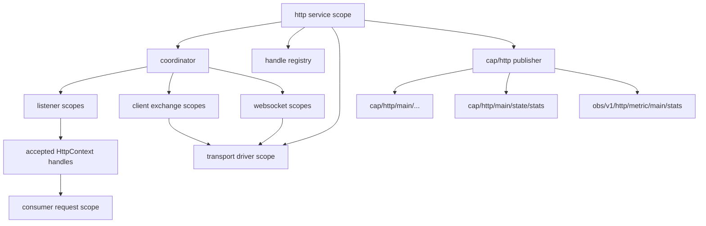

# HTTP service guide

## Purpose

HTTP owns the transport boundary for HTTP and WebSocket work.

It is responsible for:

```text
cqueues/lua-http integration
HTTP listener creation
HTTP client exchange
server-side accepted contexts
WebSocket transport handles
request/response command loops
immediate transport termination
HTTP capability publication
transport observability
```

HTTP is an infrastructure service. UI and other services consume it through public HTTP capability handles.

## Lifetime shape



Callbacks from transport code must not mutate service model state directly. They may update backend-local state and wake an Op-facing boundary.

## Public surfaces

HTTP should publish:

```text
svc/http/status
svc/http/meta
cfg/http

cap/http/main/meta
cap/http/main/status
cap/http/main/rpc/listen
cap/http/main/rpc/open-exchange
cap/http/main/rpc/exchange
cap/http/main/rpc/connect-ws
cap/http/main/state/stats

obs/v1/http/metric/main/stats
```

`cap/http/main/state/stats` is a narrow interface-scoped adjunct. Canonical domain state should not be hidden there.

## Consumption pattern

A consumer should use the SDK:

```lua
local http = require('services.http').sdk
local ref = http.new_ref(conn, 'main')

local reply = fibers.perform(ref:listen_op({
  host = '127.0.0.1',
  port = 8080,
}))

local listener = reply.listener
```

The consumer owns accepted contexts after handoff. HTTP owns unaccepted contexts and transport handles until ownership transfer.


## Body object capabilities

HTTP follows the local bus object-capability style used by HAL/UART. Request
and response bodies are passed as Lua objects with explicit Op-shaped methods;
they are not described by remote references and are not resolved through an HTTP
body registry.

An outgoing request body is supplied as:

```lua
{
  uri = 'https://example.test/api',
  method = 'POST',
  headers = { ['content-type'] = 'application/json' },
  body_source = blob_source.from_string('{"ok":true}'),
}
```

`body_source` must provide:

```text
read_chunk_op(max_bytes)
terminate(reason)
```

`response_sink`, when supplied, must provide:

```text
write_chunk_op(chunk)
terminate(reason)
finish_op() or commit_op()   optional success finalisation
```

Inline control-plane bytes remain invalid:

```text
body
body_string
body_chunks
data
chunk
chunks
bytes
```

The rule is:

```text
The bus may carry local Lua object capabilities.
It must not carry raw bulk bytes in control-plane fields.
```

If a future Fabric boundary needs to carry HTTP bodies between nodes, Fabric
should adapt known interfaces such as BlobSource and BlobSink into protocol
operations. HTTP should still see the local object shape.

## Op-only boundary

Transport operations should be Op-first:

```text
construct Op
admit command to driver
run backend step
return public wrapper or result
terminate immediately on losing choice/cancellation
```

Transport wrappers must provide `terminate(reason)`.

Graceful protocol closure belongs in `close_op()` and only in request/worker scopes that may wait.

## Reviewer checklist

```text
Only transport modules require cqueues or lua-http.
Service code does not use perform_raw.
Public methods use kebab-case.
Returned handles are public wrappers, not backend objects.
Callbacks do not reduce service state directly.
Accepted context ownership transfer is explicit.
Losing HTTP/WebSocket Ops terminate active backend work.
Stats under cap/.../state are narrow.
Metrics also appear under obs/v1/http/...
```
