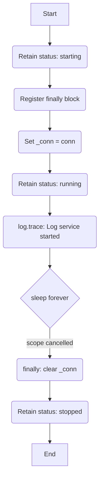

# Log Service

## Description

The log service is a **singleton** that provides structured logging to the rest of the system. It has two modes of operation:

- **Pre-connection** — log calls write to the console (via `rxilog`) only, with no bus activity.
- **Post-connection** — once `log_service.start()` has wired up a bus connection, every log call also publishes a structured message to `{'logs', <level>}` on the bus so that other services (e.g. a log checker or an uploader) can subscribe to them.

Because it is a singleton registered in `package.loaded`, any module that calls `require 'services.log'` gets the same instance regardless of load order or scope boundaries.

## Levels

The service exposes one method per log level, matching the levels defined in `rxilog`:

| Method | Bus topic | Severity |
|--------|-----------|----------|
| `log.trace(...)` | `{'logs', 'trace'}` | lowest |
| `log.debug(...)` | `{'logs', 'debug'}` | |
| `log.info(...)`  | `{'logs', 'info'}`  | |
| `log.warn(...)`  | `{'logs', 'warn'}`  | |
| `log.error(...)` | `{'logs', 'error'}` | |
| `log.fatal(...)` | `{'logs', 'fatal'}` | highest |

Each method always writes to the console. Publishing to the bus only happens when `log_service._conn` is set (i.e. after `start()` has run).

## Bus Messages

### Log entry (non-retained)

Topic: `{'logs', <level>}`

Published for every log call made while the service is running.

```lua
{
    message   = "[INFO  Thu Mar 18 14:23:45 2026] src/main.lua:42: Something happened",
    timestamp = <number>,  -- realtime clock (seconds since epoch)
}
```

The format is `[%-6s%s] %s: %s` — level left-padded to 6 chars, then the full `os.date()` string (locale-dependent, e.g. `Thu Mar 18 14:23:45 2026`), then `file.lua:line`, then the message. Note: the file-output timestamp uses `os.date()` with no format argument (full date/time), unlike the console output which uses `os.date("%H:%M:%S")`.

- `message` is the pre-formatted string produced by `rxilog.format_log_message`, including level, timestamp, source location, and message text.
- `timestamp` is the wall-clock time from `fibers.utils.time.realtime()`.

### Service status (retained)

Topic: `{'svc', <name>, 'status'}`

```lua
{ state = 'starting' | 'running' | 'stopped', ts = <monotonic number> }
```

Published at each lifecycle transition. `name` defaults to `'log'` but can be overridden via `opts.name`.

## Initialisation

`log_service.start(conn, opts)` follows the standard service lifecycle:

1. Retains `state = 'starting'` on `{'svc', name, 'status'}`.
2. Registers a `finally` block that clears `_conn` and retains `state = 'stopped'` when the scope exits.
3. Sets `log_service._conn = conn` so subsequent log calls publish to the bus.
4. Retains `state = 'running'`.
5. Emits its own first log entry: `log.trace("Log service started")`.
6. Blocks in a `sleep(math.huge)` loop — the service runs until its scope is cancelled.

## Service Flow



## Architecture

- The service owns a single long-lived sleep and relies entirely on scope cancellation for shutdown — there is no explicit shutdown message.
- The singleton pattern (`package.loaded["services.log"] = log_service`) means the connection state is global. Only one instance of `start()` should be running at a time.
- Log calls are synchronous: `_conn:publish` is called inline before returning to the caller. There is no batching or queue.
- Source location is captured at call time via `debug.getinfo(2, "Sl")`, so the `message` field always reflects the actual call site, not an internal log helper.
- The `finally` block guarantees `_conn` is cleared even if the scope fails rather than being cancelled cleanly.

## Tests

Tests live in `tests/test_log.lua` and are run with:

```sh
cd tests && luajit test_log.lua
```

The entry point wraps `luaunit.LuaUnit.run()` inside `fibers.run()` so every test method can call `perform()` directly.

### TestLogSingleton

Unit tests that do not require the scheduler.

| Test | What it checks |
|------|----------------|
| `test_has_all_log_level_methods` | Singleton exposes a callable method for every `rxilog` level |
| `test_log_without_conn_does_not_error` | Calling log methods with `_conn = nil` does not raise |
| `test_singleton_identity` | `require 'services.log'` twice returns the exact same table |

### TestLogBusPublish

Integration tests that wire `_conn` directly without running the full service. Each test operates inside the fiber scheduler and calls `perform()` to receive from the bus.

| Test | What it checks |
|------|----------------|
| `test_info_publishes_to_bus` | A single `log.info()` produces exactly one `{'logs','info'}` message |
| `test_all_levels_publish_correct_topic` | Each level method publishes on its matching `{'logs', <level>}` topic |
| `test_message_payload_fields` | Payload contains a formatted `message` string and a positive `timestamp` number |
| `test_no_publish_without_connection` | No bus messages are produced when `_conn` is `nil` |

### TestLogServiceLifecycle

Full-service tests that start the log service in a child scope via `start_log()` and observe its behaviour over its lifetime.

| Test | What it checks |
|------|----------------|
| `test_publishes_starting_running_stopped` | Service retains `'starting'`, `'running'`, and `'stopped'` states in order |
| `test_service_publishes_log_entries` | Log calls made after the service reaches `'running'` are delivered to the bus |
| `test_conn_cleared_after_stop` | `log._conn` is `nil` after the service scope is cancelled |
