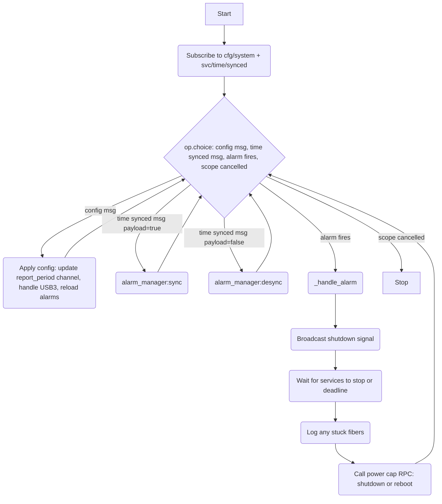
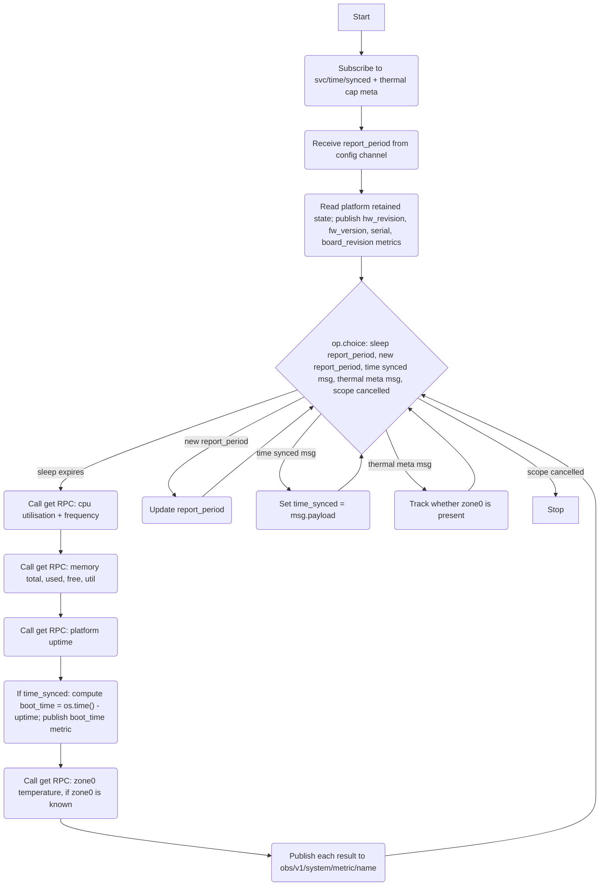

# System Service

## Description

The System Service is an application-layer service responsible for:

1. **Sysinfo reporting** — periodically gathering system metrics from HAL capabilities and publishing each as an individual `obs/v1/system/metric/<name>` metric on the bus.
2. **Alarm management** — scheduling and firing time-based alarms (daily or one-shot).
3. **Shutdown orchestration** — on an alarm, broadcasting a shutdown signal to all services, waiting for graceful shutdown, then issuing a power command via the HAL `power` capability.
4. **USB3 control** — on config update, disabling USB3 via the HAL `usb` capability if configured.

The service interacts with the hardware exclusively through HAL capabilities on the bus. No direct file reads or command execution are performed by the service itself — all OS interaction is delegated to HAL.

## Dependencies

HAL capabilities consumed:

| Capability class | Id        | Usage                                                      |
|------------------|-----------|------------------------------------------------------------|
| `cpu`            | `'1'`     | Get CPU utilisation and frequency fields                   |
| `memory`         | `'1'`     | Get RAM total, used, free, util fields                     |
| `thermal`        | any       | Get temperature per discovered zone                        |
| `platform`       | `'1'`     | Subscribe to retained state (hw_revision etc.); get uptime to compute boot_time |
| `power`          | `'1'`     | Issue shutdown or reboot command                           |
| `usb`            | `'usb3'`  | Disable USB3 bus on config                                 |

Service topics consumed:

| Topic                       | Usage                                                              |
|-----------------------------|--------------------------------------------------------------------|
| `{'svc', 'time', 'synced'}` | Retained bool — both fibers subscribe; sysinfo fiber uses it to gate `boot_time` computation; main fiber uses it to sync/desync alarms |

## Configuration

Received via retained bus message on `{'cfg', 'system'}`.

```lua
{
  report_period = <number>,     -- required: sysinfo publish interval in seconds
  usb3_enabled  = <boolean>,    -- required: if false, disable USB3 via HAL
  alarms        = <table|nil>,  -- optional: list of alarm config tables
}
```

Each alarm config:

```lua
{
  time    = <string>,           -- required: "HH:MM" (24-hour, wall-clock)
  repeats = <string|nil>,       -- optional: "daily" or omitted for one-shot
  payload = {
    name = <string>,            -- human-readable label, used in shutdown reason
    type = <string>,            -- "shutdown" or "reboot"
  }
}
```

## Sysinfo Reporting

On each report interval the sysinfo fiber calls `get` on each consumed capability with a `max_age` equal to `report_period` (so readings cached from the previous iteration are reused when the period is short). Each field is published individually as an observability metric on the bus following the `{'obs', 'v1', 'system', 'metric', <name>}` topic convention.

The sysinfo fiber subscribes to `{'svc', 'time', 'synced'}` and tracks a local `time_synced` flag. This is required because `boot_time` is computed as `os.time() - uptime` — if published before NTP sync, `os.time()` returns the wrong value and the stored metric would be incorrect even after the metrics service eventually ships it. The `boot_time` metric is therefore only computed and published when `time_synced = true`.

Static platform identity fields (`hw_revision`, `fw_version`, `serial`, `board_revision`) are read once from the retained platform state topic at sysinfo fiber startup and published as metrics at that point. They are not re-fetched or re-published on each report cycle.

### Published Metrics

Each metric payload contains a `value` field. Metrics that need a namespace override (to set the senml key independently of the topic) also carry a `namespace` field.

| Topic (`{'obs','v1','system','metric', …}`) | Namespace override                         | Source                        | Notes                                           |
|---------------------------------------------|--------------------------------------------|-------------------------------|-------------------------------------------------|
| `'boot_time'`                               | —                                          | `os.time() - platform uptime` | **only when `time_synced = true`**; Unix epoch  |
| `'hw_revision'`                             | —                                          | platform retained state       | published once at startup                       |
| `'fw_version'`                              | —                                          | platform retained state       | published once at startup                       |
| `'serial'`                                  | —                                          | platform retained state       | published once at startup                       |
| `'board_revision'`                          | —                                          | platform retained state       | published once at startup                       |
| `'cpu_utilisation'`                         | —                                          | cpu cap `get utilisation`     |                                                 |
| `'cpu_frequency'`                           | —                                          | cpu cap `get frequency`       |                                                 |
| `'mem_total'`                               | —                                          | memory cap `get total`        | bytes                                           |
| `'mem_used'`                                | —                                          | memory cap `get used`         | bytes                                           |
| `'mem_free'`                                | —                                          | memory cap `get free`         | bytes                                           |
| `'mem_util'`                                | —                                          | memory cap `get util`         | percentage                                      |
| `'temperature'`                             | —                                          | thermal cap `get` on zone `'zone0'` | single value; historically zone 0 only    |

Temperature is always reported from zone `'zone0'` — a single metric matching the historical name. Multi-zone reporting is intentionally not implemented to preserve collected metric continuity.

### Thermal zone discovery

The sysinfo fiber subscribes to `{'cap', 'thermal', '+', 'meta'}` to discover available thermal zones dynamically. The subscription is used only to confirm that `zone0` is present before attempting reads. No per-zone metric publications are made.

## Alarm Management

Alarms are managed internally by an `AlarmManager` instance (same logic as the old service). Alarms are wall-clock scheduled and require NTP sync to fire correctly, so the alarm manager is only activated once the time service reports `synced = true`.

- On sync: `alarm_manager:sync()` — recalculates all next-trigger times from the current wall clock
- On unsync: `alarm_manager:desync()` — prevents alarms from firing until re-synced
- On alarm fire: call `_handle_alarm` (see Shutdown Orchestration)

Alarms are replaced wholesale on each config update: `delete_all()` followed by `add()` for each entry.

## Shutdown Orchestration

When an alarm with `type = 'shutdown'` or `type = 'reboot'` fires:

1. Compute `deadline = monotime() + 10`.
2. Publish retained `{'+', 'control', 'shutdown'}` with `{ reason = alarm.payload.name, deadline = deadline }`.
3. Create an independent scope with a deadline of `deadline + 1` (one extra second beyond the broadcast deadline).
4. Subscribe to `{'+', 'health'}` and track all services that are not yet `'disabled'`.
5. Wait for all tracked services to reach `'disabled'` state, or until the deadline scope expires.
6. For any service that did not shut down in time, subscribe to `{service, 'health', 'fibers', '+'}` and log which fibers are stuck.
7. Call the `power` capability RPC (`shutdown` or `reboot`) with `{ reason = alarm.payload.name }`.

The shutdown scope is independent of the service scope, since the service scope will itself be cancelled by the broadcast shutdown signal.

## Service Flow

### System Main fiber



### Sysinfo fiber



## Architecture

- Two long-running fibers: `System Main` (config, alarms, shutdown) and `System Sysinfo` (metrics loop).
- A channel carries `report_period` updates from the main fiber to the sysinfo fiber. The sysinfo fiber blocks on `channel:get()` before its first loop iteration, waiting for config.
- Platform static identity fields are read once from the retained `platform` state topic at sysinfo fiber startup. Each field is immediately published as an `obs/v1/system/metric/<name>` metric. They are not re-published on each report cycle.
- USB3 handling: if `usb3_enabled = false` in config, call `cap/usb/usb3/rpc/disable`. If `usb3_enabled = true`, call `cap/usb/usb3/rpc/enable`. This is idempotent (calling disable when already disabled is harmless).
- The sysinfo fiber does **not** fail if any individual `get` RPC fails — it logs a warning and skips publishing that metric.
- The sysinfo fiber subscribes to `{'svc', 'time', 'synced'}` and maintains a local `time_synced` flag. `boot_time` (`os.time() - uptime`) is only computed and published when `time_synced = true`, ensuring the wall-clock value is correct before it enters the metrics pipeline.
- `finally` blocks in both fibers log the reason for shutdown.
- Thermal zone subscription tracks whether `zone0` is present. Temperature is only read and published when `zone0` is known. No per-zone metric publications are made — a single `temperature` metric name is preserved to maintain continuity with historically collected data.
