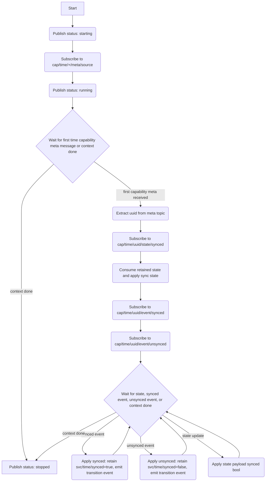

# Time Service

## Description

The time service listens to time capabilities for sync and unsync events. It uses the events to sync and unsync the alarm module of fibers and broadcast sync/unsync events to the bus for other services to listen to.

## Time capability

There is initially only one time capability, provided by the time driver in HAL. In the future we can discover multiple time capabilities and balance multiple sources of time intelligently (e.g. prefer the capability reporting the lowest stratum).

For now, the time service subscribes to `{'cap', 'time', '+', 'meta', 'source'}` and uses the **first** capability announced. Subsequent announcements are ignored.

## Bus Outputs

### Service status (retained)

Topic: `{'svc', 'time', 'status'}`

```lua
{
  state = 'starting' | 'running' | 'stopped',
  ts    = <number>,
}
```

### Time synced state (retained)

Topic: `{'svc', 'time', 'synced'}`

Payload: `true` or `false`

Published whenever the overall sync state changes. This is the authoritative "is system time trustworthy" signal for other services. It is retained so services that start later immediately receive the current state.

### Time transition events (non-retained)

Topics:
- `{'svc', 'time', 'event', 'synced'}`
- `{'svc', 'time', 'event', 'unsynced'}`

Published on state transitions for consumers that need edge-triggered behaviour.

## Service Flow



The retained `{'cap', 'time', <uuid>, 'state', 'synced'}` payload is consumed immediately after subscription to initialise sync state before any events arrive.

With the new fibers alarm API, the service calls:
- `alarm.set_time_source(fibers.utils.time.realtime)` on first synced state
- `alarm.time_changed()` on subsequent synced transitions/events

There is no direct equivalent of `clock_desynced` in the new API; unsynced updates still propagate over bus outputs.

## Architecture

- Everything runs in a single fiber — no child fibers needed. The fiber blocks waiting for the first capability, then transitions directly into the event loop for that capability.
- The service does not interact with the OS directly — all time source information arrives through the capability published by the time driver in HAL.
- Use `finally` to log shutdown reason and publish `stopped` status.

