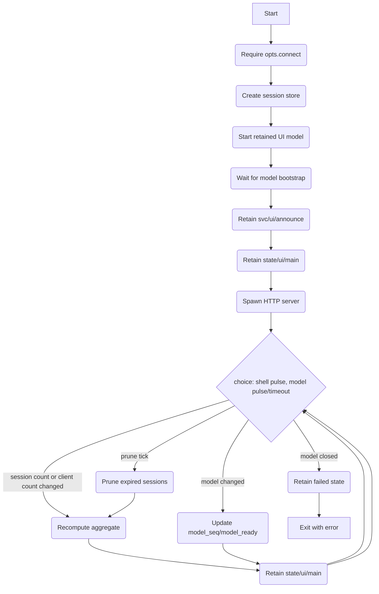
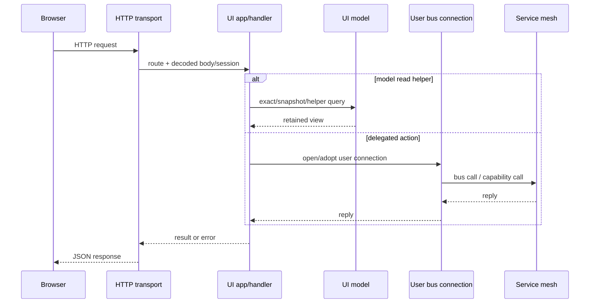
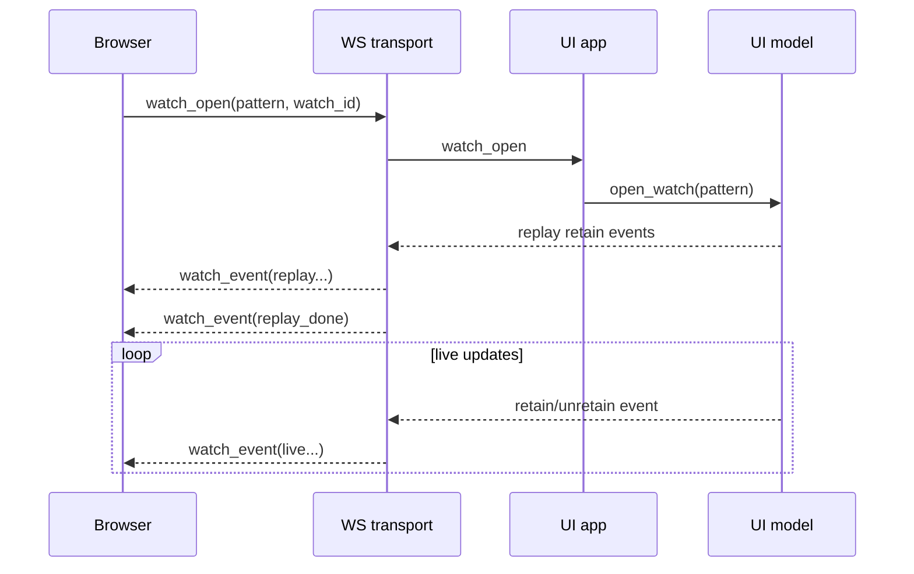

# UI Service

## Purpose

The UI Service is the local operator-facing application service responsible for:

1. **HTTP and WebSocket front-door** — serving static assets, exposing an authenticated JSON HTTP API, and exposing a session-bound WebSocket control channel.
2. **Session-based local authentication** — issuing and pruning in-memory local UI sessions, attaching them to bus principals, and propagating those principals into per-request user connections.
3. **Retained model cache** — maintaining a local read-mostly cache of selected retained topic spaces (`cfg`, `svc`, `state`, `cap`, `dev`) for exact reads, snapshots, and watch streams.
4. **Local operator façades** — exposing helper endpoints for config, service status, fabric status, generic bus calls, and update job management, while delegating the underlying work to the existing service mesh over user-scoped bus connections.
5. **Aggregate UI state publication** — publishing coarse retained service state under `state/ui/main`, including session count, connected WebSocket client count, and retained-model readiness.

The service is intentionally a **thin front-door** rather than a policy engine. It does not implement business logic for config, updates, fabric, or device operations. Instead it:

- authenticates a user,
- opens a user-scoped local bus connection,
- delegates to the existing command/config/update surfaces,
- and provides a stable browser-facing transport over HTTP and WebSocket.

**The reason UI exists is to provide one local, authenticated operator surface over the appliance’s retained state and command model, so management, inspection and update actions can be performed consistently without coupling browsers directly to internal service topology.**

## Dependencies

### Consumed retained topics (via internal UI model)

By default the service starts an internal retained-state model that replays and follows:

| Pattern | Usage |
|--------|-------|
| `{'cfg', '#'}` | Configuration reads and config snapshots. |
| `{'svc', '#'}` | Service announce/status inspection. |
| `{'state', '#'}` | State inspection, fabric views, update job views, device views, and general UI reads/watches. |
| `{'cap', '#'}` | Capability advertisement snapshots. |
| `{'dev', '#'}` | Device advertisement snapshots. |

These are not consumed directly by browser callers. They are normalised into the UI model and then served through exact/snapshot/watch APIs.

### Service connections consumed on demand

The service does not own a permanent generic bus helper connection for operator actions. Instead, for authenticated operations it calls `opts.connect(principal, origin_extra)` to create a **user-scoped connection** on demand.

That user connection is then used for delegated operations such as:

| Surface | Usage |
|--------|-------|
| arbitrary `conn:call(topic, payload, ...)` | generic UI call façade |
| `{'config', <service>, 'set'}` | config set helper |
| `{'cmd','update','job', ...}` | update job create/get/list/do |
| `artifact_store/main` capability | update upload ingress (`create_sink`) |

The UI service itself does not talk to HAL directly.

### Environment dependency

The default bootstrap login verifier uses:

| Variable | Usage |
|---------|-------|
| `DEVICECODE_UI_ADMIN_PASSWORD` | Password for the built-in `admin` user when `opts.verify_login` is not supplied. |

## Configuration / startup options

The current service is configured primarily through `start(conn, opts)` rather than through a retained `cfg/ui` topic.

Relevant options are:

```lua
{
  name = <string|nil>,
  env = <string|nil>,

  connect = function(principal, origin_extra) ... end,   -- required
  verify_login = function(username, password) ... end,   -- optional

  session_ttl_s = <number|nil>,
  session_prune_s = <number|nil>,
  model_ready_timeout_s = <number|nil>,
  model_queue_len = <number|nil>,
  model_sources = { ... } | nil,

  host = <string|nil>,
  port = <number|nil>,
  www_root = <string|nil>,

  run_http = <function|nil>,
}
```

### Default runtime values

If not supplied:

```lua
{
  name = 'ui',
  session_ttl_s = 3600,
  session_prune_s = 60,
  model_ready_timeout_s = 2.0,
  model_sources = {
    { name = 'cfg',   pattern = { 'cfg', '#' } },
    { name = 'svc',   pattern = { 'svc', '#' } },
    { name = 'state', pattern = { 'state', '#' } },
    { name = 'cap',   pattern = { 'cap', '#' } },
    { name = 'dev',   pattern = { 'dev', '#' } },
  },
  host = '0.0.0.0',
  port = 80,
}
```

There is no retained config watch in the current implementation; changing UI runtime parameters requires restarting the service with different options.

## Authentication and session model

### Login verification

If `opts.verify_login` is not supplied, the service uses the bootstrap verifier:

- username must be `admin`
- password must match `DEVICECODE_UI_ADMIN_PASSWORD`
- success yields a principal equivalent to `authz.user_principal('admin', { roles = { 'admin' } })`

A custom verifier may instead return any suitable local principal.

### Session storage

Sessions are stored in-memory only.

Each session record includes:
- `id`
- `principal`
- public user identity derived from that principal
- expiry timestamp

Sessions are:
- created on successful login
- touched on each authenticated request
- pruned periodically by the UI shell
- deleted explicitly on logout

The public session payload returned to clients is the value from `sessions:public(rec)`.

### Session transport

For HTTP and WebSocket, the service accepts session ids from either:

- cookie `devicecode_session=<id>`
- header `x-session-id: <id>`

On successful HTTP login, the service sets:

```text
Set-Cookie: devicecode_session=<id>; Path=/; HttpOnly; SameSite=Strict
```

On logout, it clears that cookie.

## Retained state published

### Service announce

The service retains:

| Topic | Usage |
|------|-------|
| `{'svc', <service_name>, 'announce'}` | Coarse operator-facing service capability advertisement. |

Default announce payload:

```lua
{
  role = 'ui',
  auth = 'local-session',
  caps = {
    login = true,
    logout = true,
    session = true,
    model_exact = true,
    model_snapshot = true,
    config_get = true,
    config_set = true,
    service_status = true,
    services_snapshot = true,
    fabric_status = true,
    fabric_link_status = true,
    capability_snapshot = true,
    call = true,
    watch = true,
    update_job_create = true,
    update_job_get = true,
    update_job_list = true,
    update_job_do = true,
    update_job_upload = true,
  },
}
```

### Aggregate UI state

The service retains:

| Topic | Payload kind |
|------|---------------|
| `{'state','ui','main'}` | `ui.main` |

Payload shape:

```lua
{
  status = 'starting' | 'running' | 'failed',
  sessions = <integer>,
  clients = <integer>,
  model_ready = <boolean>,
  model_seq = <integer>,
  t = <monotonic seconds>,
  reason = <string|nil>,
}
```

Semantics:
- `sessions` = current in-memory session count
- `clients` = current connected WebSocket client count
- `model_ready` = retained model bootstrap complete
- `model_seq` = current retained model sequence
- `status` = UI shell status

### Audit events

The service publishes local operator audit events under:

| Topic prefix | Usage |
|-------------|-------|
| `{'obs','audit','ui', <kind>}` | Successful login/logout and config set audit facts. |

Current audit kinds emitted directly by the service include:
- `login`
- `logout`
- `config_set`

## Internal retained model

The UI model is an in-process retained-state cache over configured source patterns.

Responsibilities:
- replay retained state from each configured source watch
- maintain a local trie keyed by exact topic
- provide exact lookup
- provide pattern snapshot
- provide watch streams with replay followed by live retain/unretain events
- expose readiness and monotonic change sequence

### Exact lookup

`model:get_exact(topic)` returns:

```lua
{
  topic = <topic>,
  payload = <payload>,
  origin = <string|nil>,
  seq = <integer>,
}
```

### Snapshot

`model:snapshot(pattern)` returns:

```lua
{
  seq = <integer>,
  entries = {
    {
      topic = <topic>,
      payload = <payload>,
      origin = <string|nil>,
      seq = <integer>,
    },
    ...
  }
}
```

### Watch streams

`model:open_watch(pattern, opts)` returns a watch object that first replays the current snapshot and then yields live changes.

Replay events:

```lua
{ op = 'retain', phase = 'replay', topic = <topic>, payload = <payload>, origin = <origin>, seq = <integer> }
{ op = 'replay_done', seq = <model_seq> }
```

Live events:

```lua
{ op = 'retain', phase = 'live', topic = <topic>, payload = <payload>, origin = <origin>, seq = <integer> }
{ op = 'unretain', phase = 'live', topic = <topic>, origin = <origin>, seq = <integer> }
```

Watch streams are bounded. If a watch mailbox overflows, that watch is closed.

## Browser-facing transport surfaces

The service currently exposes:

- static file serving (optional)
- JSON HTTP API under `/api/...`
- WebSocket API at `/ws`

The HTTP transport is built on `lua-http` and the WebSocket transport is built on `http.websocket` over the same server.

## HTTP API

Unless otherwise noted:
- responses are JSON
- success shape is `{ ok = true, data = <value> }`
- failure shape is `{ ok = false, err = <string>, code = <string> }`

### Authentication/session endpoints

#### `POST /api/login`
Request:

```lua
{ username = <string>, password = <string> }
```

Response data:

```lua
<public session record>
```

Also sets the session cookie.

#### `POST /api/logout`
Uses current session from cookie/header.

Response data:

```lua
{ ok = true }
```

Also clears the session cookie.

#### `GET /api/session`
Returns the current public session record.

### Health and retained-model endpoints

#### `GET /api/health`
Returns:

```lua
{
  service = <service name>,
  now = <monotonic seconds>,
  sessions = <integer>,
  model_ready = <boolean>,
  model_seq = <integer>,
}
```

#### `POST /api/model/exact`
Request:

```lua
{ topic = <concrete topic> }
```

Returns one model entry.

#### `POST /api/model/snapshot`
Request:

```lua
{ pattern = <topic pattern> }
```

Returns one model snapshot.

### Service/config/fabric inspection endpoints

#### `GET /api/services`
Returns a snapshot containing:
- retained `svc/*/announce`
- retained `svc/*/status`

#### `GET /api/capabilities`
Returns a snapshot containing:
- retained `cap/#`
- retained `dev/#`
- and the same service snapshot used by `/api/services`

#### `GET /api/config/<service>`
Returns retained `cfg/<service>` from the UI model.

#### `POST /api/config/<service>`
Request:

```lua
{ data = <plain table> }
```

Delegates to:

```lua
{ 'config', <service>, 'set' }
```

over a user-scoped bus connection.

#### `GET /api/service/<service>/status`
Returns retained `svc/<service>/status` from the UI model.

#### `GET /api/fabric`
Returns a combined fabric view containing:
- retained `state/fabric`
- retained `state/fabric/link/<id>/<view>` grouped by link id

#### `GET /api/fabric/link/<link_id>`
Returns:
- `session`
- `bridge`
- `transfer`

for that retained fabric link state, if present.

### Generic call endpoint

#### `POST /api/call`
Request:

```lua
{
  topic = <concrete topic>,
  payload = <any|nil>,
  timeout = <number|nil>,
}
```

The service opens or reuses a user-scoped connection and calls:

```lua
conn:call(topic, payload, {
  timeout = timeout,
  extra = { via = 'ui' },
})
```

Returns the raw bus reply.

### Update job endpoints

#### `GET /api/update/jobs`
Returns the result of `cmd/update/job/list`.

#### `POST /api/update/jobs`
Request payload is forwarded to `cmd/update/job/create`.

If the payload contains:

```lua
{ source = { kind = 'upload' } }
```

the handler forces:

```lua
options.auto_start = true
options.auto_commit = true
```

unless already explicitly supplied.

On success, upload-backed jobs are annotated with:

```lua
upload = {
  required = true,
  method = 'POST',
  path = '/api/update/jobs/<job_id>/artifact',
}
```

#### `GET /api/update/jobs/<job_id>`
Returns the result of `cmd/update/job/get`.

#### `POST /api/update/jobs/<job_id>/do`
Request body is forwarded to `cmd/update/job/do` after injecting `job_id`.

#### `POST /api/update/jobs/<job_id>/artifact`
This is the browser upload ingress path for upload-backed update jobs.

Request body:
- raw octet stream

Optional headers:
- `content-length`
- `x-artifact-name`
- `x-artifact-version`
- `x-artifact-build`
- `x-artifact-checksum`

Flow:
1. validate session
2. open a user-scoped connection
3. open `artifact_store/main`
4. call `create_sink` with transient upload metadata
5. stream request body into the sink in chunks
6. report interim upload progress through `cmd/update/job/do` with `op='upload_progress'`
7. on success, `commit()` the sink to an artifact
8. call `cmd/update/job/do` with `op='attach_artifact'`

Response data:

```lua
{
  ok = true,
  job = <public update job>,
  artifact = {
    ref = <artifact_ref>,
    size = <integer>,
    checksum = <string|nil>,
  }
}
```

## WebSocket API

WebSocket endpoint:

```text
GET /ws
```

The WebSocket transport is request/response plus watch-event multiplexing.

### Reply shape

For normal replies:

```lua
{
  id = <request id|nil>,
  ok = <boolean>,
  data = <value|nil>,
  err = <string|nil>,
  code = <string|nil>,
}
```

### Watch event shape

```lua
{ op = 'watch_event', watch_id = <string|number|nil>, event = <watch event> }
{ op = 'watch_closed', watch_id = <string|number|nil>, reason = <string> }
```

### Session handling

On socket open, the transport may adopt an initial session from:
- cookie `devicecode_session`
- header `x-session-id`

It can also change/adopt session after a successful `login` operation.

When the active session changes:
- all open watches are closed
- the old user connection is disconnected
- a new user connection is opened for the adopted session

### Supported WebSocket operations

#### `hello`
Returns:

```lua
{ service = <service name> }
```

#### `session`
Returns current session record.

#### `health`
Returns the same payload as HTTP `/api/health`.

#### `login`
Request:

```lua
{ op = 'login', username = <string>, password = <string> }
```

Returns a public session record and adopts that session for subsequent socket operations.

#### `logout`
Logs out the current session and clears the active user connection for the socket.

#### `config_get`
Equivalent to HTTP config get.

#### `config_set`
Equivalent to HTTP config set.

#### `service_status`
Equivalent to HTTP service status.

#### `services_snapshot`
Equivalent to HTTP services snapshot.

#### `fabric_status`
Equivalent to HTTP fabric status.

#### `fabric_link_status`
Equivalent to HTTP fabric link status.

#### `capability_snapshot`
Equivalent to HTTP capability snapshot.

#### `model_exact`
Equivalent to HTTP model exact.

#### `model_snapshot`
Equivalent to HTTP model snapshot.

#### `call`
Equivalent to HTTP generic call.

#### `watch_open`
Request:

```lua
{
  op = 'watch_open',
  watch_id = <opaque client id>,
  pattern = <topic pattern>,
  queue_len = <number|nil>,
}
```

Creates a retained-model watch and starts sending `watch_event` / `watch_closed` frames for that `watch_id`.

#### `watch_close`
Request:

```lua
{ op = 'watch_close', watch_id = <opaque client id> }
```

Closes the watch.

### Not exposed on WebSocket today

The current WebSocket implementation does **not** expose update-job create/get/list/do/upload operations. Those are currently HTTP-only.

## Query/helper semantics

The service implements a small set of higher-level helper reads over the retained UI model.

### `services_snapshot`
Returns:

```lua
{
  seq = <integer>,
  announce = { [<service>] = <announce payload>, ... },
  status = { [<service>] = <status payload>, ... },
}
```

### `fabric_status`
Returns:

```lua
{
  seq = <integer>,
  main = <state/fabric payload|nil>,
  links = {
    [<link_id>] = {
      session = <payload|nil>,
      bridge = <payload|nil>,
      transfer = <payload|nil>,
      ...
    }
  }
}
```

### `fabric_link_status`
Returns:

```lua
{
  session = <payload|nil>,
  bridge = <payload|nil>,
  transfer = <payload|nil>,
}
```

### `capability_snapshot`
Returns:

```lua
{
  seq = <integer>,
  capabilities = { [<topic_debug>] = <payload>, ... },
  devices = { [<topic_debug>] = <payload>, ... },
  services = <services_snapshot>,
}
```

## Error model

The service normalises errors through `services.ui.errors`.

Errors may carry:
- message
- code
- HTTP status

Common categories include:
- `bad_request`
- `unauthorised`
- `not_found`
- `not_ready`
- `unavailable`
- upstream/transport-derived failures

HTTP routes and WebSocket replies both surface these normalised errors.

## Service flow

### UI shell



### HTTP request path



### WebSocket watch path



## Architecture

- The service is deliberately a **local operator façade**, not a business-logic service.
- Authentication is local-session based and currently bootstrap-friendly by default.
- All privileged work runs through user-scoped bus connections so that the caller principal is preserved.
- The retained UI model is the read path for snapshots and watches; it avoids repeated direct retained walks by browser callers.
- HTTP and WebSocket share the same app surface, but not every capability is exposed on both transports.
- The update upload path uses `artifact_store.create_sink` so browser artefacts are normalised through capability backends rather than by direct filesystem access.
- Browser-visible aggregate state is intentionally small: the service publishes only a coarse retained summary under `state/ui/main`, while richer reads come from the UI model and delegated helper endpoints.
