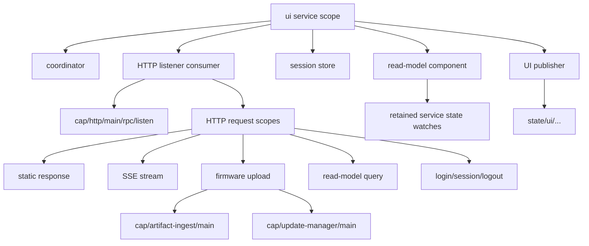
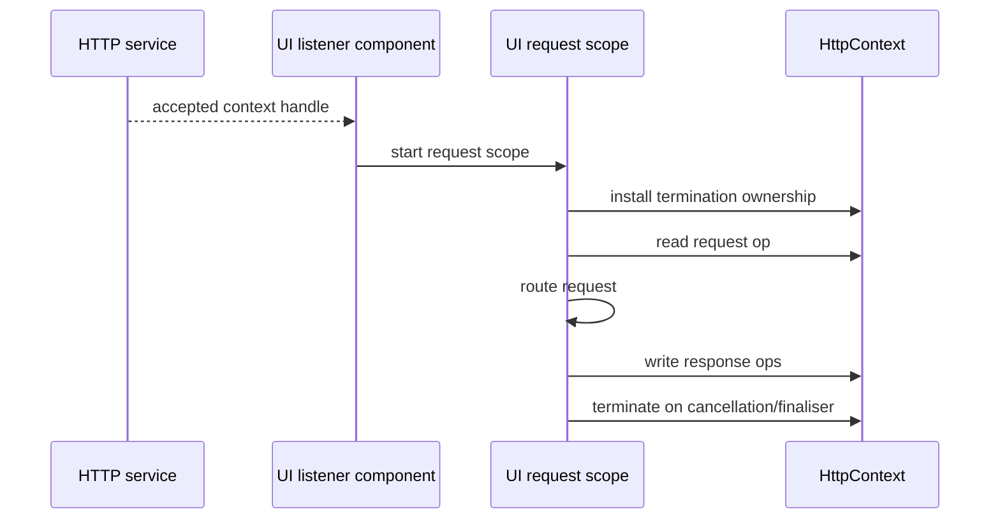

# UI service guide

## Purpose

UI owns operator-facing application semantics.

It is responsible for:

```text
static UI route policy
read-model queries
server-sent events
local sessions
authentication policy
firmware upload policy
update/artifact manager handoff
UI summary publication
```

UI does not own HTTP transport. It consumes the HTTP service.

## Lifetime shape


```mermaid
flowchart TD
  UiScope["ui service scope"] --> Coordinator["coordinator"]
  UiScope --> ReadModel["read-model component"]
  UiScope --> Sessions["session store"]
  UiScope --> Listener["HTTP listener consumer"]
  UiScope --> Publisher["UI publisher"]

  Listener --> HttpCap["cap/http/main/rpc/listen"]
  Listener --> RequestScopes["HTTP request scopes"]

  RequestScopes --> Static["static response"]
  RequestScopes --> SSE["SSE stream"]
  RequestScopes --> Upload["firmware upload"]
  RequestScopes --> Query["read-model query"]
  RequestScopes --> SessionOps["login/session/logout"]

  Upload --> Ingest["cap/artifact-ingest/main"]
  Upload --> Update["cap/update-manager/main"]

  ReadModel --> State["retained service state watches"]
  Publisher --> UiState["state/ui/..."]
```

A request scope owns one accepted HTTP context after listener handoff.

## Public surfaces

UI should publish:

```text
svc/ui/status
svc/ui/meta
cfg/ui

state/ui/summary
state/ui/read-model
state/ui/sessions
```

The UI service may publish narrow UI-domain retained state. It must not become the naming boundary for workflows owned by Update or Artifact Ingest.

Firmware upload should call:

```text
cap/artifact-ingest/main/rpc/create
cap/artifact-ingest/main/rpc/append
cap/artifact-ingest/main/rpc/commit
cap/artifact-ingest/main/rpc/abort

cap/update-manager/main/rpc/create-job
cap/update-manager/main/rpc/start-job
```

UI must not expose upload workflows as `cmd/ui/...` or `cmd/update/...`.

## HTTP request ownership


```mermaid
sequenceDiagram
  participant HTTP as HTTP service
  participant UI as UI listener component
  participant Req as UI request scope
  participant Ctx as HttpContext

  HTTP-->>UI: accepted context handle
  UI->>Req: start request scope
  Req->>Ctx: install termination ownership
  Req->>Ctx: read request op
  Req->>Req: route request
  Req->>Ctx: write response ops
  Req->>Ctx: terminate on cancellation/finaliser
```

The UI coordinator should not perform HTTP I/O. Request scopes may perform HTTP reads and writes.

## Read model

The read model is observable state, not a worker that performs application policy.

It should provide:

```text
snapshot
query
watch
changed_op
terminate
```

Read-model updates should be non-yielding. Expensive work belongs in request scopes or workers.

## Upload ownership

Upload owns:

```text
accepted HTTP context
request body streaming
artifact ingest session until commit or abort
timeout policy
update job creation/start request
```

On cancellation or append failure:

```text
abort uncommitted ingest
terminate owned body/context resources
resolve request once
```

After successful commit:

```text
do not abort committed artifact
create update job through cap/update-manager
start update job if policy requires it
```

## Reviewer checklist

```text
UI does not require cqueues, lua-http or HTTP transport modules.
UI obtains HTTP through services.http.sdk.
Request scopes own HTTP I/O.
Upload uses cap/artifact-ingest and cap/update-manager.
UI does not publish workflow records owned by Update.
UI state stays narrow under state/ui/...
Session changes are observable through the store/model, not callback sinks.
Finalisers terminate contexts and unresolved requests immediately.
```
