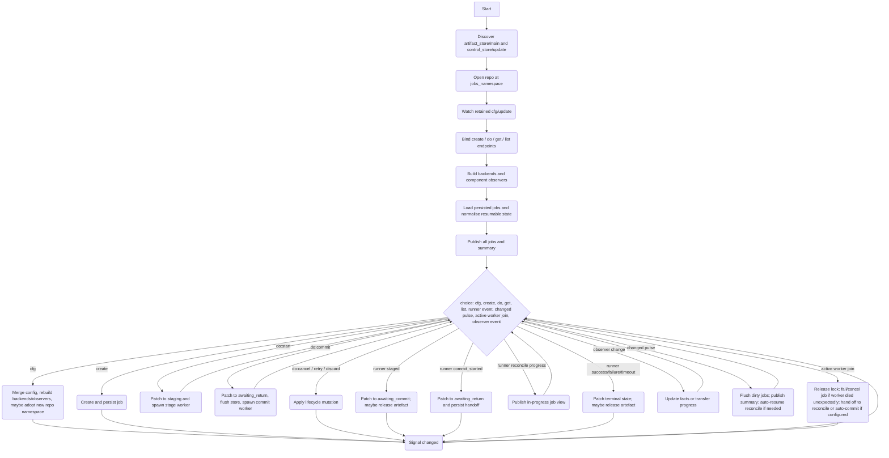

# Update Service

## Purpose

The Update service owns durable update jobs.

It is responsible for:

1. creating, storing, listing, retrieving, retrying, cancelling, and discarding jobs
2. normalising artefact inputs so the rest of the flow works on artefact refs only
3. delegating component-specific work to pluggable backends
4. persisting jobs through `control_store`
5. publishing one retained record per job plus an aggregate summary
6. running stage / commit / reconcile workers under a single active-worker policy
7. resuming post-commit reconcile after restart

The current design is intentionally simple:

- one active job globally
- no deferred scheduler
- explicit operator-driven jobs
- component-specific mechanics in backends
- service-level policy, persistence, and publication in the shell

## Dependencies

### Retained configuration

| Topic | Purpose |
|---|---|
| `{'cfg','update'}` | Update runtime configuration. Retained and replayed on startup. |

### Required capabilities

| Capability | Id | Purpose |
|---|---|---|
| `control_store` | `'update'` | Persist and reload job records under the configured namespace. |
| `artifact_store` | `'main'` | Open, delete, and import artefacts. |

The service discovers both capabilities before it becomes runnable.

### Consumed service endpoints

Backends call into the rest of the system through stable local services.

#### Through `device`

| Topic | Purpose |
|---|---|
| `{'cmd','device','component','get'}` | Read current component state. |
| `{'cmd','device','component','do'}` | Dispatch `prepare_update`, `stage_update`, or `commit_update`. |

#### Through `fabric`

| Topic | Purpose |
|---|---|
| `{'cmd','fabric','transfer'}` | Stage MCU artefacts to a remote member over a fabric link. |

## Configuration

Retained payload on `{'cfg','update'}`:

```lua
{
  schema = 'devicecode.config/update/1',
  jobs_namespace = <string|nil>,
  reconcile = {
    interval_s = <number|nil>,
    timeout_s = <number|nil>,
  } | nil,
  artifacts = {
    default_policy = <string|nil>,
    policies = {
      [<component>] = <string>,
    } | nil,
  } | nil,
  components = {
    [<component>] = {
      backend = 'cm5_swupdate' | 'mcu_component' | <string>,
      transfer = {
        link_id = <string|nil>,
        receiver = <topic|nil>,
        timeout_s = <number|nil>,
      } | nil,
      timeout_prepare = <number|nil>,
      timeout_stage = <number|nil>,
      timeout_commit = <number|nil>,
    },
  } | nil,
}
```

### Default configuration

```lua
{
  schema = 'devicecode.config/update/1',
  jobs_namespace = 'update/jobs',
  reconcile = {
    interval_s = 10.0,
    timeout_s = 180.0,
  },
  artifacts = {
    default_policy = 'transient_only',
    policies = {
      cm5 = 'transient_only',
      mcu = 'transient_only',
    },
  },
  components = {
    cm5 = {
      backend = 'cm5_swupdate',
    },
    mcu = {
      backend = 'mcu_component',
      transfer = {
        link_id = 'cm5-uart-mcu',
        receiver = { 'rpc', 'member', 'mcu', 'receive' },
        timeout_s = 60.0,
      },
    },
  },
}
```

Notes:

- if `cfg.components` is supplied, it replaces the default component-backend table completely
- `reconcile.interval_s` remains part of config, but current live reconcile is driven by retained-state changes plus timeout rather than interval polling
- admission is currently global-single in practice; the state model keeps only `locks.global`

## Exposed commands

| Topic | Purpose |
|---|---|
| `{'cmd','update','job','create'}` | Create a new job. |
| `{'cmd','update','job','do'}` | Apply one lifecycle action to an existing job. |
| `{'cmd','update','job','get'}` | Fetch one public job view. |
| `{'cmd','update','job','list'}` | Fetch all public job views. |

## Artefact model

The service works on artefact refs after job creation.

A job may be created from:

### Imported filesystem path

```lua
{
  component = <string>,
  artifact = {
    kind = 'import_path',
    path = <string>,
  },
  expected_version = <string|nil>,
  metadata = <table|nil>,
  options = {
    auto_start = <boolean|nil>,
    auto_commit = <boolean|nil>,
  } | nil,
}
```

The service imports the path through `artifact_store.import_path(...)` and stores only:

- the resulting artefact ref
- a descriptor snapshot

### Existing artefact ref

```lua
{
  component = <string>,
  artifact = {
    kind = 'ref',
    ref = <string>,
  },
  expected_version = <string|nil>,
  metadata = <table|nil>,
  options = {
    auto_start = <boolean|nil>,
    auto_commit = <boolean|nil>,
  } | nil,
}
```

The service opens it through `artifact_store.open(...)` and snapshots its descriptor.

### Retention policy

Import policy is chosen by:

1. `cfg.artifacts.policies[component]`
2. otherwise `cfg.artifacts.default_policy`
3. otherwise `'prefer_durable'`

During execution, staged metadata may also return `artifact_retention`.

Current behaviour:

- `release` -> the artefact is deleted after staging success or terminal completion, depending on the path
- anything else -> keep the artefact until explicit discard or other cleanup

## Job model

Top-level in-memory service state:

```lua
{
  cfg = <merged service config>,
  store = { jobs = { [id] = job }, order = { id... } },
  seq = <monotonic in-service sequence>,
  active_job = { job_id, scope, component, started_at, mode } | nil,
  locks = { global = job_id | nil },
  backends = { [component] = backend },
  dirty_jobs = { [job_id] = true },
  summary_dirty = <boolean>,
  component_obs = { [key] = observer_rec },
}
```

Persisted job fields include:

```lua
{
  job_id = <string>,
  offer_id = <string|nil>,
  component = <string>,
  artifact_ref = <string|nil>,
  artifact_meta = <table|nil>,
  expected_version = <string|nil>,
  metadata = <table|nil>,
  auto_start = <boolean>,
  auto_commit = <boolean>,
  state = <string>,
  stage = <string>,
  next_step = <string|nil>,
  created_seq = <integer>,
  updated_seq = <integer>,
  created_mono = <number>,
  updated_mono = <number>,
  result = <table|nil>,
  error = <string|nil>,
  pre_commit_boot_id = <string|nil>,
  artifact_released_at = <number|nil>,
  staged_meta = <table|nil>,
  runtime = {
    phase_run_id = <string|nil>,
    phase_mono = <number|nil>,
    awaiting_return_run_id = <string|nil>,
    awaiting_return_mono = <number|nil>,
    progress = <table|nil>,
    ...
  } | nil,
}
```

Runtime-only fields under `job.runtime` are stripped before persistence.

## Job states

### Passive states

- `created`
- `awaiting_commit`

### Active states

- `staging`
- `awaiting_return`

### Terminal states

- `succeeded`
- `failed`
- `rolled_back`
- `cancelled`
- `timed_out`
- `superseded`
- `discarded`

`discarded` exists in the model enums, but discarded jobs are removed from the store rather than retained as visible job records.

## Public job view

Retained per-job payload under `{'state','update','jobs', <job_id>}`:

```lua
{
  job_id = <string>,
  component = <string>,
  source = {
    offer_id = <string|nil>,
  },
  artifact = {
    ref = <string|nil>,
    meta = <table|nil>,
    expected_version = <string|nil>,
    released_at = <number|nil>,
    retention = <string|nil>,
  },
  lifecycle = {
    state = <string>,
    stage = <string>,
    next_step = <string|nil>,
    created_seq = <integer>,
    updated_seq = <integer>,
    created_mono = <number>,
    updated_mono = <number>,
    error = <string|nil>,
  },
  progress = <table|nil>,
  observation = {
    pre_commit_boot_id = <string|nil>,
  },
  actions = {
    start = <boolean>,
    commit = <boolean>,
    cancel = <boolean>,
    retry = <boolean>,
    discard = <boolean>,
  },
  result = <table|nil>,
  metadata = <table|nil>,
}
```

### Summary payload

Retained under `{'state','update','summary'}`:

```lua
{
  kind = 'update.summary',
  jobs = { <public job>, ... },
  counts = {
    total = <integer>,
    active = <integer>,
    terminal = <integer>,
    awaiting_commit = <integer>,
    awaiting_return = <integer>,
    created = <integer>,
    failed = <integer>,
    succeeded = <integer>,
    ...state counters...
  },
  active = {
    job_id = <string>,
    component = <string>,
    state = <string>,
    since = <number>,
  } | nil,
  locks = {
    global = <job_id|nil>,
  },
}
```

## Job actions

Derived from job state:

- `start` when `state == 'created'`
- `commit` when `state == 'awaiting_commit'`
- `cancel` when `state == 'created'` or `state == 'awaiting_commit'`
- `retry` when terminal and an artefact ref is still present (`failed`, `rolled_back`, `timed_out`, `cancelled`)
- `discard` when terminal

## Command behaviour

### `cmd/update/job/create`

Accepted payload:

```lua
{
  component = <string>,
  offer_id = <string|nil>,
  artifact = {
    kind = 'import_path',
    path = <string>,
  } | {
    kind = 'ref',
    ref = <string>,
  },
  expected_version = <string|nil>,
  metadata = <table|nil>,
  options = {
    auto_start = <boolean|nil>,
    auto_commit = <boolean|nil>,
  } | nil,
}
```

Behaviour:

1. validate component exists in current config
2. resolve or import the artefact through `artifact_store`
3. create a job in `created`
4. if `auto_start` is true, immediately transition to `staging` and spawn a stage worker
5. persist and publish the job

### `cmd/update/job/do`

Accepted shape:

```lua
{
  job_id = <string>,
  op = 'start' | 'commit' | 'cancel' | 'retry' | 'discard',
}
```

#### `start`

Allowed only when:

- `state == 'created'`
- no active global lock exists

Effects:

1. patch job to `state='staging'`, `stage='validating_artifact'`, `next_step='stage'`
2. spawn a stage worker

#### `commit`

Allowed only when:

- `state == 'awaiting_commit'`
- no active global lock exists

Effects:

1. patch job to `state='awaiting_return'`, `stage='commit_sent'`, `next_step='reconcile'`
2. flush dirty jobs immediately before commit
3. spawn a commit worker

#### `cancel`

Allowed only when passive and non-terminal.

Effect:

- patch to `cancelled`

#### `retry`

Allowed only when `job_actions(job).retry` is true.

Effect:

1. create a fresh job from the same artefact ref and metadata
2. patch the original job to `superseded`

#### `discard`

Allowed only when terminal.

Effect:

1. release/delete any retained artefact if still present
2. delete the job from the control store
3. delete it from local state
4. unretain `state/update/jobs/<job_id>`

Discarded jobs are removed rather than published in a visible `discarded` lifecycle state.

### `cmd/update/job/get`

Request:

```lua
{ job_id = <string> }
```

Response:

```lua
{ ok = true, job = <public job> }
```

Fails with `unknown_job`.

### `cmd/update/job/list`

Request payload is ignored.

Response:

```lua
{ ok = true, jobs = { <public job>, ... } }
```

## Backends

The service constructs one backend instance per configured component.

### `cm5_swupdate`

Built on top of the generic component-proxy backend.

Uses `device` to:

- read component status
- `prepare_update`
- `stage_update`
- `commit_update`

Stage path:

- call `stage_update` with:
  - `artifact_ref`
  - `expected_version`
  - `metadata`

Reconcile success when:

- observed software version matches `expected_version`
- and updater state is compatible with `running`, `idle`, or `ready` (or absent)

Reconcile failure when:

- updater state is `failed`
- or `rollback_detected`

Default staged artefact retention for this backend is `keep`.

### `mcu_component`

Built on top of the component-proxy backend, but overrides stage.

Prepare and commit still use `device` actions.

Stage path uses `fabric` directly:

```lua
conn:call({ 'cmd', 'fabric', 'transfer' }, {
  op = 'send_blob',
  link_id = <configured link_id>,
  source = <opened artefact source>,
  receiver = <configured receiver topic|nil>,
  meta = {
    kind = 'firmware',
    component = <component>,
    version = job.expected_version,
    job_id = job.job_id,
    size = source:size(),
    checksum = source:checksum(),
    metadata = job.metadata,
  },
}, { timeout = transfer.timeout_s })
```

Stage success is normalised to:

- `staged = true`
- `artifact_retention = 'release'` if the backend did not already provide one

Reconcile success when:

- observed software version matches `expected_version`
- and at least one of these is true:
  - boot id changed from `pre_commit_boot_id`
  - updater state is already `running`, `ready`, `idle`, or absent

Reconcile failure when:

- updater state is `failed`
- or `rollback_detected`

## Persistence and restart adoption

Jobs are persisted under `jobs_namespace` through `control_store/update`.

On startup:

1. discover required capabilities
2. open the configured repo namespace
3. load all jobs
4. rebuild backends and observers
5. normalise persisted jobs
6. mark all jobs dirty
7. publish per-job state and summary
8. signal `changed`
9. if a resumable job exists, spawn a reconcile worker automatically

Adoption rules:

- `staging` -> `created` if the artefact ref still exists, else `failed` with `interrupted_before_stage`
- `awaiting_return` stays resumable and gets `next_step='reconcile'`
- `awaiting_commit` stays passive and committable

The service currently resumes at most one post-commit reconcile job automatically, because admission is global-single.

## Event-driven reconciliation

Current reconcile is event-driven rather than interval-polled.

The service watches retained state for:

- `{'state','device','component', <component>}` for every configured component
- `{'state','fabric','link', <link_id>, 'transfer'}` for components that declare a transfer link

Observed component payloads are fed into `observe.lua`, which maintains the latest facts per component and signals a pulse whenever those facts change.

The reconcile worker then waits on:

- observed-facts change
- or timeout

On each change it re-evaluates backend-specific reconcile predicates. Progress updates are emitted whenever evaluation returns a non-terminal in-progress result.

This means:

- live reconcile is event-driven while the process is running
- restart reconcile is rebuilt from persisted jobs plus fresh retained facts after restart

`reconcile.interval_s` remains in config but is not the primary driver of progress detection in the current code.

## Locking and admission

Current admission policy is one active job globally.

State fields:

- `state.locks.global`
- `state.active_job`

`can_activate()` currently enforces only the global lock.

A worker slot owns:

- worker-scope creation
- lock acquisition
- lock release
- `join_op()` for the current active worker

The update service shell is responsible for observing active-worker completion and applying the resulting state transitions.

## Service flow



## Architecture notes

- the shell owns durable state, locks, publication, and command handling
- stage / commit / reconcile work runs in child scopes and reports back through a bounded mailbox
- all material is referred to indirectly by artefact ref after job creation
- destructive commit is followed by explicit observation and timeout-bounded reconcile
- the current scheduling policy is intentionally simple: one active job globally
