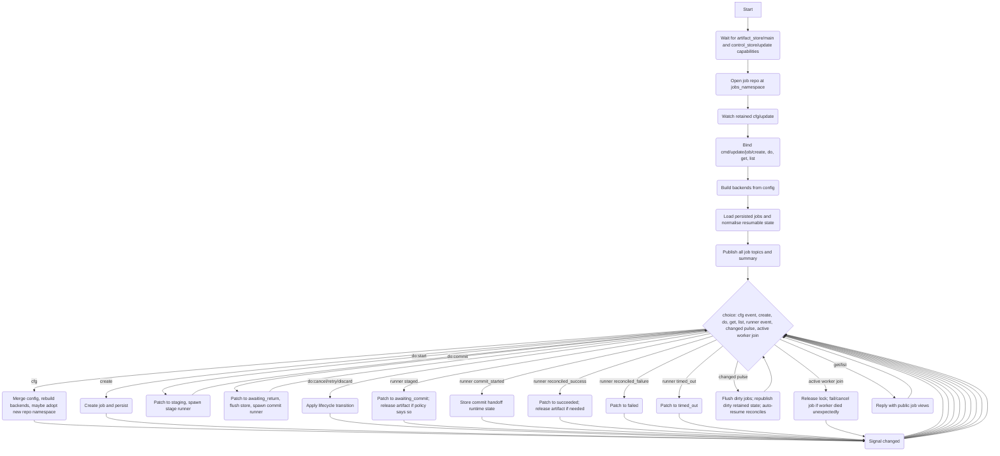
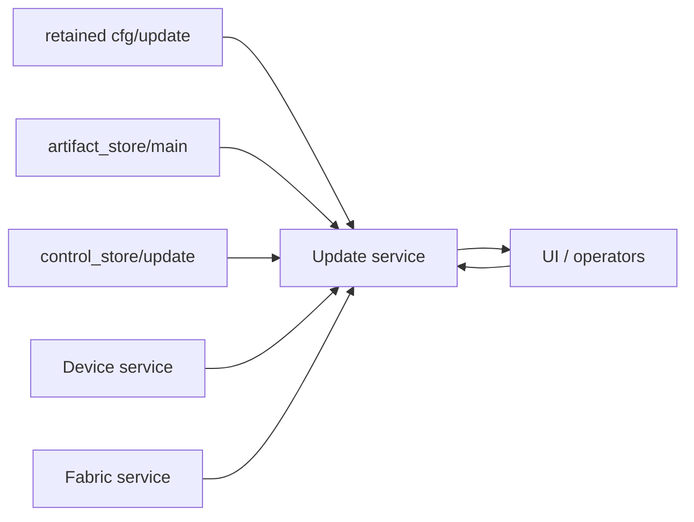
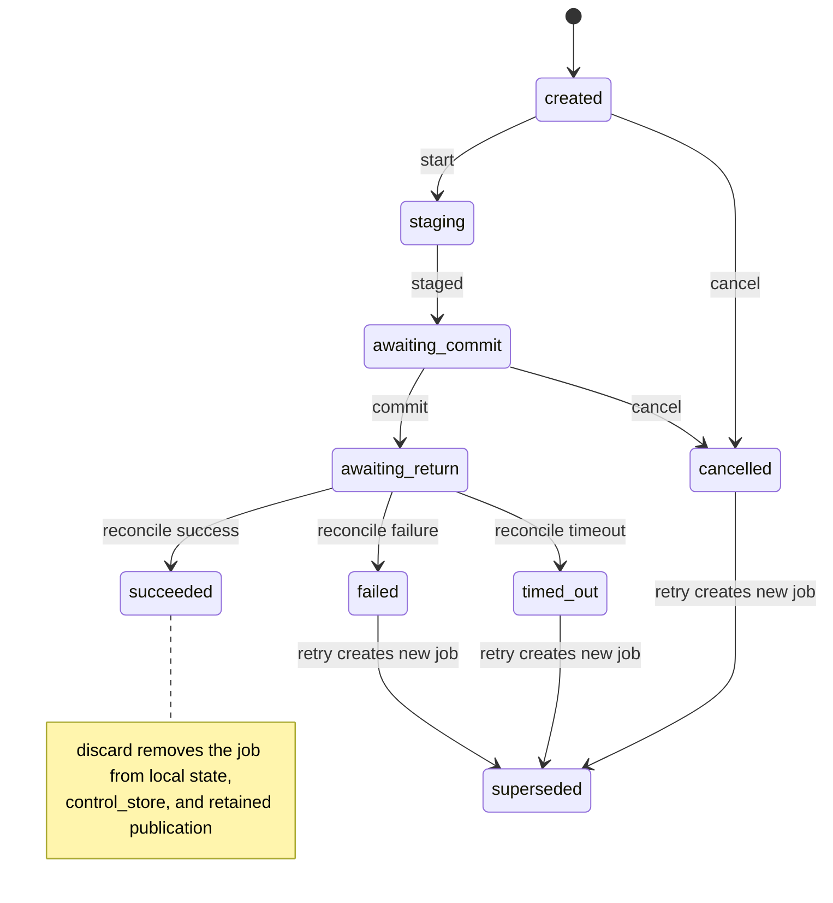
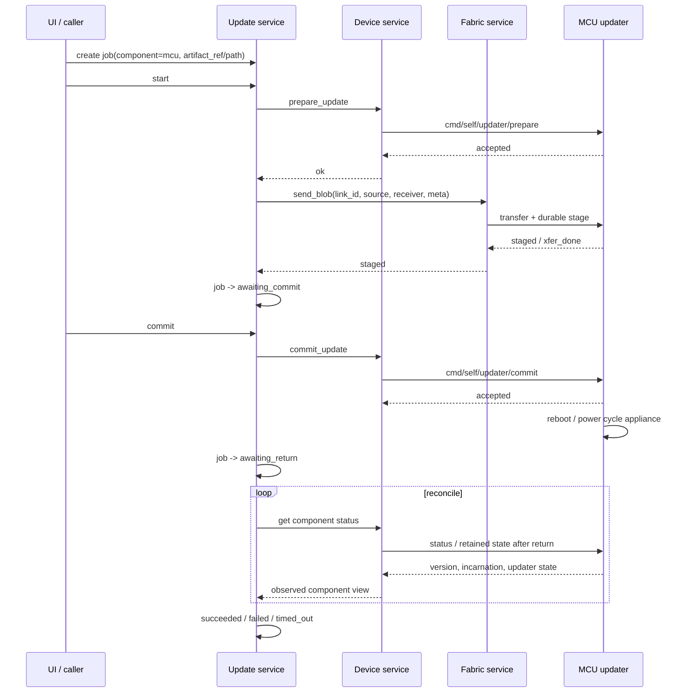
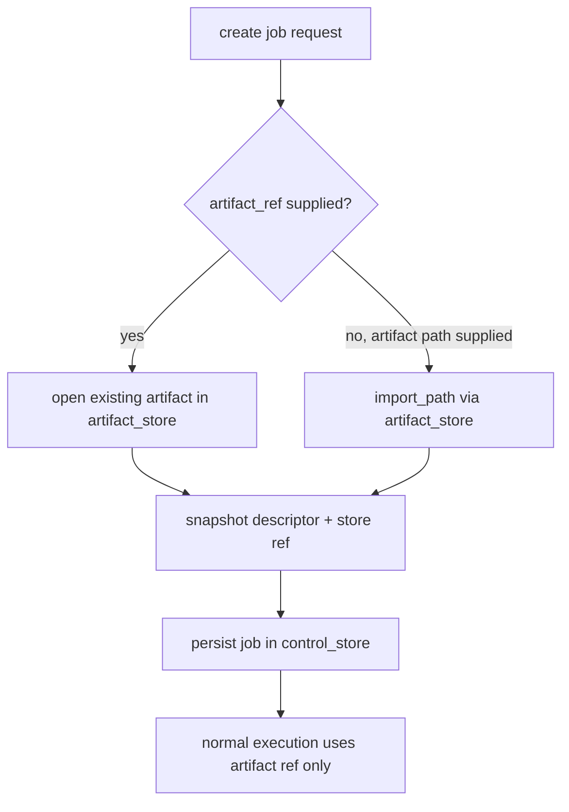

# Update Service

## Description

The Update Service is an application-layer service responsible for:

1. **Job management** — creating, storing, listing, retrieving, retrying, cancelling, and discarding update jobs.
2. **Artifact normalisation** — resolving a caller-supplied artifact reference or importing a filesystem path into the artifact store capability, then carrying only artifact references through the rest of the flow.
3. **Backend orchestration** — delegating component-specific prepare / stage / commit / reconcile work to pluggable backends.
4. **Durable persistence** — persisting jobs in the control store capability under a configurable namespace and re-adopting persisted jobs on restart.
5. **Retained state publication** — publishing one retained record per job plus an aggregate summary under `state/update/...`.
6. **Post-commit reconciliation** — after a destructive commit may have rebooted the target, periodically reconciling observed component state until success, failure, or timeout.

The service is intentionally policy-light in the current codebase:
- one active job at a time (`global_single` admission)
- no scheduler/defer queue
- jobs are explicit, operator-driven objects
- artifacts are managed via capability backends rather than by direct filesystem access.

## Dependencies

### Consumed retained configuration

| Topic | Usage |
|-------|-------|
| `{'cfg','update'}` | Runtime configuration. Retained; replayed on startup. |

### HAL capabilities consumed

| Capability class | Id | Usage |
|------------------|----|-------|
| `artifact_store` | `'main'` | Open, delete, and import artifacts by path. |
| `control_store`  | `'update'` | Persist and reload job records in the configured namespace. |

These are acquired through `svc:wait_for_cap(...)` before job handling begins.

### Consumed service endpoints

The service depends on backends to talk to the rest of the system.

#### Through `device` (component proxy backends)

| Topic | Usage |
|-------|-------|
| `{'cmd','device','component','get'}` | Observe current component state. |
| `{'cmd','device','component','do'}` | Perform `prepare_update` / `commit_update`, and for generic component-proxy backends also `stage_update`. |

#### Through `fabric` (MCU backend transfer path)

| Topic | Usage |
|-------|-------|
| `{'cmd','fabric','transfer'}` | Stage a blob to a remote member over the fabric link. |

## Configuration

Received via retained bus message on `{'cfg','update'}`.

Schema:

```lua
{
  schema = 'devicecode.config/update/1',
  jobs_namespace = <string|nil>,
  reconcile = {
    interval_s = <number|nil>,
    timeout_s = <number|nil>,
  } | nil,
  artifacts = {
    default_policy = <string|nil>,
    policies = {
      [<component>] = 'keep' | 'release' | 'transient_only' | <string>,
    } | nil,
  } | nil,
  components = {
    [<component>] = {
      backend = 'cm5_swupdate' | 'mcu_component' | <string>,
      transfer = {
        link_id = <string|nil>,
        receiver = <topic|nil>,
        timeout_s = <number|nil>,
      } | nil,
      timeout_prepare = <number|nil>,
      timeout_stage = <number|nil>,
      timeout_commit = <number|nil>,
    }
  } | nil,
  admission = {
    mode = 'global_single' | <string>,
  } | nil,
}
```

### Default configuration

If no retained config is present, the service uses:

```lua
{
  schema = 'devicecode.config/update/1',
  jobs_namespace = 'update/jobs',
  reconcile = {
    interval_s = 10.0,
    timeout_s = 180.0,
  },
  artifacts = {
    default_policy = 'transient_only',
    policies = {
      cm5 = 'transient_only',
      mcu = 'transient_only',
    },
  },
  components = {
    cm5 = {
      backend = 'cm5_swupdate',
    },
    mcu = {
      backend = 'mcu_component',
      transfer = {
        link_id = 'cm5-uart-mcu',
        receiver = { 'rpc', 'member', 'mcu', 'receive' },
        timeout_s = 60.0,
      },
    },
  },
  admission = {
    mode = 'global_single',
  },
}
```

If `cfg.components` is supplied, it replaces the default component backend table entirely.

## Exposed command topics

| Topic | Usage |
|-------|-------|
| `{'cmd','update','job','create'}` | Create a new update job. |
| `{'cmd','update','job','do'}` | Perform a lifecycle action on a job. |
| `{'cmd','update','job','get'}` | Fetch one public job view. |
| `{'cmd','update','job','list'}` | Fetch all public job views. |

## Job model

Each persisted job contains, at minimum:

```lua
{
  job_id = <string>,
  offer_id = <string|nil>,
  component = <string>,
  artifact_ref = <string>,
  artifact_meta = <table|nil>,
  expected_version = <string|nil>,
  metadata = <table|nil>,
  state = <string>,
  next_step = <string|nil>,
  created_seq = <integer>,
  updated_seq = <integer>,
  created_mono = <number>,
  updated_mono = <number>,
  result = <table|nil>,
  error = <string|nil>,
  runtime = {
    attempt = <integer>,
    adopted = <boolean>,
    active_lock = <string|nil>,
    last_progress = <any|nil>,
    phase_run_id = <string>,
    phase_mono = <number>,
    ...
  },
}
```

### Job states

#### Passive states
- `created`
- `awaiting_commit`

#### Active states
- `staging`
- `awaiting_return`

#### Terminal states (observable job records)
- `succeeded`
- `failed`
- `rolled_back`
- `cancelled`
- `timed_out`
- `superseded`

Note: the model enum also includes `discarded`, but the current code deletes discarded jobs from the store and unretians their per-job topics rather than transitioning a persisted job into a visible `discarded` state.

### Public job actions

The service exposes action booleans based on the current job state:

- `start`
- `commit`
- `cancel`
- `retry`
- `discard`

## Artifact handling

The service never reads an artifact directly from the filesystem.

A job may be created from:

### Existing artifact ref
```lua
{ artifact_ref = <string> }
```

The service opens it through `artifact_store.open` and snapshots its descriptor.

### Filesystem path
```lua
{ artifact = <string path> }
```

The service imports it through `artifact_store.import_path(path, meta, policy)` and stores only the resulting artifact ref plus the descriptor snapshot.

Artifact retention policy is determined by:
- `cfg.artifacts.policies[component]`
- falling back to `cfg.artifacts.default_policy`

During execution the backend may also return `artifact_retention` in its staged metadata.
The service currently honours:
- `release` — delete the artifact after successful staging
- `keep` / anything else — leave the artifact in store

Artifacts are also deleted on discard and on some failure/success paths when the policy requires it.

## Backend model

The service constructs one backend instance per configured component.

### `cm5_swupdate`

Built via the generic component proxy backend.

Uses `device` to:
- fetch status
- `prepare_update`
- `stage_update`
- `commit_update`

Reconcile success when:
- observed version matches `expected_version`
- and component state is compatible with running/idle/ready

Reconcile failure when:
- state is `failed`
- or `rollback_detected`

Artifact retention for this backend is `keep`.

### `mcu_component`

Built on top of the component proxy backend, but overrides stage.

Prepare and commit still use `device` action calls.

Stage uses the fabric transfer service directly:

```lua
conn:call({ 'cmd', 'fabric', 'transfer' }, {
  op = 'send_blob',
  link_id = <configured link_id>,
  source = <opened artifact source>,
  receiver = <configured receiver topic|nil>,
  meta = {
    kind = 'firmware',
    component = 'mcu',
    version = job.expected_version,
    job_id = job.job_id,
    size = source:size(),
    checksum = source:checksum(),
    metadata = job.metadata,
  },
}, { timeout = transfer.timeout_s })
```

Stage success is converted into:
- `staged = true`
- `artifact_retention = 'release'` unless a different retention is already supplied

Reconcile success when either:
- observed version matches `expected_version`, or
- pre-commit incarnation changes and the component state is `running` or `ready`

Reconcile failure when:
- state is `failed`
- or `rollback_detected`

## Exposed retained topics

| Topic | Payload |
|-------|---------|
| `{'state','update','jobs', <job_id>}` | public job view |
| `{'state','update','summary'}` | aggregate summary |

### Public job payload

```lua
{
  job_id = <string>,
  component = <string>,
  source = {
    offer_id = <string|nil>,
  },
  artifact = {
    ref = <string|nil>,
    meta = <table|nil>,
    expected_version = <string|nil>,
    released_at = <number|nil>,
    retention = <string|nil>,
  },
  lifecycle = {
    state = <string>,
    next_step = <string|nil>,
    created_seq = <integer>,
    updated_seq = <integer>,
    created_mono = <number>,
    updated_mono = <number>,
    error = <string|nil>,
  },
  observation = {
    pre_commit_incarnation = <number|nil>,
    post_commit_incarnation = <number|nil>,
  },
  actions = {
    start = <boolean>,
    commit = <boolean>,
    cancel = <boolean>,
    retry = <boolean>,
    discard = <boolean>,
  },
  result = <table|nil>,
  metadata = <table|nil>,
}
```

### Summary payload

```lua
{
  kind = 'update.summary',
  jobs = { <public job>, ... },
  counts = {
    total = <integer>,
    active = <integer>,
    terminal = <integer>,
    awaiting_commit = <integer>,
    awaiting_return = <integer>,
    created = <integer>,
    failed = <integer>,
    succeeded = <integer>,
    ... state counters ...
  },
  active = {
    job_id = <string>,
    component = <string>,
    state = <string>,
    since = <number>,
  } | nil,
  locks = {
    global = <job_id|nil>,
    component = { [<component>] = <job_id|nil> },
  },
}
```

## Job lifecycle

### Create

`cmd/update/job/create` accepts:

```lua
{
  component = <string>,
  offer_id = <string|nil>,
  artifact_ref = <string|nil>,
  artifact = <string path|nil>,
  expected_version = <string|nil>,
  metadata = <table|nil>,
}
```

The service:
1. validates the component exists in config
2. resolves/imports the artifact
3. creates a job in state `created`
4. saves it to the control store
5. marks publications dirty.

### Start

`cmd/update/job/do` with:

```lua
{ job_id = <string>, op = 'start' }
```

Allowed only when state is `created` and no global lock is held.

Flow:
1. patch job to `staging`
2. spawn stage runner
3. runner performs backend `prepare`
4. runner performs backend `stage`
5. on success emit `staged`
6. shell patches job to `awaiting_commit`
7. if staged metadata says `artifact_retention = 'release'`, release the artifact immediately.

### Commit

`cmd/update/job/do` with:

```lua
{ job_id = <string>, op = 'commit' }
```

Allowed only when state is `awaiting_commit` and no global lock is held.

Flow:
1. patch job to `awaiting_return`
2. persist dirty jobs immediately before commit
3. spawn commit runner
4. runner performs backend `commit`
5. runner enters reconcile loop until success/failure/timeout

### Cancel

Allowed only when state is `created` or `awaiting_commit` and not active.

Patches state to `cancelled`.

### Retry

Allowed only for terminal failed/rolled-back/timed-out/cancelled jobs that still have an artifact ref.

Creates a new job from the same artifact ref and metadata, then marks the old job `superseded`.

### Discard

Allowed only for terminal jobs.

Deletes the artifact if still present, deletes the job from the control store, removes local state, and unretains the per-job topic. The job is removed; it is not published in a persisted `discarded` state.

## Persistence and adoption

Jobs are persisted through `control_store/update` under `jobs_namespace`.

On startup:
1. load all jobs from the repo
2. normalise persisted states
3. mark all jobs dirty
4. publish all jobs and summary
5. signal `changed`
6. if a resumable job exists (`awaiting_return` + `next_step='reconcile'`), spawn a reconcile runner automatically.

Normalisation rules for persisted jobs:
- `staging` → `created` if the artifact ref still exists, else `failed` with `interrupted_before_stage`
- `awaiting_return` remains resumable and gets `next_step='reconcile'`
- `awaiting_approval`, `deferred`, or `staged` become `awaiting_commit`

## Reconciliation

The reconcile runner loops every `cfg.reconcile.interval_s` until:
- backend reports `done=true, success=true`
- backend reports `done=true, success=false`
- timeout exceeds `cfg.reconcile.timeout_s`

Intermediate not-done results are published as `reconcile_progress`, which keeps the job in `awaiting_return`.

## Locking and admission

Current code enforces one active job at a time.

- `state.locks.global` holds the active job id
- `state.locks.component[component]` is also set, but `can_activate()` currently only checks the global lock
- `state.active_job` tracks the child scope and start time of the currently running stage/commit/reconcile worker

Admission mode config exists, but only `global_single` is effectively implemented in the current code.

## Service Flow

### Update main fiber




## Additional Review Diagrams

### Service position in the platform



### Job lifecycle state machine



### MCU update sequence across reboot



### Artifact handling decision path



## Architecture

- The service shell owns all durable state, job transitions, locks, and publication.
- Stage/commit/reconcile work runs in child scopes and reports back via a bounded mailbox.
- Artifact material is always referred to indirectly by artifact ref after creation.
- The current implementation keeps the scheduling model intentionally simple: one active job globally.
- The service is designed so that:
  - component-specific mechanics live in backends
  - service-level policy, persistence, and publication live in the shell
  - destructive commit is followed by explicit observation and timeout-based reconcile.
