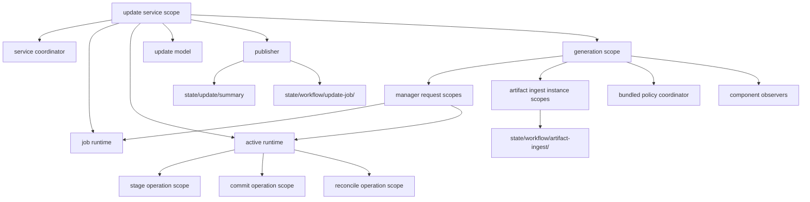
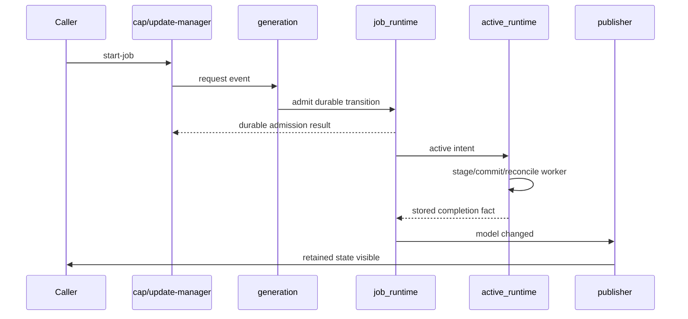

# Update service guide

## Purpose

Update owns firmware update workflows, artifact ingestion and update-domain summaries.

It is responsible for:

```text
durable update jobs
artifact ingest workflows
single-active-update admission
component stage/commit/reconcile work
restart adoption
bundled-image policy
update-domain summaries
workflow records
public update manager and ingest capabilities
```

Update must remain responsive while storage, artifact handling, component operations or restart reconciliation are slow.

## Lifetime shape


```mermaid
flowchart TD
  UpdateScope["update service scope"] --> Coordinator["service coordinator"]
  UpdateScope --> JobRuntime["job runtime"]
  UpdateScope --> ActiveRuntime["active runtime"]
  UpdateScope --> Model["update model"]
  UpdateScope --> Publisher["publisher"]
  UpdateScope --> Generation["generation scope"]

  Generation --> Manager["manager request scopes"]
  Generation --> Ingest["artifact ingest instance scopes"]
  Generation --> Bundled["bundled policy coordinator"]
  Generation --> Observers["component observers"]

  Manager --> JobRuntime
  Manager --> ActiveRuntime
  Ingest --> Workflow["state/workflow/artifact-ingest/<id>"]

  ActiveRuntime --> Stage["stage operation scope"]
  ActiveRuntime --> Commit["commit operation scope"]
  ActiveRuntime --> Reconcile["reconcile operation scope"]

  Publisher --> Summary["state/update/summary"]
  Publisher --> Jobs["state/workflow/update-job/<id>"]
```

The key split is:

```text
generation admits and routes
job_runtime owns durable authority
active_runtime owns active execution
publisher projects public retained state
```

Generation replacement must not cancel already accepted durable active work.

## Public surfaces

Update should publish:

```text
svc/update/status
svc/update/meta
cfg/update

cap/update-manager/main/meta
cap/update-manager/main/status
cap/update-manager/main/rpc/create-job
cap/update-manager/main/rpc/start-job
cap/update-manager/main/rpc/commit-job
cap/update-manager/main/rpc/cancel-job
cap/update-manager/main/rpc/retry-job
cap/update-manager/main/rpc/discard-job

cap/artifact-ingest/main/meta
cap/artifact-ingest/main/status
cap/artifact-ingest/main/rpc/create
cap/artifact-ingest/main/rpc/append
cap/artifact-ingest/main/rpc/commit
cap/artifact-ingest/main/rpc/abort

state/update/summary
state/update/component/<component>
state/workflow/update-job/<id>
state/workflow/artifact-ingest/<id>
```

Do not expose public update workflows under `cmd/update/...`.

## Durable and active split


```mermaid
sequenceDiagram
  participant Caller
  participant Manager as cap/update-manager
  participant Gen as generation
  participant Job as job_runtime
  participant Active as active_runtime
  participant Pub as publisher

  Caller->>Manager: start-job
  Manager->>Gen: request event
  Gen->>Job: admit durable transition
  Job-->>Manager: durable admission result
  Job->>Active: active intent
  Active->>Active: stage/commit/reconcile worker
  Active-->>Job: stored completion fact
  Job->>Pub: model changed
  Pub->>Caller: retained state visible
```

Manager requests may wait for durable admission. They must not mutate durable state directly.

Manager requests are caller-owned until admitted. The manager should create a `request_owner` at admission and pass `owner:caller_cancel_op()` to any scoped request work. If the caller abandons the bus request before durable admission completes, the request scope is cancelled and late completion is local only.

Durable admission is a boundary. Once an update job transition has been durably accepted, caller abandonment stops waiting for the reply but does not imply rollback of the durable fact unless the operation explicitly promises rollback.

Active workers report facts. They do not directly update durable job records.

## Artifact ownership

Artifact ingest is a workflow.

Rules:

```text
uncommitted sink belongs to ingest instance
append operations are serialised per instance
commit transfers sink/artifact ownership durably
abort terminates uncommitted resources immediately
finalisers abandon unresolved requests and terminate uncommitted resources
queued ingest requests abandoned before active admission are skipped
active ingest requests observe caller abandonment through owner:caller_cancel_op()
```

## Reviewer checklist

```text
No public cmd/update/... paths.
Manager calls are under cap/update-manager/...
Manager request work observes caller abandonment through owner:caller_cancel_op().
Ingest calls are under cap/artifact-ingest/...
Ingest append/commit/abort work observes caller abandonment through owner:caller_cancel_op().
Jobs are retained under state/workflow/update-job/<id>.
Ingest records are retained under state/workflow/artifact-ingest/<id>.
Update summaries are under state/update/...
job_runtime owns durable authority.
active_runtime is service-owned, not generation-owned.
Completions are stored before reporting.
Generation replacement does not cancel accepted active work.
Workers report facts rather than mutating durable state directly.
```
