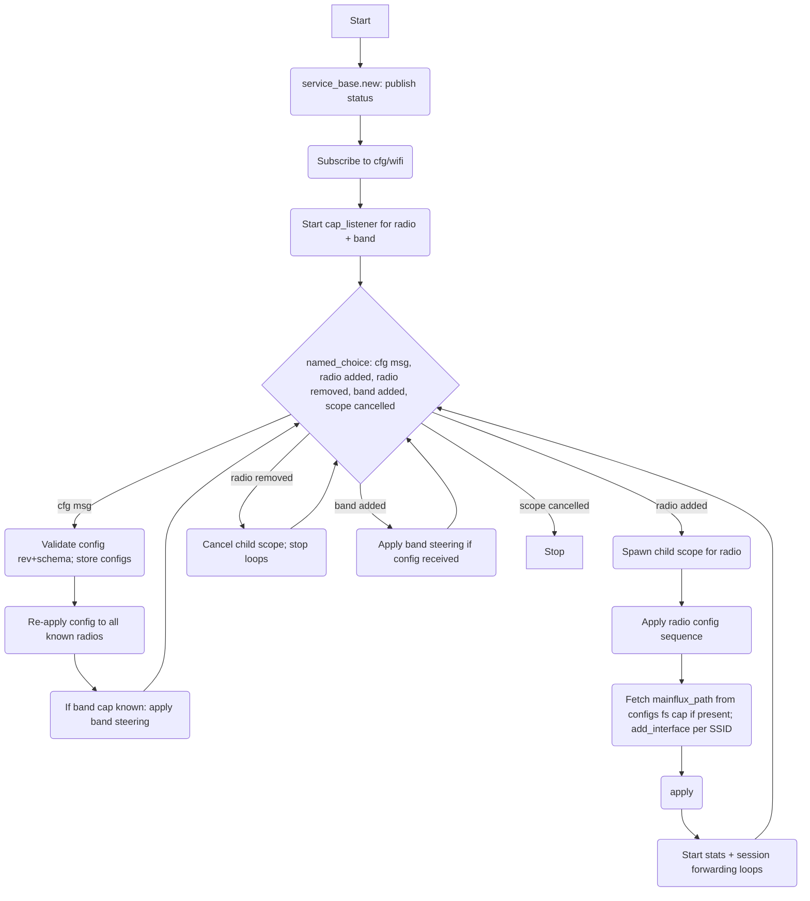

# Wifi Service

## Description

The Wifi Service is an application-layer service responsible for:

1. **Radio configuration** — forwarding per-radio settings (channel, txpower, country, enabled state) to HAL radio capabilities.
2. **SSID management** — configuring wireless interfaces (SSIDs) on each radio, sourcing SSID credentials from `mainflux.json` via the `configs` filesystem capability when a `mainflux_path` is present in the config.
3. **Band steering configuration** — forwarding band steering parameters to the HAL `band` capability (DAWN daemon).
4. **Stats forwarding** — subscribing to `cap/radio/<id>/state|event` topics emitted by radio capabilities and forwarding them to the observability bus.
5. **Session management** — tracking client association/disassociation events, hashing MAC addresses, and emitting session start/end records.
6. **Capability lifecycle tracking** — starting and stopping radio configuration when radio capabilities come and go.

The service interacts with hardware exclusively through HAL capabilities on the bus. No direct file reads or command execution are performed by the service itself.

## Dependencies

HAL capabilities consumed:

| Capability class | Id                           | Usage                                                    |
|------------------|------------------------------|----------------------------------------------------------|
| `radio`          | per radio (e.g. `'radio0'`)  | Configure channels, txpower, country, SSIDs; `apply`     |
| `band`           | `'1'`                        | Configure band steering (DAWN); `apply`                  |
| `filesystem`     | `'configs'`                  | Read `mainflux.json` for SSID credential sourcing        |

Service topics consumed:

| Topic              | Usage                                                                       |
|--------------------|-----------------------------------------------------------------------------|
| `{'cfg', 'wifi'}`  | Retained config — the main fiber subscribes to this for all wifi settings   |

Cap topics subscribed for radio stats:

| Topic                                    | Usage                                                              |
|------------------------------------------|--------------------------------------------------------------------|
| `{'cap', 'radio', id, 'state', name}`    | Named stat emitted by the radio driver; forwarded to obs bus       |
| `{'cap', 'radio', id, 'event', name}`    | Named client event emitted by the radio driver; used for sessions  |

## Configuration

Received via retained bus message on `{'cfg', 'wifi'}`. The message uses the standard versioned config envelope:

```lua
{
  rev  = <number>,   -- config revision; service skips messages with rev <= last applied rev
  data = {
    schema        = "devicecode.config/wifi/1",
    report_period = <number>,       -- required: stats publish interval in seconds
    radios = {                      -- required: array of per-radio configs
      {
        name     = <string>,          -- required: radio section name, e.g. "radio0"
        band     = <string>,          -- required: "2g" or "5g"
        channel  = <number|string>,   -- required: channel number or "auto"
        htmode   = <string>,          -- required: e.g. "HE80", "VHT80", "HT40+"
        channels = <table|nil>,       -- required when channel == "auto": list of allowed channels
        txpower  = <number|string|nil>, -- optional: transmit power
        country  = <string|nil>,      -- optional: 2-letter ISO country code
        disabled = <boolean|nil>,     -- optional: if true, radio is administratively disabled
      },
      ...
    },
    ssids = {                       -- required: array of SSID configs
      {
        name           = <string>,      -- required: SSID string
        mode           = <string>,      -- required: "access_point"|"client"|"adhoc"|"mesh"|"monitor"
        radios         = <table>,       -- required: list of radio names this SSID applies to
        network        = <string|nil>,  -- required if mainflux_path absent: network interface name
        mainflux_path  = <string|nil>,  -- optional: path within the configs filesystem cap to the mainflux credential file (e.g. "mainflux.json")
        encryption     = <string|nil>,  -- optional: default "none"
        password       = <string|nil>,  -- optional
      },
      ...
    },
    band_steering = {               -- required: band steering settings
      globals = {
        kicking = {
          kick_mode           = <string>,   -- required: "none"|"compare"|"absolute"|"both"
          bandwidth_threshold = <number>,   -- required
          kicking_threshold   = <number>,   -- required
          evals_before_kick   = <number>,   -- required
        },
        stations = {                -- optional
          use_station_count = <boolean>,
          max_station_diff  = <number>,
        },
        rrm_mode         = <string|nil>,    -- optional
        neighbor_reports = {               -- optional
          dyn_report_num      = <number>,
          disassoc_report_len = <number>,
        },
        legacy = <table|nil>,       -- optional: key-value legacy options
      },
      timings = {
        updates = {                 -- required: update frequencies in seconds
          client     = <number>,
          chan_util   = <number>,
          hostapd    = <number>,
        },
        inactive_client_kickoff = <number>,  -- required
        cleanup = {                 -- required
          client = <number>,
          probe  = <number>,
          ap     = <number>,
        },
      },
      bands = {                     -- required: per-band scoring config
        ["2G"] = {
          initial_score    = <number>,
          rssi_scoring     = { ... },   -- optional
          chan_util_scoring = { ... },  -- optional
          support_bonuses  = { ... },   -- optional
        },
        ["5G"] = { ... },           -- same structure
      },
    },
  },
}
```

> **Underflow note:** JSON decoding may silently convert negative numbers to large positive integers due to integer underflow. The service must check decoded numeric fields that are expected to be non-negative and, if the value exceeds a sanity threshold (e.g. > 2^31), treat it as if the original value were negative by subtracting 2^32.

## SSID Sourcing Policy

When an SSID entry contains `mainflux_path`, the service reads that file from the `configs` filesystem capability:

```lua
cap_ref:call_control('read', FilesystemReadOpts(mainflux_path))
```

The file is expected to contain a JSON object with a `networks.networks` array holding credential payloads. Each network entry in the array is used to derive the SSID `name`, `password`, and `encryption` for one wireless interface.

**If the file read fails or the content cannot be decoded, no SSIDs are configured for that entry at all.** No hardcoded fallback SSIDs are produced. This is an intentional strict policy — partial SSID configuration is considered worse than no configuration.

When `mainflux_path` is absent, the SSID entry is applied directly using its `name`, `network`, and other fields.

## Radio Capability Lifecycle

The service discovers radio capabilities using `cap_sdk.new_cap_listener(conn, 'radio')`. When a radio capability is added:

- The service applies the matching radio config (by name) from the stored `data.radios` config.
- It configures SSIDs that reference that radio, sourcing credentials from the `configs` filesystem cap via `mainflux_path` when present.
- It starts the stats forwarding and session tracking loop, subscribed to `{'cap', 'radio', id, 'state', '+'}` and `{'cap', 'radio', id, 'event', '+'}`.

When a radio capability is removed, the service cancels its associated child scope, stopping all loops and releasing subscriptions.

The band capability (`class = 'band'`, `id = '1'`) is discovered independently. Band steering configuration is applied whenever both the band capability is available and a valid config has been received.

## Radio Configuration Sequence

For each radio capability added, the service invokes RPCs via `cap_ref:call_control(method, args)` in the following order:

1. `clear_radio_config` — resets the driver's staged radio config to base state.
2. `set_report_period` — sets the stats emit interval.
3. `set_channels` — sets band, channel, htmode, and optional auto-channels list.
4. `set_txpower` — if present in config.
5. `set_country` — if present in config.
6. `set_enabled` — if `disabled` is present in config.
7. `add_interface` (repeated per SSID) — stages each SSID as a wireless interface. For SSIDs with `mainflux_path`, credentials are fetched from the `configs` filesystem cap before this call.
8. `apply` — tells the driver to commit staged config and reload wireless.

Rollback is not called by the service on error; the radio driver's staged state is simply abandoned.

## Session Management

Client association and disassociation events arrive on `{'cap', 'radio', id, 'event'}`. The wifi service is responsible for:

1. **MAC hashing** — raw MAC addresses are never forwarded to the observability bus. Each MAC is hashed using `gen.userid(mac)` to produce a stable, anonymous user identifier.
2. **Session tracking** — on association, a new session ID is generated via `gen.gen_session_id()` and a `session_start` record is emitted. On disassociation, a `session_end` record is emitted with the same session ID.
3. **Published session events** — emitted to the specific metric topic for the event type: `{'obs', 'v1', 'wifi', 'metric', 'session_start'}` and `{'obs', 'v1', 'wifi', 'metric', 'session_end'}`. Each record includes fields `user_id`, `session_id`, `radio`, and `timestamp`.

The radio driver itself has no knowledge of sessions or MAC hashing — it emits raw events and the wifi service applies the anonymisation and session logic.

## Published Topics

All stats and events are forwarded to `obs/v1/wifi/metric/<name>` topics, matching the metrics collection keys used in device configs.

| Topic                                               | Content                                                         |
|-----------------------------------------------------|-----------------------------------------------------------------|
| `{'svc', 'wifi', 'status'}`                         | Service status (via `service_base`)                             |
| `{'obs', 'v1', 'wifi', 'metric', <name>}`           | Named stat or event from a radio (e.g. `num_sta`, `iface_rx_bytes`, `client_signal`) |
| `{'obs', 'v1', 'wifi', 'metric', 'session_start'}`  | Anonymised session start record (MAC hashed to `user_id`)       |
| `{'obs', 'v1', 'wifi', 'metric', 'session_end'}`    | Anonymised session end record (MAC hashed to `user_id`)         |

## Service Flow



### Stats forwarding loop (per radio)

Runs in child scope, subscribes to `{'cap', 'radio', id, 'state', '+'}` and `{'cap', 'radio', id, 'event', '+'}`:

1. On `state/<name>` message: forward payload to `{'obs', 'v1', 'wifi', 'metric', name}`.
2. On `event/client_event` message (association):
   - Hash MAC via `gen.userid(mac)` → `user_id`.
   - Generate session ID via `gen.gen_session_id()` → `session_id`.
   - Store `(mac → session_id)` in per-radio session table.
   - Publish `session_start` record to `{'obs', 'v1', 'wifi', 'metric', 'session_start'}`.
3. On `event/client_event` message (disassociation):
   - Look up `session_id` from per-radio session table.
   - Publish `session_end` record to `{'obs', 'v1', 'wifi', 'metric', 'session_end'}`.
   - Remove entry from session table.
4. On other `event/<name>` messages: forward payload to `{'obs', 'v1', 'wifi', 'metric', name}`.
5. On scope cancellation: exit loop.

## Architecture

- The service uses `service_base.new(conn, opts)` for `svc:status`, `svc:obs_log`, and `svc:obs_event`.
- Radio caps and the band cap are tracked independently. A config update always attempts to re-apply to all currently known capabilities.
- Each radio capability runs its lifecycle in a child scope of the main service scope. Cancelling the child scope stops the stats/session forwarding loops and releases all subscriptions for that radio.
- SSID configuration is always idempotent: each full config update clears and rebuilds all interfaces from scratch.
- Mainflux credentials are read from the `configs` filesystem capability via `cap_ref:call_control('read', FilesystemReadOpts(mainflux_path))`. No bus topic subscription is used for mainflux data. On read failure, the SSID entry is skipped entirely.
- `band_steering.data.globals.kicking.kick_mode` determines whether `has_band_steering = true` is set on each SSID. When `kick_mode == "none"`, band steering flags are not added to the wifi-iface entries.
- Config version gating: the service checks `msg.rev` on each `cfg/wifi` update and skips messages with `rev <= last_rev` to avoid re-applying stale retained messages.
- A `finally` block on the service scope logs the shutdown reason.
