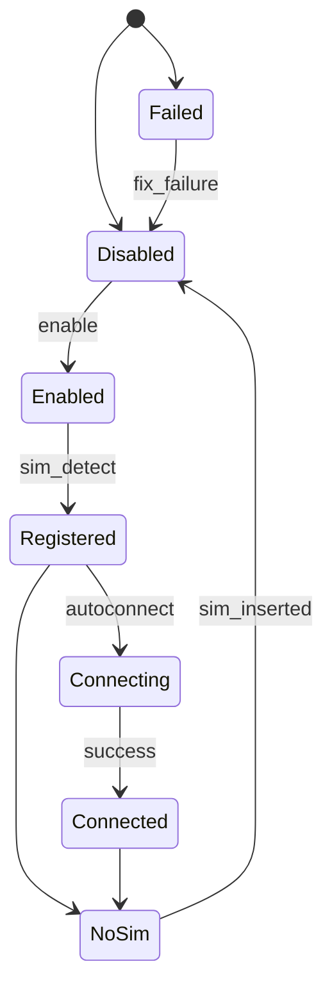

# GSM Service Documentation

## Overview

The GSM service is responsible for managing GSM modems, handling their configuration, and ensuring they connect to the network using appropriate APNs. This document provides a high-level overview (black box) and a detailed internal explanation of how the `gsm.lua` module works.

## GSM Interface Overview

### Responsibilities

- **Modem Management**: Detects and manages GSM modems.
- **Configuration Handling**: Applies configurations to modems based on their IMEI or device type.
- **Network Connection**: Attempts to connect modems to the network using ranked APNs.
- **State Monitoring**: Monitors the state of modems and handles state transitions.

### Key Functions

- **`gsm_service:start`**: Starts the GSM service and initializes the modem manager.

### Bus Interactions

- **Incoming Messages**:
  - **Modem Capability**: Subscribes to `hal/capability/modem/+` to handle modem capability messages.
  - **Modem Info**: Subscribes to various endpoints under `hal/capability/modem/<modem_index>/info/` to get state and hardware information
  - **Configuration**: Subscribes to `config/gsm` to handle configuration messages.

- **Outgoing Messages**:
  - **Modem Control**: Publishes commands to various endpoints under `hal/capability/modem/<modem_index>/control/` to navigate modem through the state machine.
  - **Network Interface**: Publishes network interface information to `gsm/modem/<modem_idx>/net-interface`.

### Configuration

- **Default Configuration**: Holds default settings for modems.
- **Known Modems**: Specific configurations for known modems identified by IMEI or device path.

## GSM Internal Overview

### Data Structures

- **`configs`**: Holds configurations for modems, indexed by IMEI or device type.
- **`modems`**: Stores active modems, indexed by preferred ID fields (IMEI or device).

### Classes and Methods

#### `Modem` Class

- **`Modem:autoconnect(ctx, cutoff)`**:
  - Gathers Modem and sim information.
  - Retrieves ranked APNs and attempts to connect using them.
  - Monitors the connection status and retries if necessary.

- **`Modem:enable_autoconnect(ctx)`**:
  - Spawns a fiber to monitor modem state changes.
  - Handles state transitions such as `failed`, `no_sim`, `disabled`, `registered`, and `connected`.

- **`Modem:update_config(config)`**:
  - Updates the modem configuration and enables/disables autoconnect based on the configuration.

- **`new_modem(ctx, bus_conn, imei, index, modemcard)`**:
  - Creates a new modem instance and initializes its context, bus connection, IMEI, index, and modem card.

#### `gsm_service` Table

- **`gsm_service:start(service_ctx, bus_connection)`**:
  - Starts the GSM service by spawning a fiber for the GSM manager.
  - The GSM manager handles modem capability detection and configuration updates.

### Event Handling

- **`modem_capability_handler(ctx, bus_conn, modem_capability_msg)`**:
  - Handles modem capability messages, subscribes to modem information topics, and updates the modem configuration.

- **`config_handler(config_msg)`**:
  - Handles configuration messages, updates the default and known modem configurations, and applies them to active modems.

### GSM Manager

- **`gsm_manager(ctx, bus_conn)`**:
  - Subscribes to modem capability and configuration topics.
  - Processes capability and configuration messages in a loop, updating modem states and configurations as needed.

### Modem State Transitions

