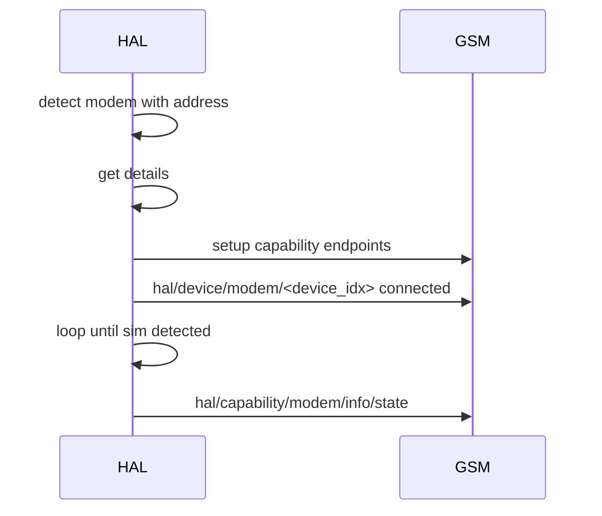
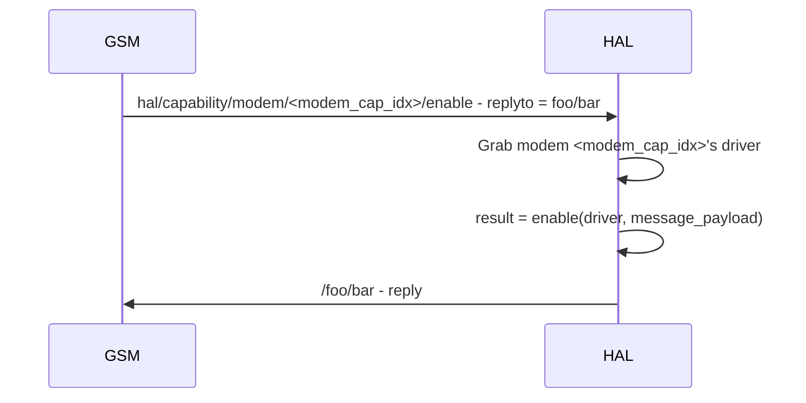
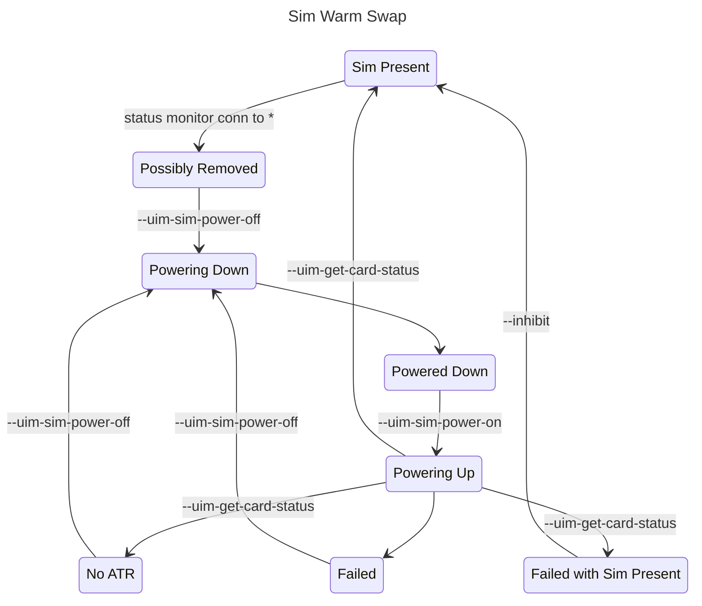

## Description
- HAL exposes the interfaces of mmcli for device functionalities such as modem, location, time and sim through creation of subscription services.
- HAL should be as stateless as possible with state only required to prevent hardware level errors

## Bus Structure
### Capability
Using modem as example
```
hal /capability /modem  /<modem_cap_idx>    /control    /enable
                                                        /disable
                                                        /restart
                                                        /connect
                                                        /disconnect
                                            /info       /state
                                                        /signal-quality

```
### Device
```
hal /device /usb    /<device_idx>   /info   /temperature
                                            /somthing else?
            /cpu    /<device_idx>   /info   /utilisation
```

## Detection steps (modem as example)
Apon detection HAL will use its device_configs to get the modems capability, mode, name etc
HAL will expose the capabilities of the modem on the bus in the format given under 'Bus Structure: Capability'.
A central control method handles all capability endpoint requests.

These will be setup before publishing of detection so the GSM can be sure the capabilities are immediately available. 

Next HAL will publish modem connection events under `hal/device/usb/<index>/` and will expose 
device endpoints in the form:

```
hal /device /usb    /<device_idx>   /info   /temperature
                                            /somthing else?
```
the detection message will have a payload in the format of
```
{
    "status" = {
        "connected" = true,
        "time" = time.now() -- not implemented
    },
    "identity" = {
        "name" = primary|secondary|external,
        "model" = driver:model(),
        "imei" = driver:imei()
    }
    "capability" = {
        "modem" = <modem_cap_idx>,
        "geo" = <geo_cap_idx>|nil,
        "time" = <time_cap_idx>|nil
    }
}
```
This message will be retained until overwritten by a disconnection event upon the device disconnecting.

The modem state monitor will start publishing under the topic `hal/capabilities/modem/<index>/info/state` only
once a sim has been detected as present in the assigned sim slot.



## Capability interfacing
A univeral control fiber will listen for capability control signals, getting the required driver and running the asked for method with supplied arguments. 
The control fiber will return a message which contains the result of running the associated method and an error if aplicable. It should be noted that the 
error field is only for HAL level errors such as 'modem not found' 'endpoint does not exist' etc, mmcli related errors will be found in the result field.

### Capability reply structure
```
{
    result = function return value,
    error = endpoint call error
}
```


## Sim Warm Swap

This is the base state machine for warm swap, it does not take into account locked sims yet.
Warm swap in devicecode v0.9 uses polling to continuously check for a sim with set timings for the polls. 
The new version of warm swap will use mmcli status monitor and qmi monitor to detect "immediate" disconnection of sims
and changes of power states (as asking for power on/off is not immediate) in lieu of timings, hopefully speeding up the process and 
reducing unneeded polls.

## Device Event Structure
```
{
    connected = <bool>,
    type = <type> (usb),
    driver = <driver> (modem_driver),
    capabilities = {
        <cap_name> = {
            <cap_func_name> = <cap_function>,
            ...
        }
        ...
    },
    device_control = {
        <control_option> = <control_function>,
        ...
    },
    identifier = <identifier>,
    identity = {
        device = <device> (modem_card),
        name = <name>
    }
}
```

## Capability Structure
```
{
    endpoints = {
        <cap_func_name> = <cap_function>,
        ...
    },
    driver = <driver>
}
```

## Device Structure
```
{
    endpoints = {
        <control_name> = <control_function>,
        ...
    },
    driver = <driver>, 
    cap_indexes = {
        cap_name = <cap_index>,
        ...
    }
}
```

## Devices Structure
```
{
    <type> (usb) = {
        <device_index> = <device>,
        ...
    },
    ...
}
```

## Capabilities Structure
```
{
    <cap_name> (modem) = {
        <cap_index> = <capability>,
        ...
    },
    ...
}
```

### General Notes
Job of HAL - handle device endpoints and configs, and capability endpoints.
Job of ModemManager - detect modems and build their drivers
Job of Driver - supply endpoints and contain functionality to handle asychronous endpoint access

for ModemManager to build a driver and send it to HAL should it need to have access to configs? If it does not then it will not know which modem is primary/secondary, therefore cannot pick imei or device as the identifier to be used by HAL. If it does then configs must be supplied to ModemManager somehow, perhaps as a class call.