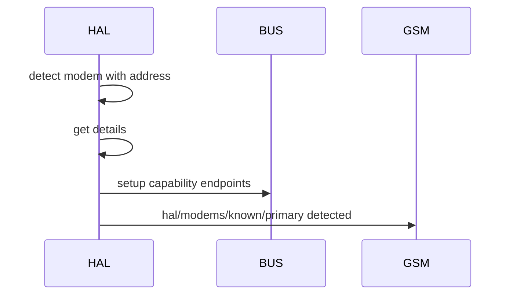
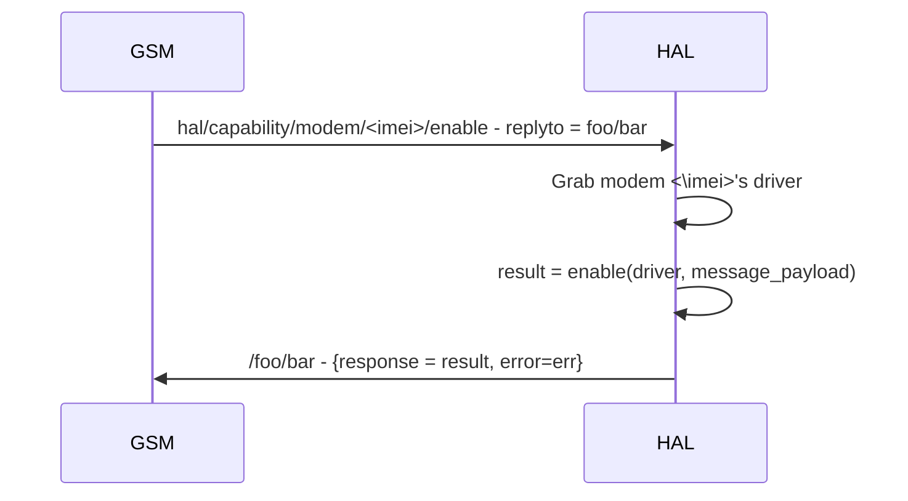

## Description
- HAL exposes the interfaces of mmcli for device functionalities such as modem, location, time and sim through creation of subscription services.
- HAL should be as stateless as possible with state only required to prevent hardware level errors

## Bus Structure
### Capability
Using modem as example
```
hal /capability /modem  /<modem_imei>   /control    /enable
                                                    /disable
                                                    /restart
                                                    /connect
                                                    /disconnect
                                        /info       /state
                                                    /signal-quality

```
### Device
```
hal /device /usb    /<imei?>    /info   /temperature
                                        /somthing else?
            /cpu    /<serial?>  /info   /utilisation?
```

### Detection steps (modem as example)
Apon detection HAL will use its device_configs to get the modems capability, mode, name etc
HAL will expose the capabilities of the modem on the bus in the format by settings up its subscription

These will be setup before publishing of detection so the GSM can be sure the capabilities are immediately available. 

Next HAL will publish modem connection events under `hal/device/usb/<imei>/` and will expose 
endpoints in the form:

```
hal /device /usb    /1  /info   /temperature
                                /somthing else?
```
the detection message will have a payload in the format of
```
{
    "status" = {
        "connected" = true,
        "time" = time.now() -- not implemented
    },
    "identity" = {
        "name" = primary|secondary|external,
        "model" = driver:model(),
        "imei" = driver:imei()
    }
    "capability" = {
        "modem" = 0,
        "geo" = 0,
        "time" = nil
    }
}
```
and it will be retained until a disconnection/connection of the physical device
connection events 



### Capability interfacing
A univeral control fiber will listen for capability control signals, getting the required driver and running the asked for method with supplied arguments. 
The control fiber will return a message which contains the result of running the associated method and an error if aplicable. It should be noted that the 
error field is only for HAL level errors such as 'modem not found' 'endpoint does not exist' etc, mmcli related errors will be found in the result field.
