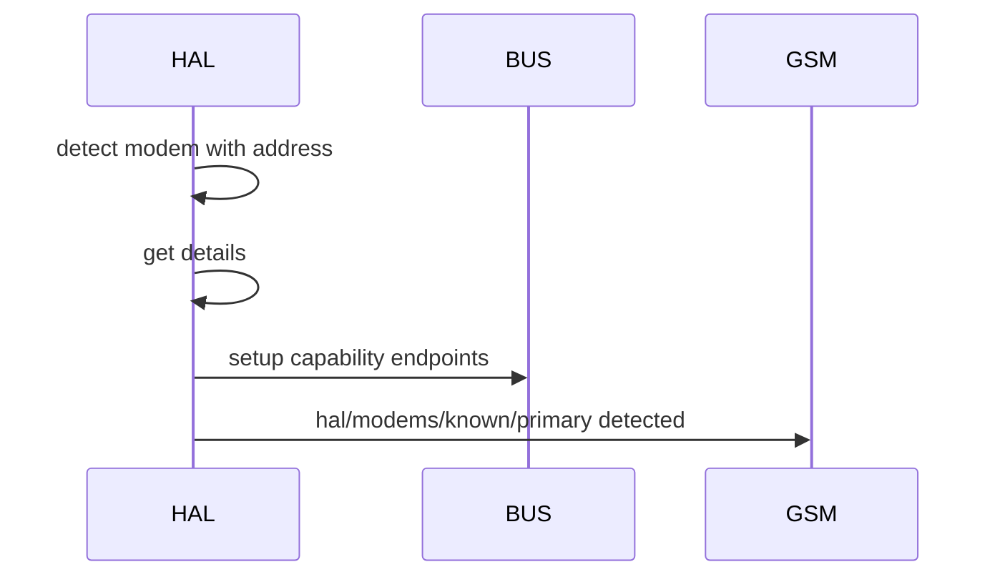
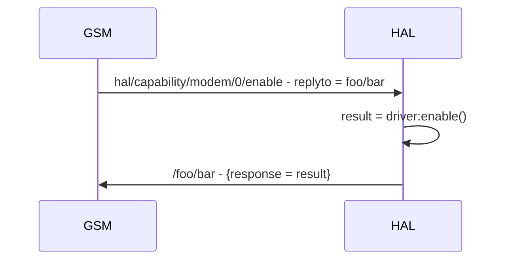

## Description
- HAL exposes the interfaces of mmcli for device functionalities such as modem, location, time and sim through creation of subscription services.
- HAL should be as stateless as possible with state only required to prevent hardware level errors

### Detection steps (modem as example)
Apon detection HAL will use its device_configs to get the modems capability, mode, name etc
HAL will expose the capabilities of the modem on the bus in the format

```
hal /capability /modem  /0  /enable
                            /disable
                            /restart
                            /connect
                            /disconnect
```
These will be setup before publishing of detection so the GSM can be sure the capabilities are immediately available. 

Next HAL will publish modem connection events in the topic format of

```
hal /modems /known  /primary
                    /secondary
            /unknown
                    /1
                    /2
                    ...
```
with a payload in the format of
```
{
    "status" = {
        "connected" = true,
        "time" = time.now()
    },
    "identity" = {
        "name" = primary|secondary|integer,
        "model" = driver:model()
    }
    "capability" = {
        "modem" = 0,
        "geo" = 0,
        "time" = nil
    }
}
```



### Capability interfacing
Each Capability set (such as `hal/capability/modem/0`) will spawn its own fiber which will loop through a choice op on all subsciptions with a revalent wrap handler.
The wrap handler should get a response from the driver and send it to the reply_to field in the original message. 
