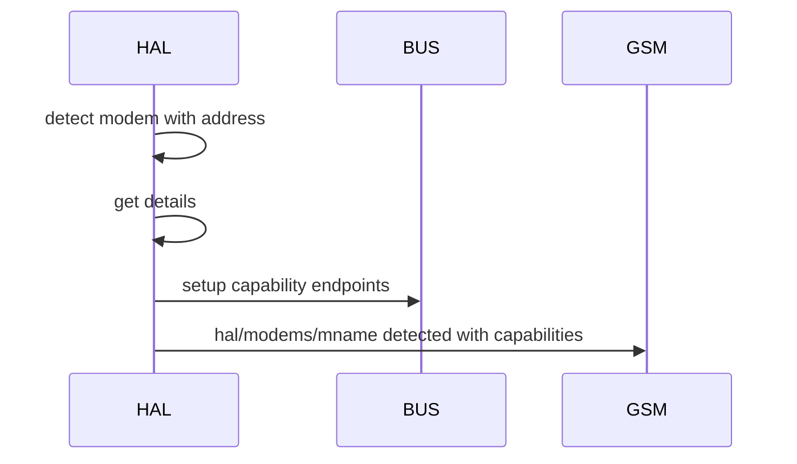

## Description
- HAL exposes the interfaces of mmcli for device functionalities such as modem, location, time and sim through creation of subscription services.
- HAL should be as stateless as possible with state only required to prevent hardware level errors

