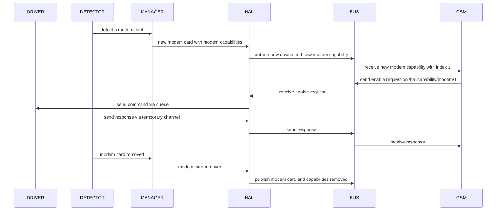

# HAL Usage Documentation
The Hardware Abstraction Layer (HAL) is a service and module (to be implemented) hybrid which provides a layer between platform-specific code.
Currently HAL is only interfaced via the central communication bus.

## Hal Architecture Overview


## Interfacing with HAL

### HAL Bus Interface
1. **Devices**

Devices are published over the bus with the topic  `hal/devices/<device_type>/<device_index>`
where `device_type` is an abstract type of device, for example a modem card is a USB device,
and `device_index` is a unique number used to identify each instance of a device type.

Device connection and disconnection events are published in the following table format
```
{
  connected = <boolean>,
  type = <device_type>,
  index = <device_index>,
  identity = <device_identity>
}
```
where `device_identity` is a table containing any granular device specific information for example a modem card
has the identity table of
```
{
  device = 'modemcard',
  name = <instance_name> or 'unknown',
  imei = <imei>,
  port = <usb_port>
}
```
This lets someone listening for USB devices know that the received device is specifically a modem card and gives some
further identification which can be used to set specific configs to an individual card.

---

2. **Capabilities**

HAL separates devices and their capabilities into separate sections to simplify cases of one-to-many relationships of device to capability.
For example a modem card can provide not only modem functionality but, in some cases, also time and gnss functions. A service that only cares about
finding location will not need to know about modem card devices or time and modem functionalities; it only needs to listen on the bus for gnss
(or geo which is the current word for location functionality) capabilities.

Creation and removal of capabilities are published over the bus with the topic `hal/capabilities/<capability_name>/<capability_index>`
where `capability_name` is the name of a capability for example `modem`, and `capability_index` is a unique number used to identify each instance of a capability under the same name.

Capability creation and removal events are published in the following table format
```
{
  connected = <boolean>,
  name = <cap_name>,
  index = <cap_index>
}
```
*note: I plan to change the name field to type and add an info field which holds a table of identifying information beyond the basic attributes

Capability endpoints are how a service can run functions of a capability, the topic structure to call an endpoint is `hal/capabilities/<capability_name>/<capability_index>/control/<endpoint>`

The modem is the only currently functional capability with the endpoints
```
enable
disable
restart
connect
disconnect
```

An example of calling connect on a modem
```lua
local msg = {
  topic = 'hal/capability/modem/1/control/connect',
  payload = <this is where a list of arguments could go>
}

local sub = bus_connection:request(msg)

local return_msg = sub:next_msg()

-- result holds the return of running the command on the modem driver
-- error holds any communication issues with the modem driver
local ret, err = return_msg.payload.result, return_msg.payload.error
```

**Device and Capability Lifecycle**




## Contributing Device Components and Capabilities to HAL

HAL in it's current state only supports modem card devices and modem capabilities but is built to be easily extensible in order to add or extend
devices and capabilities.

### Steps to Make a New Device
1. **Build the Device Driver**

A device driver will be instantiated for every device connected. This driver must service capabilities for which your device provides.
Your driver must have a command queue from which all capability commands are sent through.
The result of a request is then returned on a return channel which will be provided in the capability command.

The layout of a capability command send from HAL to a driver via the command queue
```lua
local capability_command = {
  command = <string>,
  args = <list>,
  return_channel = channel.new()
}
```

for example a simple driver that receives a command, checks it exists as a driver function and returns the result of that function would look like.
```lua
  local Driver = {
    command_q = channel.new()
  }
  Driver.__index = Driver

  function Driver:command_manager()
    while not self.ctx:err() do
      local cmd = self.command_q:get()
      local func = self[cmd.command]
      if func then
        local val = func(self, unpack(cmd.args))
        cmd.return_channel:put(val)
      end
    end
  end
```
The command_manager function should be run in it's own fiber.

---

2. **Make a Device Manager**

Each device requires a device manager to handle detection of devices and creation of their drivers.
The manager sends device connection and removal events to HAL with capability, device control and identity information
through a queue.

The layout of a device event sent from a device manager to HAL via the device event queue

```lua
local device_event = {
  connected = <bool>,
  type = <string>,
  capabilities = <list_of_capability_objects>,
  device_control = <functions>,
  identifier = <any>,
  identity = <table>
}
```

`identifier` is a specific attribute for each type of device, for USB devices it is the address of the port that the USB is plugged into.
It must be unique for the lifetime of that device.

`capabilities` is a list which contains capability objects, these objects provide abstractions for sending commands down a drivers command queue.

`device_control` currently this is unused/unimplemented

`identity` is a table which contains any extra information which might be needed by services to interact with a device or capability

3. **Spawn the manager in HAL**

HAL's `start` method is where each manager is spawned for example this is how modem card manager is spawned

```lua
local device_q = queue.new()
-- start modem manager and detection
local modem_manager_instance = modem_manager.new()
service.spawn_fiber('Modem Card Manger', bus_connection, ctx, function(child_ctx)
    modem_manager_instance:manager(child_ctx, bus_connection, device_q, modem_config_channel)
end)

service.spawn_fiber('Modem Card Detector', bus_connection, ctx, function(child_ctx)
    modem_manager_instance:detector(child_ctx)
end)
```

### Steps to Make a New Capability

1. **Add a capability to hal_capabilities**
hal_capabilities.lua contains all capability objects that HAL calls upon.
Each capability has a `new_<capability_name>_capability` function which takes a driver_q as an argument and returns a capability object
which has all capability endpoints and implementation for how they're sent and received along the queue.

Heres an example of a capability
```lua
local ExampleCapability = {}
ExampleCapability.__index = ExampleCapability

local function new_example_capability(driver_q)
  return setmetatable({driver_q = driver_q}, ExampleCapability)
end

function ExampleCapability:do_something(args)
  local ret_channel = channel.new()
  local cmd = {command = 'do_something', args = args, ret_channel = ret_channel}
  self.driver_q:put(cmd)
  return ret_channel:get()
end
```

2. **Send the capability to HAL via the device event queue**

As documented in 'Steps to Make a New Device' a device event contains a field for capability objects.
Simply add the new capability in a device event and it will work as a bus endpoint on HAL.

```lua
local device_event = {
  connected = true,
  type = 'example',
  capabilities = {hal_capabilities.new_example_capability(driver_q)},
  device_control = {},
  identifier = 'example_1',
  identity = {}
}
```

## Improvements

1. **Event channels directly to driver**

Currently the modem driver needs access to the bus to publish state monitor changes, this makes the design much more messy as ideally
all bus connections should happen in HAL. The planned change is to add an events field to each capability which has a channel and name per event.
HAL would parrot the messages sent on this channel under /hal/capability/<cap>/<cap_idx>/info/<event_name>, therefore centralizing bus interaction.

2. **Capability Creation**

Capability lists are repeated in multiple files, the change would get rid of these lists and put them in a config.
Furthermore capabilities would be created from a template in the driver code rather than manager, which would also allow for unassigned endpoints.

3. **Manager Spawning**

Device Managers should also be a config and HAL simply spawns which managers are needed. This will make code cleaner and building for other devices easier.

4. **Abstraction removal**
- remove capability object on both service to hak and hal to driver side
- be explicit about endpoints in capability and device publish
- give thought about semantics of pub sub structure
-

5. **What is object structures**
services are accessing using classes
