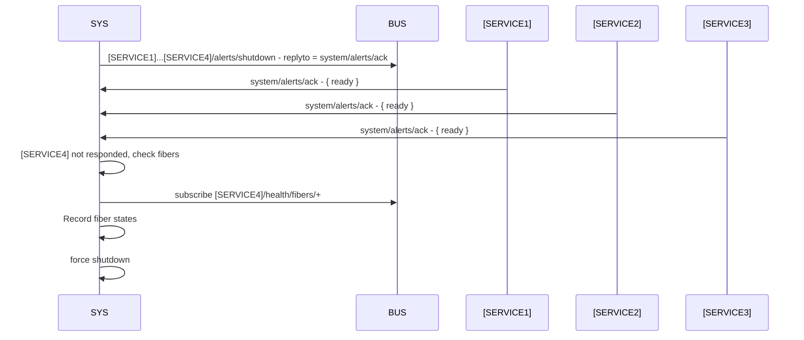

## Description
- Handles events that require alerting/coordination to other services: shutdown, reboot, update etc.
- Monitors the health of the whole system
- Controls the usb hub

## Updates, reboot and shutdown
### Option 1 broadcast events on bus
The system service will expose sources on the bus for alerting about incoming events. 
When a source publishes an incoming event it should publish with a request reply structure and wait for all services to respond, within a timeout frame. This would allow all services to stop any senetive operations, such as file interactions, and 

