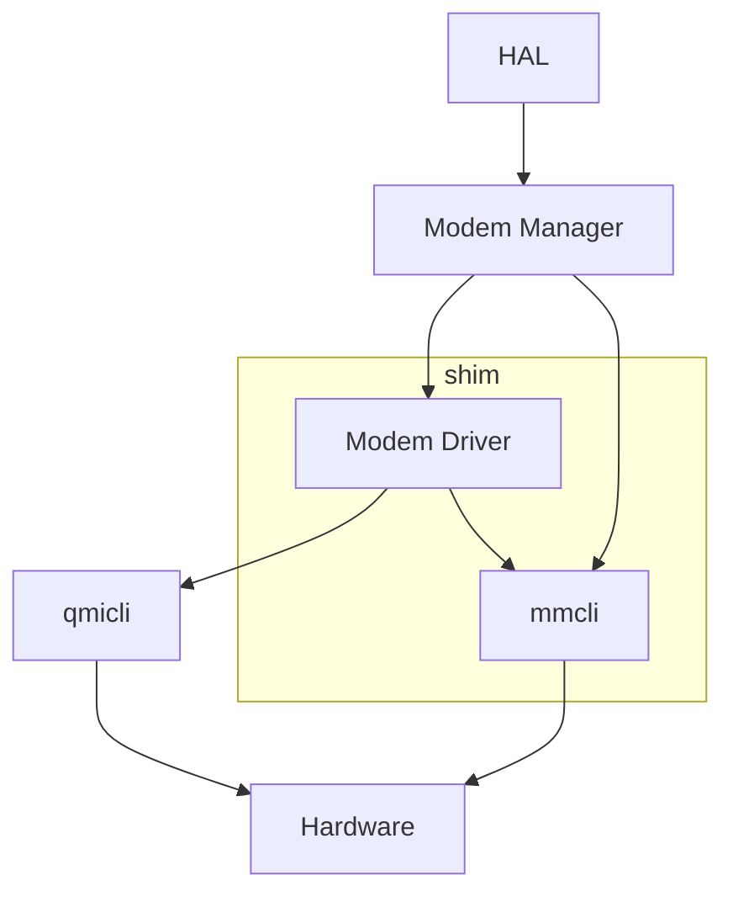

# Testing HAL
## Challenges and considerations
HAL, by nature, interacts with hardware components that are outside of devicecode control. 
Hardware would be required to do a 100% faithful test of HAL but that creates a barrier to ease-of-testing.
To get around this a way to emulate hardware needs to be devised.

### Module Shim
If we aggregate common hardware interactions into their own modules (mmcli.lua, at.lua, qmi.lua) we can shim these modules to redirect from hardware interactions and into
software emulation of these interactions. Consider the project structure:
```
devicecode-lua  /src    /services       /hal    /mmcli.lua
                                        hal.lua 
                /tests  /test_hal.lua
                        /services       /hal    /mmcli.lua
```
Here we have our production code under `src` and testing code under `tests`. 
Lua loads modules by looking though the directoriers defined in package.path, with directories eariler in the list being prioritised. 
The production code defines package.path as `"../?.lua;" .. package.path .. ";/usr/lib/lua/?.lua;/usr/lib/lua/?/init.lua"` 
when executing from `devicecode-lua/src`. The production packages will only contain the real mmcli.lua implementation under src. 
We can shim our testing version of mmcli.lua by prepending `../tests/?.lua;` to package.path, 
causing the module loader to find the test version of mmcli.lua first while all other production modules (in this case hal.lua) will be loaded from production code, as expected.

### Fake Commands

The majority (if not all) hardware interactions take place via the command line with the fibers exec module. 
Each hardware interaction returns a Command object which has common functions to run and get back command output. 
Using our shim we can return fake commands which have the same functions but return results based on events that are 
defined via a simple file e.g.
```json
{
    [
        {"command_delay" : 0.0, "output" : "No modems detected"},
        {"command_delay" : 0.4, "output" : "(+) /org/freedesktop/ModemManager1/Modem/0 [QUALCOMM INCORPORATED] QUECTEL Mobile Broadband Module"},
        {"command_delay" : 0.7, "output" : "(-) /org/freedesktop/ModemManager1/Modem/0 [QUALCOMM INCORPORATED] QUECTEL Mobile Broadband Module"},
        {"command_delay" : 0.8, "output" : null}
    ]
}
```
These commands can be executed in a timeline to simulate monitoring commands and commands which don't have instant responses.

Fake commands are good for unit and slightly larger tests but still fail for system tests as these fake interactions do not create
any real change to modem state. If one part of a system enables and connects a modem and another part checks the status of that modem, a change in status will
not be detected. Implementing cause and effect to these commands will require a ModemCard object to hold state of the card and react to commands dynamically. 

### Fake Modem Card

This class will store the state of a modem and change it as fake commands are executed, allowing for larger system tests. 
The section of code where this fake modem should be implemented needs to be chosen carefully. Injecting emulation that is too high level in our project hierarchy
can result in lots of reimplementation of complex code for a faithful emulation, which is entirely unnecessary. Injecting emulation that is too low level can result in fragmented emulated modules which can require more complexity
to ensure that modem state is communicated across all parts of emulation. 

The diagram below shows which parts of HAL will be replaced by emulated modules.



The mmcli.lua module has been chosen as it is a base module for directly talking to modems, and utilised by modem manager to listen for addition and removals of modems which can be done by simply using a fake command. The modem_driver.lua module was also chosen as it provides the lowest level of hardware abstraction where creating a shim will not produce fragmented emulation; If qmicli and mmcli where shimmed separately then synchronising modem state between the two modules would become very difficult, requiring file interactions to sync the two. Modem driver forms a single point for storage of modem state, the only case of state synchronisation which may cause issue is when the driver calls `--inhibit` which should cause a modem disconnection event. How would modem driver communicate to mmcli that a disconnection event has occurred? We need to think of the mmcli that Modem Manager loads and the mmcli that Modem Driver loads as different instances, therefore not able to communicate to each other, right??

